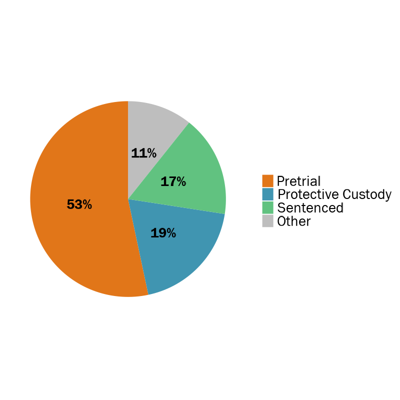
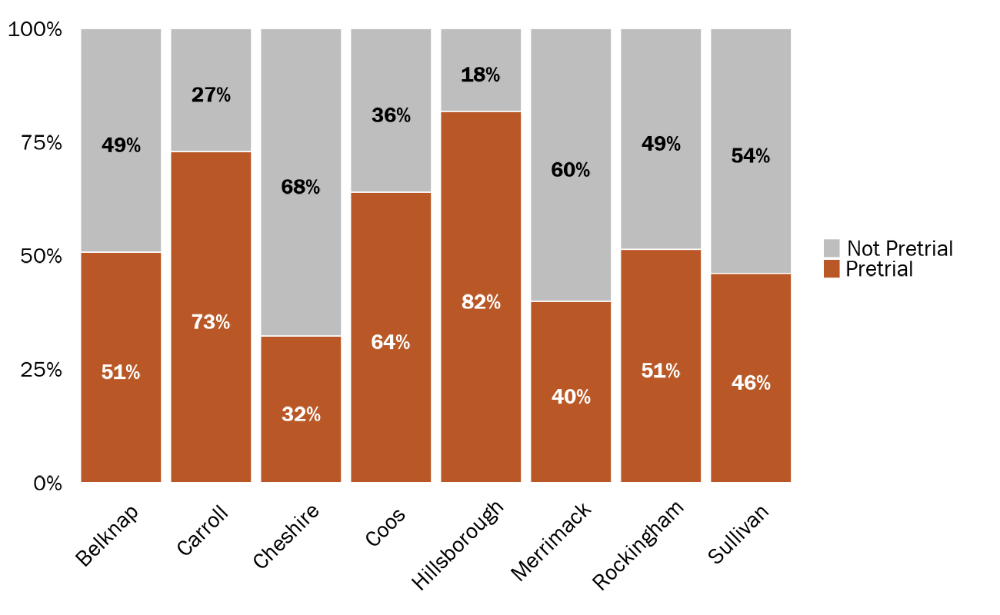
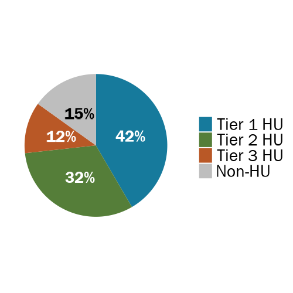

```{r setup, include=FALSE}
knitr::opts_chunk$set(
  echo=FALSE, 
  message=FALSE, 
  warning=FALSE,
  dev = "ragg_png",
  cache = FALSE
  )

# Load packages, functions, and data
source("data_cleaning/00_library.R")
source("data_cleaning/01_functions.R")
source("data_cleaning/rdas.R")

# Add HU variables
bookings_entrances <- fnc_hu_group_exclusive(bookings_entrances) 
adm_all            <- fnc_hu_group_exclusive(adm_all) 
```

## Sentence Statuses

The following booking patterns were found using jail administrative data submitted directly to CSG. DHHS matched data does not have information on sentence statuses. The "other" category includes federal holds, holds for other agencies, 24 hour and 72 hour holds, other holds, dual status, bail set, bond denied, dismissed, and sentence suspended.  

### Sentence Statuses State-wide

```{r}
# Count number of bookings on different sentence statuses for pie chart
data1 <- bookings_entrances %>% 
  select(sentence_status_standard, booking_id) %>% 
  distinct() %>% 
  mutate(sentence_status_standard = ifelse(sentence_status_standard == "UNKNOWN", NA, sentence_status_standard)) %>% 
  group_by(sentence_status_standard) %>% 
  summarise(total = n_distinct(booking_id)) %>% 
  filter(!is.na(sentence_status_standard)) %>% 
  mutate(state = "New Hampshire",
         sentence_status_standard = str_to_title(sentence_status_standard)) %>%
  mutate(pct = total/sum(total)*100) %>%
  mutate(pct = round(pct, 0)) %>% 
  mutate(pct = paste0(pct, "%")) %>% 
  mutate(sentence_status_standard = factor(sentence_status_standard, levels = c("Pretrial", "Protective Custody","Sentenced", "Other")))

# Pie chart for all three years
PRES_gg_pie_pretrial <- ggplot(data1, aes(x = state, y = total, fill = sentence_status_standard)) +
  geom_col(colour = NA, position = "fill") +
  scale_y_continuous(labels = scales::percent) +
  scale_fill_manual(values=c(jri_orange, jri_light_blue, jri_green, "gray")) +
  geom_text(aes(label = pct, 
                fontface = 'bold'), 
                position = position_fill(vjust = 0.5),
                size = 7.5,
                family = "Franklin Gothic Book",
                color = ifelse(data1$sentence_status_standard == "Other", "black", "white")
            ) +
  theme(legend.position = "top",
        legend.justification = c(0, 0),
        legend.title=element_blank(),
        axis.title.y = element_blank()) +
  coord_polar("y", start=0) +
  theme_no_grid_no_labels +
  theme(axis.ticks = element_blank(),
        axis.text.x=element_blank(),
        axis.text.y=element_blank())
```

```{r, out.width="50%", echo=FALSE, layout = "l-body"}
ggsave(PRES_gg_pie_pretrial, file="img/PRES_gg_pie_pretrial.png", width = 8,  height = 8, dpi = 100)

```

```{r}
# If sentence status is unknown, make NA
data1 <- bookings_entrances %>% 
  select(sentence_status_standard, booking_id) %>% 
  distinct() %>% 
  mutate(sentence_status_standard = ifelse(sentence_status_standard == "UNKNOWN", NA, sentence_status_standard))

# Get frequencies for different sentence statuses
data1 <- data.frame(summarytools::freq(data1$sentence_status_standard, order = "freq", cum.percent = FALSE))
data1 <- data1 %>% tibble::rownames_to_column("sentence_status_standard") %>%
  dplyr::select(`Sentence Status` = sentence_status_standard,
                `Unique Bookings (N)` = Freq,
                `Proportion of Bookings (%)` = X..Valid) %>% 
  mutate(`Proportion of Bookings (%)` = percent(`Proportion of Bookings (%)`/100))

# Create kable table
kable(data1, 
      format.args = list(big.mark = ","), 
      align=rep('l')) %>%
  kable_styling(bootstrap_options = c("striped", 
                                       "hover", 
                                       "condensed", 
                                       "responsive"), 
                 row_label_position = "l") %>% 
  column_spec(1, bold = T) %>% 
  row_spec(6, bold = TRUE)
```

### Sentence Statuses by County (N)

```{r}
# Df of total number of entrances by county
df_entrances_county <- bookings_entrances %>%
  dplyr::ungroup() %>%
  dplyr::select(booking_id, county) %>%
  dplyr::distinct() %>%
  dplyr::group_by(county) %>%
  dplyr::summarise(total = n_distinct(booking_id))

# Number of sentence types by county for all three years
# Reshape table for viewing
df_sentence_statuses_county <- bookings_entrances %>%
  dplyr::ungroup() %>%
  dplyr::select(booking_id, county, sentence_status_standard) %>%
  dplyr::distinct() %>%
  dplyr::group_by(county, sentence_status_standard) %>%
  dplyr::summarise(total = n_distinct(booking_id)) %>% 
  spread(sentence_status_standard, total) %>% clean_names() %>% 
  select(County                   = county,
         `Pretrial (N)`           = pretrial,
         `Protective Custody (N)` = protective_custody,
         `Sentenced (N)`          = sentenced,
         `Other (N)`              = other,
         `Unknown (N)`            = unknown) %>% 
  left_join(df_entrances_county, by = c("County" = "county")) %>% 
  rename(`Total Entrances (N)` = total)

# Create kable table
kable(df_sentence_statuses_county, 
      format.args = list(big.mark = ","), 
      align=rep('l')) %>%
  kable_styling(bootstrap_options = c("striped", 
                                       "hover", 
                                       "condensed", 
                                       "responsive"), 
                 row_label_position = "l") %>% 
   column_spec(1, bold = T, width = "12em") %>% 
   column_spec(2, width = "8em") %>% 
   column_spec(3, width = "8em") %>% 
   column_spec(4, width = "8em") %>% 
   column_spec(5, width = "8em") %>% 
   column_spec(6, width = "8em") %>% 
   column_spec(7, width = "8em")
```

<br>

### Sentence Statuses by County (%)

```{r}
# Calculate proportion of sentence statuses out of all entrances
df_sentence_statuses_county_pct <- df_sentence_statuses_county %>% 
  mutate(`Pretrial %`             = percent(`Pretrial (N)`/`Total Entrances (N)`),
         `Protective Custody (%)` = percent(`Protective Custody (N)`/`Total Entrances (N)`),
         `Sentenced (%)`          = percent(`Sentenced (N)`/`Total Entrances (N)`),
         `Other (%)`              = percent(`Other (N)`/`Total Entrances (N)`),
         `Unknown (%)`            = percent(`Unknown (N)`/`Total Entrances (N)`)
         ) %>% 
  select(-c(
         `Pretrial (N)`,
         `Protective Custody (N)`,
         `Sentenced (N)`,
         `Other (N)`,
         `Unknown (N)`,
         `Total Entrances (N)`))

# Create kable table
kable(df_sentence_statuses_county_pct, 
      format.args = list(big.mark = ","), 
      align=rep('l')) %>%
  kable_styling(bootstrap_options = c("striped", 
                                       "hover", 
                                       "condensed", 
                                       "responsive"), 
                 row_label_position = "l") %>% 
   column_spec(1, bold = T, width = "12em") %>% 
   column_spec(2, width = "8em") %>% 
   column_spec(3, width = "8em") %>% 
   column_spec(4, width = "8em") %>% 
   column_spec(5, width = "8em") %>% 
   column_spec(6, width = "8em") 
```

<br>

**Proportion of jail bookings that are pretrial by county**

```{r}
# Number of pretrial by county for all three years
data1 <- bookings_entrances %>%
  dplyr::ungroup() %>%
  dplyr::select(booking_id, county, sentence_status_standard) %>%
    mutate(sentence_status_standard = case_when(
    sentence_status_standard == "OTHER"              ~ "Not Pretrial",
    sentence_status_standard == "PROTECTIVE CUSTODY" ~ "Not Pretrial",
    sentence_status_standard == "SENTENCED"          ~ "Not Pretrial",
    sentence_status_standard == "UNKNOWN"            ~ "Not Pretrial",
    sentence_status_standard == "PRETRIAL"           ~ "Pretrial"
  )) %>% 
  dplyr::distinct() %>%
  dplyr::group_by(county, sentence_status_standard) %>%
  dplyr::summarise(total = n()) %>% 
  filter(county != "Strafford") %>% 
  mutate(pct = round(total/sum(total)*100, 0))

# ggplot for proportion of pretrial by county
PRES_gg_pretrial_prop <- ggplot(data1, aes(x = county, y = total, fill = sentence_status_standard)) +
  geom_col(colour = "white", position = "fill") +
  scale_y_continuous(labels = scales::percent) +
  scale_fill_manual(values=c("gray",jri_orange),
                    na.value = "white",
                    labels = c("Not Pretrial      ","Pretrial", " ")
                    ) +
  geom_text(aes(label = ifelse(pct > 4, paste(pct, "%", sep = ""), ""), 
                fontface = 'bold'),
            position = position_fill(vjust = 0.5),
            vjust = 0.8,
            size = 7.5, family = "Franklin Gothic Book",
            color = case_when(data1$sentence_status_standard == "Not Pretrial" ~ "black",
                              TRUE ~ "white")) +
  theme_no_grid_no_labels +
  theme(axis.title.y = element_blank(),
        axis.title.x = element_blank(),
        axis.text.x = element_text(angle = 45, hjust = 0.85, color = "black"))
```

```{r, out.width="100%", echo=FALSE, layout = "l-body"}
ggsave(PRES_gg_pretrial_prop, file="img/PRES_gg_pretrial_prop.png", width = 13,  height = 8, dpi = 100)

```


<br>

## Carroll County 

This is how we standardized sentence statuses in Carroll County. It's possible that some of the sentence statuses should be in "Pretrial" instead of "Other."

```{r}
# Select Carroll data to understand their sentence statuses
data1 <- adm_all %>% 
  filter(county == "Carroll") %>% 
  group_by(sentence_status, sentence_status_standard) %>% 
  summarise(total = n()) %>% 
  arrange(sentence_status_standard) %>% 
  select(`Sentence Status (Raw)` = sentence_status,
         `Sentence Status (Standardized)` = sentence_status_standard,
         `Total Bookings (N)` = total)

# Create kable table
kable(data1, 
      format.args = list(big.mark = ","), 
      align=rep('l')) %>%
  kable_styling(bootstrap_options = c("striped", 
                                       "hover", 
                                       "condensed", 
                                       "responsive"), 
                 row_label_position = "l") %>% 
   column_spec(1, bold = T, width = "15em") %>% 
   column_spec(2, width = "15em") %>% 
   column_spec(3, width = "15em") 
```


<br>

## Sentence Statuses and Charge Types

### Charge Type by Sentence Status (Row Sums)

```{r}
# Get proportion of charge types by sentence status
data1 <- table(adm_all$crime_type_lookup, adm_all$sentence_status_standard)
table1 <- prop.table(data1, 1)
table1 <- as.data.frame(cbind(data1, table1))
table1 <- table1 %>% rownames_to_column("Charge Type")

# Rename variables
table1 <- table1 %>% 
       rename("Charge Type"            = 1,
              "Other (N)"              = 2,
              "Pretrial (N)"           = 3,
              "Protective Custody (N)" = 4,
              "Sentenced (N)"          = 5,
              "Unknown (N)"            = 6,
              "Other (%)"              = 7,
              "Pretrial (%)"           = 8,
              "Protective Custody (%)" = 9,
              "Sentenced (%)"          = 10,
              "Unknown (%)"            = 11) 

# Sep tables into N and % 
table_n   <- table1 %>% select(1:6)
table_pct <- table1 %>% select(1, 7:11)

# Create reactable table for N
reactable(table_n,
          style = list(fontFamily = "Franklin Gothic Book", fontSize = "1.0rem"),
          pagination = FALSE,
          theme = reactableTheme(cellStyle = list(display = "flex", flexDirection = "column", justifyContent = "center"),
                                 headerStyle = list(display = "flex", flexDirection = "column", justifyContent = "center")),
          defaultColDef = reactable::colDef(
            format = colFormat(separators = TRUE), align = "left", minWidth = 100,
            footer = function(values, name) {
              if (name %in% c("NH State Prisoner (N)", "Other (N)", "Pretrial (N)", "Protective Custody (N)", "Sentenced (N)", "Unknown (N)")) {
                htmltools::div(paste0("", formatC(
                  x = sum(values),
                  digits = 0,
                  big.mark = ",",
                  format = "f"
                )))
              }
            },
            footerStyle = list(fontWeight = "bold")
          ),
          compact = TRUE,
          fullWidth = FALSE,
          columns = list(
            `Charge Type` = colDef(minWidth = 200, style = list(fontWeight = "bold"))
            )
          ) %>%
add_source(paste(""), font_style = "italic", font_size = 14)

# Create reactable table for %
reactable(table_pct,
          style = list(fontFamily = "Franklin Gothic Book", fontSize = "1.0rem"),
          pagination = FALSE,
          theme = reactableTheme(cellStyle = list(display = "flex", flexDirection = "column", justifyContent = "center"),
                                 headerStyle = list(display = "flex", flexDirection = "column", justifyContent = "center")),
          defaultColDef = reactable::colDef(
            format = colFormat(separators = TRUE), align = "left", minWidth = 100,
            footer = function(values, name) {
              if (name %in% c("NH State Prisoner (N)", "Other (N)", "Pretrial (N)", "Protective Custody (N)", "Sentenced (N)", "Unknown (N)")) {
                htmltools::div(paste0("", formatC(
                  x = sum(values),
                  digits = 0,
                  big.mark = ",",
                  format = "f"
                )))
              }
            },
            footerStyle = list(fontWeight = "bold")
          ),
          compact = TRUE,
          fullWidth = FALSE,
          columns = list(
            `Charge Type` = colDef(minWidth = 200, style = list(fontWeight = "bold")),
            `NH State Prisoner (%)` = colDef(minWidth = 100, format = colFormat(percent = TRUE, digits = 1)),
            `Other (%)` = colDef(minWidth = 100, format = colFormat(percent = TRUE, digits = 1)),
            `Pretrial (%)` = colDef(minWidth = 100, format = colFormat(percent = TRUE, digits = 1)),
            `Protective Custody (%)` = colDef(minWidth = 100, format = colFormat(percent = TRUE, digits = 1)),
            `Sentenced (%)` = colDef(minWidth = 100, format = colFormat(percent = TRUE, digits = 1)),
            `Unknown (%)` = colDef(minWidth = 100, format = colFormat(percent = TRUE, digits = 1))
            )
          ) %>%
add_source(paste(""), font_style = "italic", font_size = 14)
```

<br>

### Charge Type by Sentence Status (Column Sums)

```{r}
# Get proportion of charge types by sentence status
data1 <- table(adm_all$crime_type_lookup, adm_all$sentence_status_standard)
table1 <- prop.table(data1, 1)
table1 <- as.data.frame(cbind(data1, table1))
table1 <- table1 %>% rownames_to_column("Charge Type")

# Rename variables
table1 <- table1 %>% 
       rename("Charge Type"            = 1,
              "Other (N)"              = 2,
              "Pretrial (N)"           = 3,
              "Protective Custody (N)" = 4,
              "Sentenced (N)"          = 5,
              "Unknown (N)"            = 6,
              "Other (%)"              = 7,
              "Pretrial (%)"           = 8,
              "Protective Custody (%)" = 9,
              "Sentenced (%)"          = 10,
              "Unknown (%)"            = 11) 

# Sep tables into N and % 
table_n   <- table1 %>% select(1:6)
table_pct <- table1 %>% select(1, 7:11)

# Create reactable table for N
reactable(table_n,
          style = list(fontFamily = "Franklin Gothic Book", fontSize = "1.0rem"),
          pagination = FALSE,
          theme = reactableTheme(cellStyle = list(display = "flex", flexDirection = "column", justifyContent = "center"),
                                 headerStyle = list(display = "flex", flexDirection = "column", justifyContent = "center")),
          defaultColDef = reactable::colDef(
            format = colFormat(separators = TRUE), align = "left", minWidth = 100,
            footer = function(values, name) {
              if (name %in% c("NH State Prisoner (N)", "Other (N)", "Pretrial (N)", "Protective Custody (N)", "Sentenced (N)", "Unknown (N)")) {
                htmltools::div(paste0("", formatC(
                  x = sum(values),
                  digits = 0,
                  big.mark = ",",
                  format = "f"
                )))
              }
            },
            footerStyle = list(fontWeight = "bold")
          ),
          compact = TRUE,
          fullWidth = FALSE,
          columns = list(
            `Charge Type` = colDef(minWidth = 200, style = list(fontWeight = "bold"))
            )
          ) %>%
add_source(paste(""), font_style = "italic", font_size = 14)

# Create reactable table for %
reactable(table_pct,
          style = list(fontFamily = "Franklin Gothic Book", fontSize = "1.0rem"),
          pagination = FALSE,
          theme = reactableTheme(cellStyle = list(display = "flex", flexDirection = "column", justifyContent = "center"),
                                 headerStyle = list(display = "flex", flexDirection = "column", justifyContent = "center")),
          defaultColDef = reactable::colDef(
            format = colFormat(separators = TRUE), align = "left", minWidth = 100,
            footer = function(values, name) {
              if (name %in% c("NH State Prisoner (N)", "Other (N)", "Pretrial (N)", "Protective Custody (N)", "Sentenced (N)", "Unknown (N)")) {
                htmltools::div(paste0("", formatC(
                  x = sum(values),
                  digits = 0,
                  big.mark = ",",
                  format = "f"
                )))
              }
            },
            footerStyle = list(fontWeight = "bold")
          ),
          compact = TRUE,
          fullWidth = FALSE,
          columns = list(
            `Charge Type` = colDef(minWidth = 200, style = list(fontWeight = "bold")),
            `NH State Prisoner (%)` = colDef(minWidth = 100, format = colFormat(percent = TRUE, digits = 1)),
            `Other (%)` = colDef(minWidth = 100, format = colFormat(percent = TRUE, digits = 1)),
            `Pretrial (%)` = colDef(minWidth = 100, format = colFormat(percent = TRUE, digits = 1)),
            `Protective Custody (%)` = colDef(minWidth = 100, format = colFormat(percent = TRUE, digits = 1)),
            `Sentenced (%)` = colDef(minWidth = 100, format = colFormat(percent = TRUE, digits = 1)),
            `Unknown (%)` = colDef(minWidth = 100, format = colFormat(percent = TRUE, digits = 1))
            )
          ) %>%
add_source(paste(""), font_style = "italic", font_size = 14)
```


<br>


### High Utilizers and Sentence Statuses (Row sums)

```{r}
# Select HU entrances
df_hus_entrances <- adm_all %>% 
  select(id, 
         booking_id, 
         sentence_status_standard,
         county, 
         fy,
         num_entrances,
         hu_group_exclusive) %>% 
  distinct() %>% 
  filter(sentence_status_standard != "UNKNOWN")

# Get proportion of sentence statuses by HU type
data1 <- table(df_hus_entrances$sentence_status_standard, df_hus_entrances$hu_group_exclusive)
table1 <- prop.table(data1, 2)
table1 <- as.data.frame(cbind(data1, table1))
table1 <- table1 %>% rownames_to_column("Entrance Type")

# Create reactable table
reactable(table1,
          style = list(fontFamily = "Franklin Gothic Book", fontSize = "1.0rem"),
          pagination = FALSE,
          theme = reactableTheme(cellStyle = list(display = "flex", flexDirection = "column", justifyContent = "center"),
                                 headerStyle = list(display = "flex", flexDirection = "column", justifyContent = "center")),
          defaultColDef = reactable::colDef(
            format = colFormat(separators = TRUE), align = "left", minWidth = 100,
            footer = function(values, name) {
              if (name %in% c("Drug court-related booking", "Not a drug court-related booking")) {
                htmltools::div(paste0("", formatC(
                  x = sum(values),
                  digits = 0,
                  big.mark = ",",
                  format = "f"
                )))
              }
            },
            footerStyle = list(fontWeight = "bold")
          ),
          compact = TRUE,
          fullWidth = FALSE,
          columns = list(
            `Entrance Type` = colDef(name = "", minWidth = 200, style = list(fontWeight = "bold")),
            `Tier 1 HU`        = colDef(name = "Tier 1 HU (N)",  minWidth = 100),
            `Tier 2 HU`        = colDef(name = "Tier 2 HU (N)",  minWidth = 100),
            `Tier 3 HU`       = colDef(name = "Tier 3 HU (N)", minWidth = 100),
            `Non-HU%`       = colDef(name = "Non-HU (N)",  minWidth = 100),

            `Tier 1 HU.1`      = colDef(name = "Tier 1 HU (%)",  minWidth = 100, format = colFormat(percent = TRUE, digits = 0)),
            `Tier 2 HU.1`      = colDef(name = "Tier 2 HU (%)",  minWidth = 100, format = colFormat(percent = TRUE, digits = 0)),
            `Tier 3 HU.1`     = colDef(name = "Tier 3 HU (%)", minWidth = 100, format = colFormat(percent = TRUE, digits = 0)),
            `Non-HU.1`      = colDef(name = "Non-HU (%)",  minWidth = 100, format = colFormat(percent = TRUE, digits = 0))
            )
          ) %>%
add_source(paste(""), font_style = "italic", font_size = 14)
```

<br>

### High Utilizers and Sentence Statuses (Column sums)

```{r}
# Get proportion of sentence statuses by HU type
data1 <- table(df_hus_entrances$sentence_status_standard, df_hus_entrances$hu_group_exclusive)
table1 <- prop.table(data1, 1)
table1 <- as.data.frame(cbind(data1, table1))
table1 <- table1 %>% rownames_to_column("Entrance Type")

# Create reactable table
reactable(table1,
          style = list(fontFamily = "Franklin Gothic Book", fontSize = "1.0rem"),
          pagination = FALSE,
          theme = reactableTheme(cellStyle = list(display = "flex", flexDirection = "column", justifyContent = "center"),
                                 headerStyle = list(display = "flex", flexDirection = "column", justifyContent = "center")),
          defaultColDef = reactable::colDef(
            format = colFormat(separators = TRUE), align = "left", minWidth = 100,
            footer = function(values, name) {
              if (name %in% c("Drug court-related booking", "Not a drug court-related booking")) {
                htmltools::div(paste0("", formatC(
                  x = sum(values),
                  digits = 0,
                  big.mark = ",",
                  format = "f"
                )))
              }
            },
            footerStyle = list(fontWeight = "bold")
          ),
          compact = TRUE,
          fullWidth = FALSE,
          columns = list(
            `Entrance Type` = colDef(name = "", minWidth = 200, style = list(fontWeight = "bold")),
            `Tier 1 HU`        = colDef(name = "Tier 1 HU (N)",  minWidth = 100),
            `Tier 2 HU`        = colDef(name = "Tier 2 HU (N)",  minWidth = 100),
            `Tier 3 HU`       = colDef(name = "Tier 3 HU (N)", minWidth = 100),
            `Non-HU%`       = colDef(name = "Non-HU (N)",  minWidth = 100),

            `Tier 1 HU.1`      = colDef(name = "Tier 1 HU (%)",  minWidth = 100, format = colFormat(percent = TRUE, digits = 0)),
            `Tier 2 HU.1`      = colDef(name = "Tier 2 HU (%)",  minWidth = 100, format = colFormat(percent = TRUE, digits = 0)),
            `Tier 3 HU.1`     = colDef(name = "Tier 3 HU (%)", minWidth = 100, format = colFormat(percent = TRUE, digits = 0)),
            `Non-HU.1`      = colDef(name = "Non-HU (%)",  minWidth = 100, format = colFormat(percent = TRUE, digits = 0))
            )
          ) %>%
add_source(paste(""), font_style = "italic", font_size = 14)
```


<br>

## Drug Courts

Only Cheshire, Hillsborough, and Rockingham County collect booking information related to [drug courts](https://www.courts.nh.gov/our-courts/drug-mental-health-courts).  

Specialty court programs for people involved in the criminal jusice system with substance abuse or mental health diagnoses are available in various Superior and Circuit Court District Division locations in New Hampshire. These treatment courts combine community based treatment programs with strict court supervision and progressive incentives and sanctions. By linking people to treatment services, the program aims to address offender's substance abuse and mental health diagnoses that led to criminal behavior, thereby reducing recidivism, and protecting public safety. These treatment court programs are designed to promote compliance with treatment programs as an alternative to jail time.

Felony drug court programs for adult offenders are available in Belknap, Carroll, Cheshire, Coos, Grafton, Hillsborough (North and South), Merrimack, Rockingham, and Strafford Counties. A defendant who enters those drug court programs must reside in the County where drug court is offered, in addition to having committed the crime in that county. 

```{r}
# Select variables and counties to look at drug courts
df_drug_courts <- adm_all %>% 
  filter(county == "Cheshire" |
         county == "Hillsborough" |
         county == "Rockingham") %>% 
  filter(pc_hold == "Non-PC Hold") %>% 
  select(id, 
         booking_id, 
         sentence_status_standard,
         county, 
         fy,
         num_entrances,
         hu_group_exclusive,
         drug_court_pretrial,
         drug_court_sentenced,
         crime_type_lookup,
         descriptor_lookup) %>%
  filter(!is.na(drug_court_pretrial) & !is.na(drug_court_sentenced)) %>% 
  distinct() %>% 
  mutate(drug_court = case_when(drug_court_pretrial == 1 | drug_court_sentenced == 1 ~ "Drug court-related booking", 
                                drug_court_pretrial == 0 | drug_court_sentenced == 0 ~ "Not a drug court-related booking"))
```

### Drug court-related bookings by county

```{r}
# Get proportion of bookings that were drug court-related
data1 <- table(df_drug_courts$county, df_drug_courts$drug_court)
table1 <- prop.table(data1, 1)
table1 <- as.data.frame(cbind(data1, table1))
table1 <- table1 %>% rownames_to_column("County")

# Create reactable table
reactable(table1,
          style = list(fontFamily = "Franklin Gothic Book", fontSize = "1.0rem"),
          pagination = FALSE,
          theme = reactableTheme(cellStyle = list(display = "flex", flexDirection = "column", justifyContent = "center"),
                                 headerStyle = list(display = "flex", flexDirection = "column", justifyContent = "center")),
          defaultColDef = reactable::colDef(
            format = colFormat(separators = TRUE), align = "left", minWidth = 100,
            footer = function(values, name) {
              if (name %in% c("Drug court-related booking", "Not a drug court-related booking")) {
                htmltools::div(paste0("", formatC(
                  x = sum(values),
                  digits = 0,
                  big.mark = ",",
                  format = "f"
                )))
              }
            },
            footerStyle = list(fontWeight = "bold")
          ),
          columnGroups = list(
            colGroup(name = "Drug court-related booking", columns = c("Drug court-related booking", "Drug court-related booking.1")),
            colGroup(name = "Not a drug court-related booking", columns = c("Not a drug court-related booking", "Not a drug court-related booking.1"))
          ),
          compact = TRUE,
          fullWidth = FALSE,
          columns = list(
            `HU Type`                            = colDef(name = "", minWidth = 200, style = list(fontWeight = "bold")),
            `Drug court-related booking`         = colDef(name = "N", minWidth = 100),
            `Not a drug court-related booking`   = colDef(name = "N", minWidth = 100),
            `Drug court-related booking.1`       = colDef(name = "%", minWidth = 100, format = colFormat(percent = TRUE, digits = 0)),
            `Not a drug court-related booking.1` = colDef(name = "%", minWidth = 100, format = colFormat(percent = TRUE, digits = 0))
            )
          ) %>%
add_source(paste(""), font_style = "italic", font_size = 14)
```

<br>

### Drug court-related bookings by high utilizers (Row sums)

```{r}
# Get proportion of HU bookings that were drug court related
data1 <- table(df_drug_courts$hu_group_exclusive, df_drug_courts$drug_court)
table1 <- prop.table(data1, 2)
table1 <- as.data.frame(cbind(data1, table1))
table1 <- table1 %>% rownames_to_column("HU Type")

# Create reactable table
reactable(table1,
          style = list(fontFamily = "Franklin Gothic Book", fontSize = "1.0rem"),
          pagination = FALSE,
          theme = reactableTheme(cellStyle = list(display = "flex", flexDirection = "column", justifyContent = "center"),
                                 headerStyle = list(display = "flex", flexDirection = "column", justifyContent = "center")),
          defaultColDef = reactable::colDef(
            format = colFormat(separators = TRUE), align = "left", minWidth = 100,
            footer = function(values, name) {
              if (name %in% c("Drug court-related booking", "Not a drug court-related booking")) {
                htmltools::div(paste0("", formatC(
                  x = sum(values),
                  digits = 0,
                  big.mark = ",",
                  format = "f"
                )))
              }
            },
            footerStyle = list(fontWeight = "bold")
          ),
          columnGroups = list(
            colGroup(name = "Drug court-related booking", columns = c("Drug court-related booking", "Drug court-related booking.1")),
            colGroup(name = "Not a drug court-related booking", columns = c("Not a drug court-related booking", "Not a drug court-related booking.1"))
          ),
          compact = TRUE,
          fullWidth = FALSE,
          columns = list(
            `HU Type`                            = colDef(name = "", minWidth = 200, style = list(fontWeight = "bold")),
            `Drug court-related booking`         = colDef(name = "N", minWidth = 100),
            `Not a drug court-related booking`   = colDef(name = "N", minWidth = 100),
            `Drug court-related booking.1`       = colDef(name = "%", minWidth = 100, format = colFormat(percent = TRUE, digits = 0)),
            `Not a drug court-related booking.1` = colDef(name = "%", minWidth = 100, format = colFormat(percent = TRUE, digits = 0))
            )
          ) %>%
add_source(paste(""), font_style = "italic", font_size = 14)
```
```{r}
# Select variables and count number of drug court related bookings by HU type
data1 <- df_drug_courts %>%
  select(county,
         fy,
         id,
         booking_id,
         hu_group_exclusive,
         drug_court) %>%
  distinct() %>%
  filter(!is.na(drug_court)) %>%
  filter(drug_court == "Drug court-related booking") %>%
  group_by(drug_court, hu_group_exclusive) %>%
  summarise(total = n()) %>%
  mutate(pct = total/sum(total)*100) %>%
  mutate(pct = round(pct, 0))
data1 <- as.data.frame(data1)
data1 <- data1 %>% mutate(pct = paste0(pct, "%")) %>% 
  mutate(hu_group_exclusive = factor(hu_group_exclusive, levels = c("Non-HU", "Tier 3 HU","Tier 2 HU", "Tier 1 HU")))

# One stacked barplot for all three years and then make it a pie chart
PRES_gg_pie_drug_court_bookings <- ggplot(data1, aes(x = drug_court, y = total, fill = hu_group_exclusive )) +
  geom_col(colour = NA, position = "fill") +
  scale_y_continuous(labels = scales::percent) +
  scale_fill_manual(values=c("gray", jri_orange, jri_green, jri_light_blue), labels = c("Non-HU", "Tier 3 HU","Tier 2 HU", "Tier 1 HU")) +
  geom_text(aes(label = pct, fontface = 'bold'), position = position_fill(vjust = 0.5),
            size = 7.5, family = "Franklin Gothic Book",
            color = case_when(data1$hu_group_exclusive == "Non-HU" ~ "black",
                  TRUE ~ "white")) +
  coord_polar("y", start=0) +
  theme_no_grid_no_labels +
  guides(fill = guide_legend(reverse = TRUE)) +
  theme(axis.ticks = element_blank(),
        axis.text.x=element_blank(),
        axis.text.y=element_blank())
```

```{r, out.width="50%", echo=FALSE, layout = "l-body"}
ggsave(PRES_gg_pie_drug_court_bookings, file="img/PRES_gg_pie_drug_court_bookings.png", width = 5,  height = 5, dpi = 100, bg='transparent')

```

### Drug court-related bookings by high utilizers (Column sums)

```{r}
# Get proportion of HUs with drug court related bookings
data1 <- table(df_drug_courts$hu_group_exclusive, df_drug_courts$drug_court)
table1 <- prop.table(data1, 1)
table1 <- as.data.frame(cbind(data1, table1))
table1 <- table1 %>% rownames_to_column("HU Type")

# Create reactable table
reactable(table1,
          style = list(fontFamily = "Franklin Gothic Book", fontSize = "1.0rem"),
          pagination = FALSE,
          theme = reactableTheme(cellStyle = list(display = "flex", flexDirection = "column", justifyContent = "center"),
                                 headerStyle = list(display = "flex", flexDirection = "column", justifyContent = "center")),
          defaultColDef = reactable::colDef(
            format = colFormat(separators = TRUE), align = "left", minWidth = 100,
            footer = function(values, name) {
              if (name %in% c("Drug court-related booking", "Not a drug court-related booking")) {
                htmltools::div(paste0("", formatC(
                  x = sum(values),
                  digits = 0,
                  big.mark = ",",
                  format = "f"
                )))
              }
            },
            footerStyle = list(fontWeight = "bold")
          ),
          columnGroups = list(
            colGroup(name = "Drug court-related booking", columns = c("Drug court-related booking", "Drug court-related booking.1")),
            colGroup(name = "Not a drug court-related booking", columns = c("Not a drug court-related booking", "Not a drug court-related booking.1"))
          ),
          compact = TRUE,
          fullWidth = FALSE,
          columns = list(
            `HU Type`                            = colDef(name = "", minWidth = 200, style = list(fontWeight = "bold")),
            `Drug court-related booking`         = colDef(name = "N", minWidth = 100),
            `Not a drug court-related booking`   = colDef(name = "N", minWidth = 100),
            `Drug court-related booking.1`       = colDef(name = "%", minWidth = 100, format = colFormat(percent = TRUE, digits = 0)),
            `Not a drug court-related booking.1` = colDef(name = "%", minWidth = 100, format = colFormat(percent = TRUE, digits = 0))
            )
          ) %>%
add_source(paste(""), font_style = "italic", font_size = 14)
```

