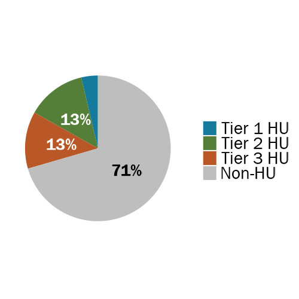
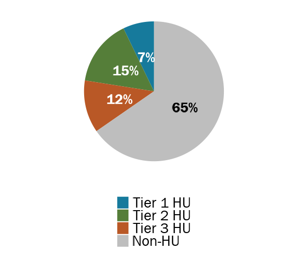

```{r setup, include=FALSE}
knitr::opts_chunk$set(
  echo=FALSE, 
  message=FALSE, 
  warning=FALSE,
  dev = "ragg_png",
  cache = FALSE
  )

# Load packages, functions, and data
source("data_cleaning/00_library.R")
source("data_cleaning/01_functions.R")
source("data_cleaning/rdas.R")
medicaid_jail_all <- read_rds("D:/Analytic/medicaid_jail_all.rds") 

# Change HU variable to 1% = 1 percent, 5% = 2-5 percent, 10% = 6-10 percent
medicaid_jail_all <- fnc_hu_group_exclusive(medicaid_jail_all)

# DHHS data
# Rename variables
# Get fiscal year based on booking date
entrances_dhhs <- medicaid_jail_all %>% 
  mutate(id = unique_person_id,
         fy = case_when(booking_date > "2018-06-30" & booking_date < "2019-07-01" ~ 2019,
                        booking_date > "2019-06-30" & booking_date < "2020-07-01" ~ 2020,
                        booking_date > "2020-06-30" & booking_date < "2021-07-01" ~ 2021),
         booking_date = ymd(as_date(booking_date)),
         release_date = ymd(as_date(release_date)), 
         jail_los = as.numeric(difftime(release_date,
                                        booking_date,
                                        units="days")))
```

## How we define people who are high utilizers of the jail system

We defined people who are high utilizers of the jail system as the top 1%, 5%, or 10% of people entering jails from FY2019 to FY2021. De-identified jail administrative data was provided by DHHS, which includes a unique id for each person to account for entrances at more than one jail.   

```{r}
########################################
# Entrances overview
########################################

# Number of people entered by county for all three years
amt_people_entered_county <- entrances_dhhs %>%
  dplyr::ungroup() %>%
  dplyr::select(id, county) %>%
  dplyr::distinct() %>%
  dplyr::group_by(county) %>%
  dplyr::summarise(total = n())

# Number of people entered by FY by county
df_people_entered_county <- entrances_dhhs %>%
  dplyr::ungroup() %>%
  dplyr::select(id, fy, county) %>%
  dplyr::distinct() %>%
  dplyr::group_by(fy, county) %>%
  dplyr::summarise(total = n()) %>%
  spread(fy, total) %>%
  mutate(`2019` = as.numeric(`2019`),
         `2020` = as.numeric(`2020`),
         `2021` = as.numeric(`2021`)) %>%
  left_join(amt_people_entered_county, by = "county") %>%
  adorn_totals("row") %>%
  mutate(change_19_21 = (`2021`-`2019`)/`2019`) %>%
  mutate(county = case_when(county == "Total" ~ "State",
                            TRUE ~ county))

# Number of entrances by county for all three years
amt_entrances_county <- entrances_dhhs %>%
  dplyr::ungroup() %>%
  dplyr::select(booking_id, county) %>%
  dplyr::distinct() %>%
  dplyr::group_by(county) %>%
  dplyr::summarise(total = n())

# Df of total number of entrances by FY
df_entrances_county <- entrances_dhhs %>%
  dplyr::ungroup() %>%
  dplyr::select(booking_id, fy, county) %>%
  dplyr::distinct() %>%
  dplyr::group_by(fy, county) %>%
  dplyr::summarise(total = n()) %>%
  spread(fy, total) %>%
  mutate(`2019` = as.numeric(`2019`),
         `2020` = as.numeric(`2020`),
         `2021` = as.numeric(`2021`)) %>%
  left_join(amt_entrances_county, by = "county") %>%
  adorn_totals("row") %>%
  mutate(change_19_21 = (`2021`-`2019`)/`2019`) %>%
  mutate(county = case_when(county == "Total" ~ "State",
                            TRUE ~ county))

# Average number of entrances/fy by county
df_avg_entrances_county <- entrances_dhhs %>%
  ungroup() %>%
  select(county, id, num_entrances) %>%
  distinct() %>%
  group_by(county) %>%
  dplyr::summarize(avg_entrances = mean(num_entrances, na.rm=TRUE)) %>%
  mutate(county = case_when(county == "Coos" ~ "Coos (bookings only)", TRUE ~ county))

# Average number of entrances/fy by state
df_avg_entrances_total <- entrances_dhhs %>%
  ungroup() %>%
  select(id, num_entrances) %>%
  distinct() %>%
  group_by() %>%
  dplyr::summarize(avg_entrances = mean(num_entrances, na.rm=TRUE)) %>%
  mutate(county = "State")

# Add county and state info together
df_avg_entrances_county <- rbind(df_avg_entrances_county, df_avg_entrances_total)

# Rename variables and add data together
df_entrances_county <- df_entrances_county %>% rename_with(~paste0("entrances_", .), -c("county")) 
df_entrances_people_county <- df_people_entered_county %>% rename_with(~paste0("people_entered_", .), -c("county"))
df_entrances_table <- merge(df_entrances_county, df_entrances_people_county, by = "county", all.x = TRUE, all.y = TRUE)
df_entrances_table <- merge(df_entrances_table, df_avg_entrances_county, by = "county", all.x = TRUE, all.y = TRUE)

########################################
# HU People
########################################

# Count number of people by county
hu_people_county <- entrances_dhhs %>%
  ungroup() %>%
  select(county,
         id,
         num_entrances,
         hu_group_exclusive) %>%
  distinct() %>%
  group_by(county, hu_group_exclusive) %>%
  summarise(total_hu_people  = n()) 

# Count number of people by state
hu_people_state <- entrances_dhhs %>%
  ungroup() %>%
  select(county,
         id,
         num_entrances,
         hu_group_exclusive) %>%
  distinct() %>%
  group_by(hu_group_exclusive) %>% 
  summarise(total_hu_people  = n()) %>%
  mutate(county = "State")

# Add data together
hu_people <- rbind(hu_people_county, hu_people_state)

########################################
# HU ENTRANCES
########################################

# Count number of entrances by county
hu_entrances_county <- entrances_dhhs %>%
  ungroup() %>%
  select(county,
         booking_id,
         num_entrances,
         hu_group_exclusive) %>%
  distinct() %>%
  group_by(county, hu_group_exclusive) %>%
  summarise(total_hu_entrances = n()) 

# Count number of entrances by state
hu_entrances_state <- entrances_dhhs %>%
  ungroup() %>%
  select(county,
         booking_id,
         num_entrances,
         hu_group_exclusive) %>%
  distinct() %>%
  group_by(hu_group_exclusive) %>%
  summarise(total_hu_entrances = n()) %>%
  mutate(county = "State")

# Add data together
hu_entrances <- rbind(hu_entrances_county, hu_entrances_state)

########################################
# HU min median mean max range
########################################

# Summary of hu entrances by county
hu_summary_county <- entrances_dhhs %>%
  ungroup() %>%
  select(county, id, num_entrances, hu_group_exclusive) %>%
  distinct() %>%
  group_by(county, hu_group_exclusive) %>%
  summarise(min    = min(num_entrances, na.rm = T),
            median = median(num_entrances, na.rm = T),
            mean   = mean(num_entrances, na.rm = T),
            max    = max(num_entrances, na.rm = T)) %>%
  select(county, everything()) 

# Summary of hu entrances by state
hu_summary_state <- entrances_dhhs %>%
  ungroup() %>%
  select(id, num_entrances, hu_group_exclusive) %>%
  distinct() %>%
  group_by(hu_group_exclusive) %>%
  summarise(min    = min(num_entrances, na.rm = T),
            median = median(num_entrances, na.rm = T),
            mean   = mean(num_entrances, na.rm = T),
            max    = max(num_entrances, na.rm = T)) %>%
  mutate(county = "State") %>%
  select(county, everything())

# Add data together
hu_summary <- rbind(hu_summary_county, hu_summary_state)

# Final summary table
hu_table <- hu_summary %>%
  left_join(hu_people, by = c("county", "hu_group_exclusive")) %>%
  left_join(hu_entrances, by = c("county", "hu_group_exclusive")) %>%
  left_join(df_entrances_county, by = "county") %>% 
  mutate(freq = total_hu_entrances/entrances_total) %>% 
  mutate(range = paste(min, max, sep = "-")) %>% 
  arrange(county %in% "State") %>% 
  select(hu_group_exclusive,
         county,
         total_hu_people,
         total_hu_entrances,
         total_entrances = entrances_total,
         freq, 
         range,
         median,
         mean)
```

<br>

## Bed Days

One bed-day is defined as one person spending one day in jail. So, one person spending 10 days in jail equals 10 bed-days. Five people each spending two days in jail also represents a total of 10 bed-days (5 people each day * 2 days = 10 bed-days). If a jail has an ADP of 100 over the course of one year, then 36,500 bed-days were used in that year (100 * 365 days = 36,500 bed-days).  

```{r}
bed_days <- entrances_dhhs %>% 
  ungroup() %>% 
  select(id, booking_id, hu_group_exclusive, jail_los) %>% 
  distinct() %>% 
  group_by(hu_group_exclusive) %>% 
  summarise(total_bed_days = sum(jail_los, na.rm = TRUE)) %>%
  mutate(total = sum(total_bed_days),
         pct = total_bed_days/total,
         pct_label = paste(round(pct*100, 0), "%", sep = ""),
         state = "NH") %>% 
  select(-total)

# Create reactable table
reactable(bed_days,
          pagination = FALSE,
          style = list(fontFamily = "Franklin Gothic Book", fontSize = "1.0rem"),
          rowStyle = function(index) {
            if (index %in% c(10)) {
              list(`border-top` = "thin solid",
                   fontWeight = "bold")
            }
          },
           defaultColDef = reactable::colDef(
            format = colFormat(separators = TRUE), align = "center"),
          compact = TRUE,
          fullWidth = FALSE,
          columns = list(
            hu_group_exclusive = colDef(show = T, minWidth = 100, name = ""),
            state = colDef(show = F),
            pct_label = colDef(show = F),
            total_bed_days     = colDef(show = T, minWidth = 100, name = "Number of Bed Days"),
            pct                = colDef(show = T, minWidth = 130, name = "Proportion of Bed Days", format = colFormat(percent = TRUE, digits = 1))
          )
)
```

```{r}
# One stacked barplot for all three years and then make it a pie chart
PRES_gg_pie_beddays <- 
  ggplot(bed_days, aes(x = state, y = total_bed_days, fill = hu_group_exclusive )) +
  geom_col(colour = NA, position = "fill") +
  scale_y_continuous(labels = scales::percent) +
  scale_fill_manual(values=c(jri_light_blue, jri_green, jri_orange, "gray")) +
  geom_text(aes(label = pct_label, fontface = 'bold'), position = position_fill(vjust = 0.5),
            size = 7.5, family = "Franklin Gothic Book",
            color = ifelse(bed_days$hu_group_exclusive == "Non-HU", "black", "white")) +
  theme_axes +
  theme(legend.position = "top",
        legend.justification = c(0, 0),
        legend.title=element_blank(),
        axis.title.y = element_blank()) +
  coord_polar("y", start=0) +
  theme_no_axes +
  theme_minimal()+
  theme(
    axis.title.x = element_blank(),
    axis.title.y = element_blank(),
    panel.border = element_blank(),
    panel.grid=element_blank(),
    axis.ticks = element_blank(),
    plot.title=element_text(size=14, face="bold"),
    axis.text.x=element_blank(),
    axis.text.y=element_blank(),
    legend.title = element_blank(),
    legend.text = element_text(family = "Franklin Gothic Book", size = 20, color = "black"))
```

```{r, out.width="50%", echo=FALSE, layout = "l-body"}
ggsave(PRES_gg_pie_beddays, file="img/PRES_gg_pie_beddays.png", width = 5,  height = 5, dpi = 100, bg='transparent')

```


<br>

## Top 1%

```{r}
# Filter to top 1%
hu_1_pct <- hu_table %>% filter(hu_group_exclusive == "Top 1%") %>% select(-hu_group_exclusive)

# Create reactable table
reactable(hu_1_pct,
          pagination = FALSE,
          style = list(fontFamily = "Franklin Gothic Book", fontSize = "1.0rem"),
          rowStyle = function(index) {
            if (index %in% c(10)) {
              list(`border-top` = "thin solid",
                   fontWeight = "bold")
            }
          },
           defaultColDef = reactable::colDef(
            format = colFormat(separators = TRUE), align = "center"),
          compact = TRUE,
          fullWidth = FALSE,
          columns = list(
            county = colDef(show = T, minWidth = 190, name = "County", align = "left",
                            style = list(fontWeight = "bold", position = "sticky", borderRight = "1px solid #d3d3d3")),
            total_hu_entrances = colDef(show = T, minWidth = 100, name = "HU's (Entrances)"),
            total_hu_people    = colDef(show = T, minWidth = 100, name = "HU's (People)"),
            total_entrances    = colDef(show = T, minWidth = 100, name = "Total Jail Entrances"),
            freq               = colDef(show = T, minWidth = 100, name = "Proportion of Entrances that were HU's",
                                              style = list(fontWeight = "bold", position = "sticky", borderRight = "1px solid #d3d3d3"),
                                              format = colFormat(percent = TRUE, digits = 1)),
                        
            median             = colDef(show = T, minWidth = 100, name = "Median Number of Entrances Per Person"),
            mean               = colDef(show = T, minWidth = 130, name = "Avg Number of Entrances Per Person", format = colFormat(percent = FALSE, digits = 1)),
            range              = colDef(show = T, minWidth = 100, name = "Min - Max Number of Entrances Per Person")

          )
)
```

## Top 5%

```{r}
# Filter to top 5%
hu_5_pct <- hu_table %>% filter(hu_group_exclusive == "Top 5%") %>% select(-hu_group_exclusive)

# Create reactable table
reactable(hu_5_pct,
          pagination = FALSE,
          style = list(fontFamily = "Franklin Gothic Book", fontSize = "1.0rem"),
          rowStyle = function(index) {
            if (index %in% c(10)) {
              list(`border-top` = "thin solid",
                   fontWeight = "bold")
            }
          },
           defaultColDef = reactable::colDef(
            format = colFormat(separators = TRUE), align = "center"),
          compact = TRUE,
          fullWidth = FALSE,
          columns = list(
            county = colDef(show = T, minWidth = 190, name = "County", align = "left",
                            style = list(fontWeight = "bold", position = "sticky", borderRight = "1px solid #d3d3d3")),
            total_hu_entrances = colDef(show = T, minWidth = 100, name = "HU's (Entrances)"),
            total_hu_people    = colDef(show = T, minWidth = 100, name = "HU's (People)"),
            total_entrances    = colDef(show = T, minWidth = 100, name = "Total Jail Entrances"),
            freq               = colDef(show = T, minWidth = 100, name = "Proportion of Entrances that were HU's",
                                              style = list(fontWeight = "bold", position = "sticky", borderRight = "1px solid #d3d3d3"),
                                              format = colFormat(percent = TRUE, digits = 1)),
                        
            median             = colDef(show = T, minWidth = 100, name = "Median Number of Entrances Per Person"),
            mean               = colDef(show = T, minWidth = 130, name = "Avg Number of Entrances Per Person", format = colFormat(percent = FALSE, digits = 1)),
            range              = colDef(show = T, minWidth = 100, name = "Min - Max Number of Entrances Per Person")

          )
)
```

## Top 10%

```{r}
# Filter to top 10%
hu_10_pct <- hu_table %>% filter(hu_group_exclusive == "Top 10%") %>% select(-hu_group_exclusive)

# Create reactable table
reactable(hu_10_pct,
          pagination = FALSE,
          style = list(fontFamily = "Franklin Gothic Book", fontSize = "1.0rem"),
          rowStyle = function(index) {
            if (index %in% c(10)) {
              list(`border-top` = "thin solid",
                   fontWeight = "bold")
            }
          },
           defaultColDef = reactable::colDef(
            format = colFormat(separators = TRUE), align = "center"),
          compact = TRUE,
          fullWidth = FALSE,
          columns = list(
            county = colDef(show = T, minWidth = 190, name = "County", align = "left",
                            style = list(fontWeight = "bold", position = "sticky", borderRight = "1px solid #d3d3d3")),
            total_hu_entrances = colDef(show = T, minWidth = 100, name = "HU's (Entrances)"),
            total_hu_people    = colDef(show = T, minWidth = 100, name = "HU's (People)"),
            total_entrances    = colDef(show = T, minWidth = 100, name = "Total Jail Entrances"),
            freq               = colDef(show = T, minWidth = 100, name = "Proportion of Entrances that were HU's",
                                              style = list(fontWeight = "bold", position = "sticky", borderRight = "1px solid #d3d3d3"),
                                              format = colFormat(percent = TRUE, digits = 1)),
                        
            median             = colDef(show = T, minWidth = 100, name = "Median Number of Entrances Per Person"),
            mean               = colDef(show = T, minWidth = 130, name = "Avg Number of Entrances Per Person", format = colFormat(percent = FALSE, digits = 1)),
            range              = colDef(show = T, minWidth = 100, name = "Min - Max Number of Entrances Per Person")

          )
)
```

## Non-High Utilizer

```{r}
# Filter to top 1%
hu_nonhu_pct <- hu_table %>% filter(hu_group_exclusive == "Non-HU") %>% select(-hu_group_exclusive)

# Create reactable table
reactable(hu_nonhu_pct,
          pagination = FALSE,
          style = list(fontFamily = "Franklin Gothic Book", fontSize = "1.0rem"),
          rowStyle = function(index) {
            if (index %in% c(10)) {
              list(`border-top` = "thin solid",
                   fontWeight = "bold")
            }
          },
           defaultColDef = reactable::colDef(
            format = colFormat(separators = TRUE), align = "center"),
          compact = TRUE,
          fullWidth = FALSE,
          columns = list(
            county = colDef(show = T, minWidth = 190, name = "County", align = "left",
                            style = list(fontWeight = "bold", position = "sticky", borderRight = "1px solid #d3d3d3")),
            total_hu_entrances = colDef(show = T, minWidth = 100, name = "HU's (Entrances)"),
            total_hu_people    = colDef(show = T, minWidth = 100, name = "HU's (People)"),
            total_entrances    = colDef(show = T, minWidth = 100, name = "Total Jail Entrances"),
            freq               = colDef(show = T, minWidth = 100, name = "Proportion of Entrances that were HU's",
                                              style = list(fontWeight = "bold", position = "sticky", borderRight = "1px solid #d3d3d3"),
                                              format = colFormat(percent = TRUE, digits = 1)),
                        
            median             = colDef(show = T, minWidth = 100, name = "Median Number of Entrances Per Person"),
            mean               = colDef(show = T, minWidth = 130, name = "Avg Number of Entrances Per Person", format = colFormat(percent = FALSE, digits = 1)),
            range              = colDef(show = T, minWidth = 100, name = "Min - Max Number of Entrances Per Person")

          )
)
```

```{r}
# Count number of pc holds by HU group
data1 <- hu_table %>%
  filter(county == "State") %>%
  select(county,
         total_hu_entrances,
         hu_group_exclusive,
         pct = freq) %>%
  mutate(pct = paste(round(pct*100, 0), "%", sep = "")) %>% 
  distinct() %>%
  # mutate(hu_group_exclusive = factor(hu_group_exclusive, levels = c("Non-HU", "Top 10%","Top 5%", "Top 1%")))
    mutate(hu_group_exclusive = factor(hu_group_exclusive, levels = c("Top 1%","Top 5%", "Top 10%", "Non-HU")))


# One stacked barplot for all three years then create a pie chart
PRES_gg_hu_pct_barchart <- ggplot(data1, aes(x = county, y = total_hu_entrances, fill = hu_group_exclusive)) +
  geom_col(colour = NA, position = "fill") +
  scale_y_continuous(labels = scales::percent) +
  scale_fill_manual(values=c(jri_light_blue, jri_green, jri_orange, "gray"), labels = c("Top 1%","Top 5%", "Top 10%", "Non-HU")) +
  geom_text(aes(label = pct, fontface = 'bold'), position = position_fill(vjust = 0.5),
            size = 7.5, family = "Franklin Gothic Book",
            color = ifelse(data1$hu_group_exclusive == "Non-HU", "black", "white")) +
  theme_axes +
  theme(legend.position = "top",
        legend.justification = c(0, 0),
        legend.title=element_blank(),
        axis.title.y = element_blank()) +
  coord_polar("y", start=0) +
  theme_no_axes +
  theme_minimal()+
  theme(
    axis.title.x = element_blank(),
    axis.title.y = element_blank(),
    panel.border = element_blank(),
    panel.grid=element_blank(),
    axis.ticks = element_blank(),
    plot.title=element_text(size=14, face="bold"),
    axis.text.x=element_blank(),
    axis.text.y=element_blank(),
    legend.title = element_blank(),
    legend.text = element_text(family = "Franklin Gothic Book", size = 20, color = "black"))
```

```{r, out.width="50%", echo=FALSE, layout = "l-body"}
ggsave(PRES_gg_hu_pct_barchart, file="img/PRES_gg_hu_pct_barchart.png", width = 6,  height = 5, dpi = 100)

```

<br>
