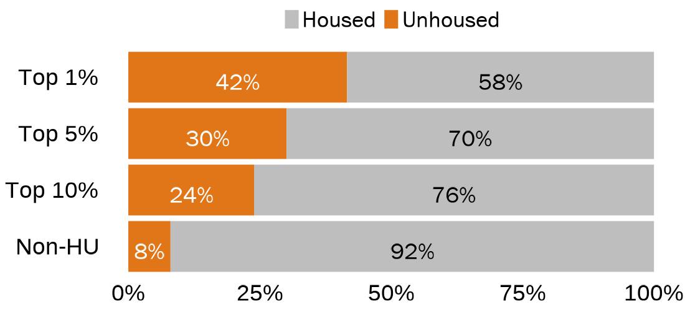
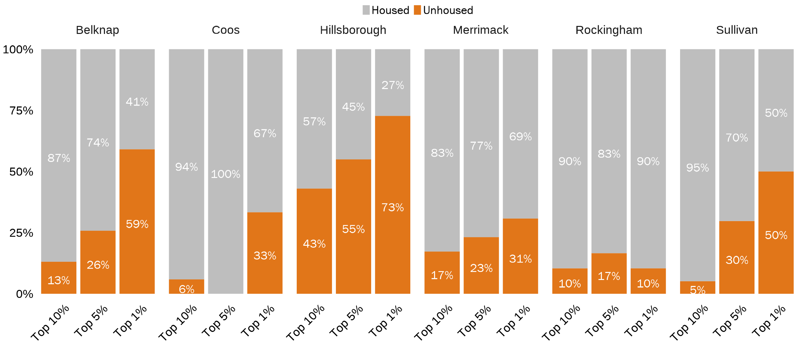

```{r setup, include=FALSE}
knitr::opts_chunk$set(
  echo=FALSE, 
  message=FALSE, 
  warning=FALSE,
  dev = "ragg_png",
  cache = FALSE
  )

# Load functions, packages, and data
source("data_cleaning/00_library.R")
source("data_cleaning/01_functions.R")
source("data_cleaning/rdas.R")

# Save dataframe for this analysis
# See if someone was unhoused at any booking
df_housing_entrances <- bookings_entrances %>% 
  filter(county != "Cheshire" & county != "Strafford" & county != "Carroll") %>% 
  filter(housing != "Unknown" & !is.na(housing)) %>% 
  dplyr::group_by(id) %>%
  mutate(all_housing_types=paste(sort(unique(housing)), collapse="&")) %>%
  mutate(housing_in_booking = case_when(all_housing_types == 'Housed&Unhoused' | 
                                        all_housing_types == 'Unhoused'          ~ "Unhoused",
                                        all_housing_types == "Housed"            ~ "Housed"))

# Save number of entrances by county and by fiscal year
df_entrances_county_fy <- df_housing_entrances %>%
  select(booking_id, fy, county) %>%
  distinct() %>%
  group_by(fy, county) %>%
  summarise(total = n()) %>%
  spread(fy, total) %>% 
  clean_names() %>% 
  mutate(total = x2019+x2020+x2021)

# Save number of entrances by county
df_entrances_county <- df_housing_entrances %>%
  select(booking_id, county) %>%
  distinct() %>%
  group_by(county) %>%
  summarise(total = n()) %>%
  clean_names()

# Save number of people by county and by fiscal year
df_people_county_fy <- df_housing_entrances %>%
  dplyr::ungroup() %>%
  dplyr::select(id, fy, county) %>%
  dplyr::distinct() %>%
  dplyr::group_by(county, fy) %>%
  dplyr::summarise(total = n()) 

# Save number of people by county 
df_people_county <- df_housing_entrances %>%
  dplyr::ungroup() %>%
  dplyr::select(id, county) %>%
  dplyr::distinct() %>%
  dplyr::group_by(county) %>%
  dplyr::summarise(number_of_people = n()) 
```

The following counties provided reliable data on housing:  

- Belknap  
- Coos  
- Hillsborough  
- Merrimack  
- Rockingham  
- Sullivan  

## Housing by County  

```{r}
# Count number and proportion of people who were housing by county and by fiscal year
housing_county <- df_housing_entrances %>% 
  select(id, county, housing_in_booking) %>% 
  distinct() %>% 
  group_by(county, housing_in_booking) %>% 
  summarise(total = n()) %>% 
  spread(housing_in_booking, total) %>% 
  clean_names() %>% 
  left_join(df_people_county, by = "county") %>% 
  adorn_totals("row") %>% 
  mutate(pct_unhoused = unhoused/number_of_people,
         pct_housed   = housed/number_of_people)

# Reactable table
reactable(housing_county,
          style = list(fontFamily = "Franklin Gothic Book", fontSize = "1.0rem"),
          pagination = FALSE,
          theme = reactableTheme(cellStyle = list(display = "flex", flexDirection = "column", justifyContent = "center"),
                                 headerStyle = list(display = "flex", flexDirection = "column", justifyContent = "center")),
          defaultColDef = reactable::colDef(
            format = colFormat(separators = TRUE), align = "left", minWidth = 100
          ),
          rowStyle = function(index) {
              if (index %in% c(7)) {
                list(`border-top` = "thin solid",
                     fontWeight = "bold")
              }
            },
          compact = TRUE,
          fullWidth = FALSE,
          columns = list(
            county           = colDef(name = "County", minWidth = 200, style = list(fontWeight = "bold")),
            unhoused         = colDef(name = "Unhoused (N)", minWidth = 100),
            housed     = colDef(name = "Housed (N)", minWidth = 100),
            number_of_people = colDef(name = "Total Number of People (N)", minWidth = 100,
                                      style = list(position = "sticky", borderRight = "1px solid #d3d3d3")),
            pct_unhoused     = colDef(name = "Unhoused (%)", minWidth = 100, format = colFormat(percent = TRUE, digits = 0)),
            pct_housed = colDef(name = "Housed (%)", minWidth = 100, format = colFormat(percent = TRUE, digits = 0))
            )
          ) %>%
add_source(paste(""), font_style = "italic", font_size = 14)
```

<br>

## High utlizers and housing (State-wide)

**42% of Top 1% high utilizers were unhoused at least once when they were booked into jail.**

```{r}
# Count number and proportion of HUs who were unhoused by county and by fiscal year
housing_hu <- df_housing_entrances %>% 
  select(id, housing_in_booking, hu_group_exclusive) %>% 
  distinct() %>% 
  group_by(housing_in_booking, hu_group_exclusive) %>% 
  summarise(total = n()) %>% 
  spread(housing_in_booking, total) %>% 
  clean_names() %>% 
  adorn_totals("row") %>% 
  mutate(number_of_people = unhoused + housed,
         pct_unhoused     = unhoused/number_of_people,
         pct_housed = housed/number_of_people)

# Get totals for HU's
housing_hu_total <- df_housing_entrances %>%
  filter(hu_group_exclusive == "Top 1%" | 
         hu_group_exclusive == "Top 5%" |
         hu_group_exclusive == "Top 10%") %>% 
  select(id, housing_in_booking) %>%
  distinct() %>%
  group_by(housing_in_booking) %>%
  summarise(total = n()) %>%
  spread(housing_in_booking, total) %>%
  clean_names() %>%
  mutate(hu_group_exclusive = "All HUs",
         number_of_people = unhoused + housed,
         pct_unhoused     = unhoused/number_of_people,
         pct_housed       = housed/number_of_people)

# Add totals to table and set up for viewing
housing_hu_breakdown <- rbind(housing_hu, housing_hu_total)
housing_hu_breakdown <- housing_hu_breakdown %>% 
  mutate(pct_unhoused = paste(round(pct_unhoused*100, 0), "%", sep = ""),
         pct_housed   = paste(round(pct_housed*100, 0), "%", sep = ""),
         arrange      = case_when(hu_group_exclusive == "All HUs" ~ 1,
                                  hu_group_exclusive == "Top 1%"  ~ 2,
                                  hu_group_exclusive == "Top 5%"  ~ 3,
                                  hu_group_exclusive == "Top 10%" ~ 4,
                                  hu_group_exclusive == "Non-HU"  ~ 5,
                                  hu_group_exclusive == "Total"   ~ 6)) %>% 
  arrange(arrange) %>% 
  select(-arrange) %>% 
  select(hu_group_exclusive, unhoused, housed, everything())

# Reactable table
reactable(housing_hu_breakdown,
          style = list(fontFamily = "Franklin Gothic Book", fontSize = "1.0rem"),
          pagination = FALSE,
          theme = reactableTheme(cellStyle = list(display = "flex", flexDirection = "column", justifyContent = "center"),
                                 headerStyle = list(display = "flex", flexDirection = "column", justifyContent = "center")),
          defaultColDef = reactable::colDef(
            format = colFormat(separators = TRUE), align = "left", minWidth = 100
          ),
          rowStyle = function(index) {
              if (housing_hu_breakdown[index, "hu_group_exclusive"] == "Top 1%") {
                  list(fontWeight = "bold",
                       color = jri_light_blue)
              } else if(housing_hu_breakdown[index, "hu_group_exclusive"] == "Top 5%"){
                 list(fontWeight = "bold",
                       color = jri_green)
              } else if(housing_hu_breakdown[index, "hu_group_exclusive"] == "Top 10%"){
                 list(fontWeight = "bold",
                       color = jri_orange)
              } else if (index %in% c(6)) {
                list(`border-top` = "thin solid",
                     fontWeight = "bold")
              }
          },
          compact = TRUE,
          fullWidth = FALSE,
          columns = list(
            hu_group_exclusive = colDef(name = "", minWidth = 200, style = list(fontWeight = "bold")),
            unhoused           = colDef(name = "Unhoused (N)", minWidth = 100),
            housed             = colDef(name = "Housed (N)", minWidth = 100),
            number_of_people   = colDef(name = "Total Number of People (N)", minWidth = 100,
                                        style = list(position = "sticky", borderRight = "1px solid #d3d3d3")),
            pct_unhoused       = colDef(name = "Unhoused (%)", minWidth = 100, format = colFormat(percent = TRUE, digits = 0)),
            pct_housed         = colDef(name = "Housed (%)", minWidth = 100, format = colFormat(percent = TRUE, digits = 0))
            )
          ) %>%
add_source(paste(""), font_style = "italic", font_size = 14)
```

```{r}
housing_hu_pct <- housing_hu %>% 
  select(hu_group_exclusive, Unhoused = pct_unhoused, Housed = pct_housed) %>% 
  filter(hu_group_exclusive != "Total")

# Change from wide to long format
housing_hu_pct <- gather(housing_hu_pct, population, pct, Unhoused:Housed, factor_key=TRUE)
housing_hu_pct <- housing_hu_pct %>%
  mutate(hu_group_exclusive = factor(hu_group_exclusive,
         levels = c("Non-HU", "Top 10%", "Top 5%", "Top 1%"),
         labels = c("Non-HU", "Top 10%", "Top 5%", "Top 1%")),
         population = factor(population,
                             levels = c("Unhoused",
                                        "Housed")))

# Stacked + percent
PRES_gg_hu_homeless <- ggplot(housing_hu_pct, aes(fill=forcats::fct_rev(population), y=pct, x=reorder(hu_group_exclusive, -pct))) + 
    geom_bar(position="fill", stat="identity") +
    scale_y_continuous(labels = scales::percent) +
    scale_fill_manual(values=c("gray", jri_orange),
                      na.value = "white") +
    geom_text(aes(label = paste(round(pct*100, 0), "%", sep = ""), 
                  fontface = 'bold'),
              position = position_fill(vjust = 0.5),
              vjust = 0.8,
              size = 10, family = "Franklin Gothic Book",
              color = case_when(housing_hu_pct$population == "Unhoused" ~ "white",
                                TRUE ~ "black")) +
    coord_flip() +
    theme_minimal() +
    theme(panel.grid.minor.y = element_blank(),
          panel.grid.major.y = element_blank(),
          panel.grid.major.x = element_blank(),
          panel.grid.minor.x = element_blank(),
          axis.title.y = element_blank(),
          axis.title.x = element_blank(),
          axis.text.x = element_text(size = 28, color = "black"),
          axis.text.y = element_text(size = 28, color = "black"),
          legend.position = "top",
          # legend.justification = c(1, 0.5),
          legend.title=element_blank(),
          legend.text = element_text(family = "Franklin Gothic Book", size = 28, color = "black")) 

```
```{r, out.width="100%", echo=FALSE, layout = "l-body"}
ggsave(PRES_gg_hu_homeless, file="img/PRES_gg_hu_homeless.png", width = 11,  height = 5, dpi = 100)

```

<br>

## High utlizers and housing (County)

```{r}
# Count number and proportion of HUs who were unhoused by county and by fiscal year
housing_hu_county <- df_housing_entrances %>% 
  select(id, county, housing_in_booking, hu_group_exclusive) %>% 
  distinct() %>% 
  group_by(county, housing_in_booking, hu_group_exclusive) %>% 
  summarise(total = n()) %>% 
  spread(housing_in_booking, total) %>% 
  clean_names() %>% 
  mutate_at(c("housed",
              "unhoused"), ~replace_na(.,0)) %>% 
  mutate(number_of_people = unhoused + housed,
         pct_unhoused     = unhoused/number_of_people,
         pct_housed = housed/number_of_people)

# Get totals by county for HU's
housing_hu_county_total <- df_housing_entrances %>%
  filter(hu_group_exclusive == "Top 1%" | 
         hu_group_exclusive == "Top 5%" |
         hu_group_exclusive == "Top 10%") %>% 
  select(id, county, housing_in_booking) %>%
  distinct() %>%
  group_by(county, housing_in_booking) %>%
  summarise(total = n()) %>%
  spread(housing_in_booking, total) %>%
  clean_names() %>%
  mutate(hu_group_exclusive = "All HUs",
         number_of_people = unhoused + housed,
         pct_unhoused     = unhoused/number_of_people,
         pct_housed       = housed/number_of_people)

# Add totals to table and set up for viewing
housing_hu_county_breakdown <- rbind(housing_hu_county, housing_hu_county_total)
housing_hu_county_breakdown <- housing_hu_county_breakdown %>% arrange(county) %>% 
  mutate(pct_unhoused = paste(round(pct_unhoused*100, 0), "%", sep = ""),
         pct_housed   = paste(round(pct_housed*100, 0), "%", sep = ""),
         arrange      = case_when(hu_group_exclusive == "All HUs" ~ 1,
                                  hu_group_exclusive == "Top 1%"  ~ 2,
                                  hu_group_exclusive == "Top 5%"  ~ 3,
                                  hu_group_exclusive == "Top 10%" ~ 4,
                                  hu_group_exclusive == "Non-HU"  ~ 5)) %>% 
  arrange(arrange) %>% 
  select(-arrange) %>% 
  select(county, hu_group_exclusive, unhoused, housed, everything())

# Create reactable table with expandable rows for details in each county
reactable(
  housing_hu_county_breakdown,
  groupBy = "county",
  style = list(fontFamily = "Franklin Gothic Book", fontSize = "1.0rem"),
          pagination = FALSE,
          theme = reactableTheme(cellStyle = list(display = "flex", flexDirection = "column", justifyContent = "center"),
                                 headerStyle = list(display = "flex", flexDirection = "column", justifyContent = "center")),
          defaultExpanded = TRUE,
          defaultColDef = reactable::colDef(
            format = colFormat(separators = TRUE), align = "left", minWidth = 100
          ),
          rowStyle = function(index) {
              if (index %in% c(1, 2, 3, 4, 5, 6)) {
                list(`border-top` = "thin solid",
                     fontWeight = "bold")
              }
              else if (housing_hu_county_breakdown[index, "hu_group_exclusive"] == "Top 1%") {
                  list(fontWeight = "bold",
                       color = jri_light_blue)
              } else if(housing_hu_county_breakdown[index, "hu_group_exclusive"] == "Top 5%"){
                 list(fontWeight = "bold",
                       color = jri_green)
              } else if(housing_hu_county_breakdown[index, "hu_group_exclusive"] == "Top 10%"){
                 list(fontWeight = "bold",
                       color = jri_orange)
              }
          },
          compact = TRUE,
          fullWidth = FALSE,
          columns = list(
            county             = colDef(name = "County", minWidth = 175, 
                                        style = list(fontWeight = "bold"),
                                              grouped = JS("function(cellInfo) {return cellInfo.value}")), # remove paranthesis around county showing number of drop down options
            hu_group_exclusive = colDef(name = "", minWidth = 175),
                                        
            unhoused           = colDef(name = "Unhoused (N)", minWidth = 100),
            housed             = colDef(name = "Housed (N)", minWidth = 100),
            number_of_people   = colDef(name = "Total Number of People (N)", minWidth = 100,
                                        style = list(position = "sticky", borderRight = "1px solid #d3d3d3")),
            pct_unhoused       = colDef(name = "Unhoused (%)", minWidth = 100, 
                                        format = colFormat(percent = TRUE, digits = 0)),
            pct_housed         = colDef(name = "Housed (%)", minWidth = 100, format = colFormat(percent = TRUE, digits = 0))
            )
          ) %>%
add_source(paste(""), font_style = "italic", font_size = 14)
```
<br>

```{r}
housing_hu_county_pct <- housing_hu_county %>% 
  select(hu_group_exclusive, Unhoused = pct_unhoused, Housed = pct_housed) %>% 
  filter(hu_group_exclusive != "Total" & hu_group_exclusive != "Non-HU")

# Change from wide to long format
housing_hu_county_pct <- gather(housing_hu_county_pct, population, pct, Unhoused:Housed, factor_key=TRUE)
housing_hu_county_pct <- housing_hu_county_pct %>%
  mutate(hu_group_exclusive = factor(hu_group_exclusive,
         levels = c("Non-HU", "Top 10%", "Top 5%", "Top 1%"),
         labels = c("Non-HU", "Top 10%", "Top 5%", "Top 1%")),
         population = factor(population,
                             levels = c("Unhoused",
                                        "Housed")))

# Stacked + percent
PRES_gg_hu_homeless_county <- 
  ggplot(housing_hu_county_pct, aes(fill=forcats::fct_rev(population), y=pct, x=reorder(hu_group_exclusive, -pct))) + 
    geom_bar(position="fill", stat="identity") +
    facet_grid(~ county) +
    scale_y_continuous(labels = scales::percent) +
    scale_fill_manual(values=c("gray", jri_orange),
                      na.value = "white") +
    geom_text(aes(label = ifelse(pct == 0, "", paste(round(pct*100, 0), "%", sep = "")),
                  fontface = 'bold'),
              position = position_fill(vjust = 0.5),
              vjust = 0.8,
              size = 10, family = "Franklin Gothic Book",
              color = case_when(housing_hu_county_pct$population == "Unhoused" ~ "white",
                                TRUE ~ "white")) +
    #coord_flip() +
    theme_minimal() +
    theme(panel.grid.minor.y = element_blank(),
          panel.grid.major.y = element_blank(),
          panel.grid.major.x = element_blank(),
          panel.grid.minor.x = element_blank(),
          axis.title.y = element_blank(),
          axis.title.x = element_blank(),
          axis.text.x = element_text(angle = 45, hjust = 0.85, size = 28, color = "black"),
          axis.text.y = element_text(size = 28, color = "black"),
          legend.position = "top",
          # legend.justification = c(1, 0.5),
          legend.title=element_blank(),
          legend.text = element_text(family = "Franklin Gothic Book", size = 28, color = "black"),
          strip.text.x = element_text(size = 28)) 
```

```{r, out.width="100%", echo=FALSE, layout = "l-body"}
ggsave(PRES_gg_hu_homeless_county, file="img/PRES_gg_hu_homeless_county.png", width = 25,  height = 11, dpi = 100)

```


<br><br>
