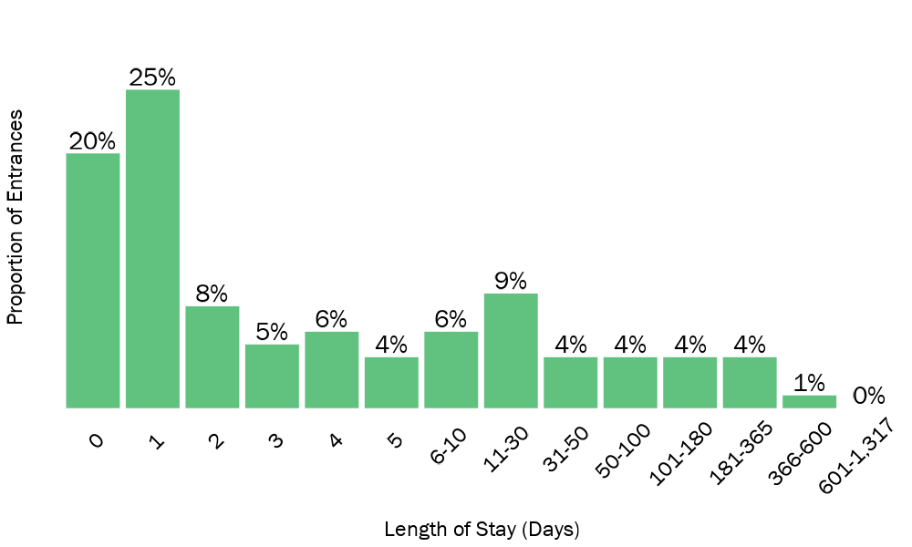
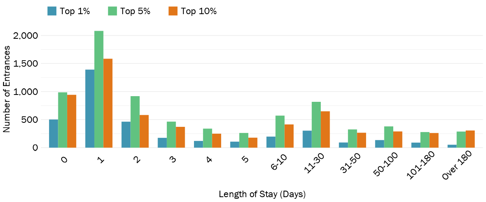
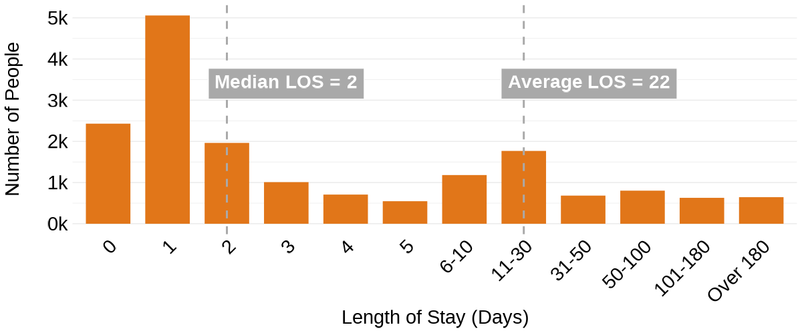
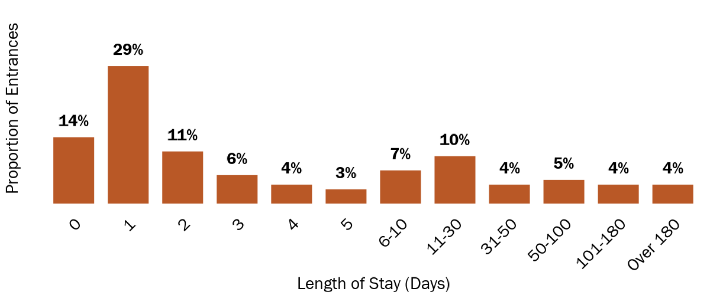
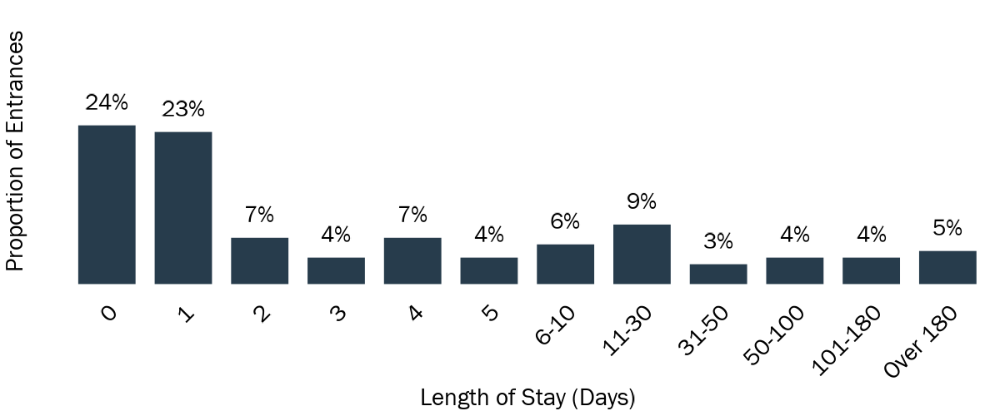
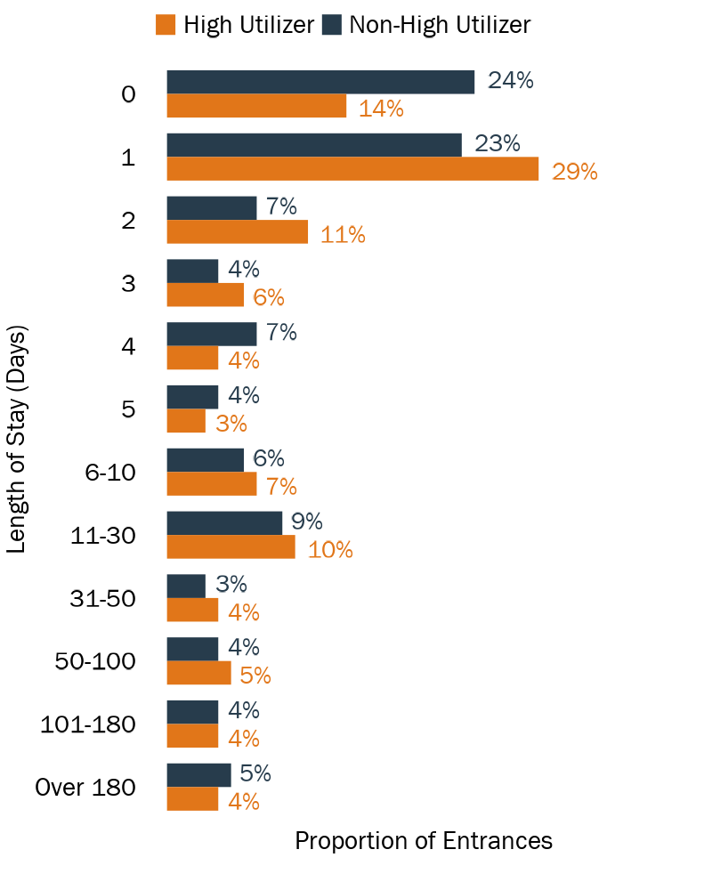
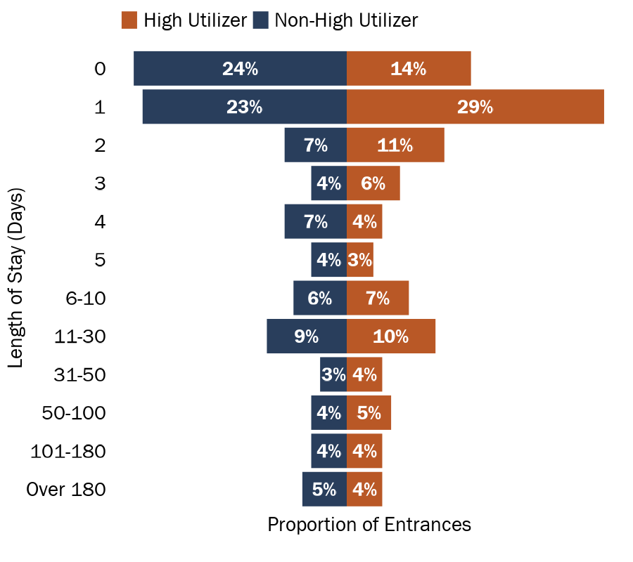
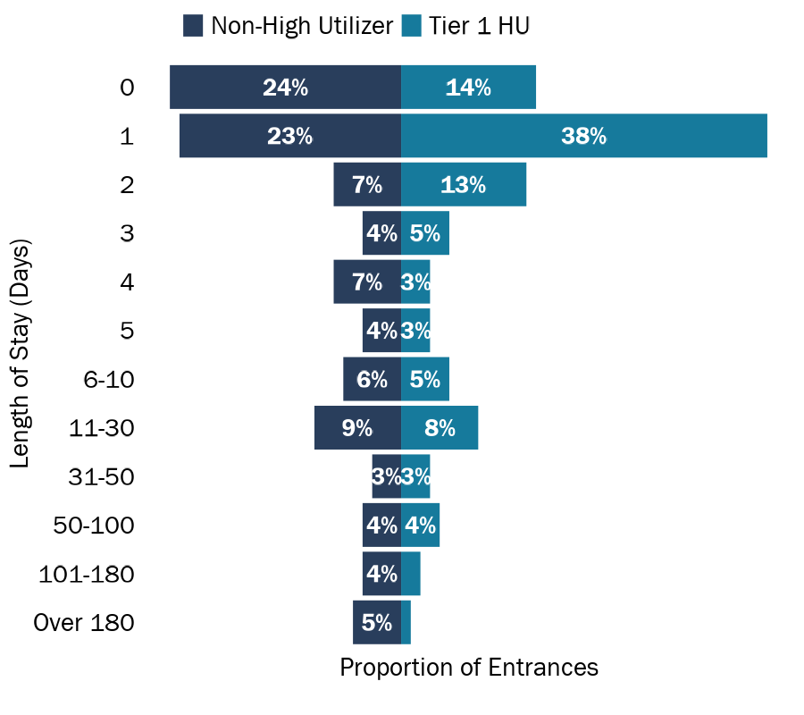

```{r setup, include=FALSE}
knitr::opts_chunk$set(
  echo=FALSE, 
  message=FALSE, 
  warning=FALSE,
  dev = "ragg_png",
  cache = FALSE
  )

# Load packages, functions and Medicaid data
source("data_cleaning/00_library.R")
source("data_cleaning/01_functions.R")
medicaid_jail_all <- read_rds("D:/Analytic/medicaid_jail_all.rds") 

# Change HU variable to 1% = 1 percent, 5% = 2-5 percent, 10% = 6-10 percent
medicaid_jail_all <- fnc_hu_group_exclusive(medicaid_jail_all)
```

# Length of Stay, Statewide from 2019 to 2021

```{r}
# DHHS data
# Rename variables
# Get fiscal year based on booking date
# Get los and los category
entrances_dhhs <- medicaid_jail_all %>% 
  mutate(id = unique_person_id,
         fy = case_when(booking_date > "2018-06-30" & booking_date < "2019-07-01" ~ 2019,
                        booking_date > "2019-06-30" & booking_date < "2020-07-01" ~ 2020,
                        booking_date > "2020-06-30" & booking_date < "2021-07-01" ~ 2021),
         booking_date = ymd(as_date(booking_date)),
         release_date = ymd(as_date(release_date)), 
         jail_los = as.numeric(difftime(release_date,
                                        booking_date,
                                        units="days"))) %>% 
    mutate(los_category =
           case_when(jail_los == 0 ~ "0",
                     jail_los == 1 ~ "1",
                     jail_los == 2 ~ "2",
                     jail_los == 3 ~ "3",
                     jail_los == 4 ~ "4",
                     jail_los == 5 ~ "5",
                     jail_los >= 6   & jail_los <= 10  ~ "6-10",
                     jail_los >= 11  & jail_los <= 30  ~ "11-30",
                     jail_los >= 31  & jail_los <= 50  ~ "31-50",
                     jail_los >= 50  & jail_los <= 100 ~ "50-100",
                     jail_los >= 101 & jail_los <= 180 ~ "101-180",
                     jail_los >  180                   ~ "Over 180")) %>%
  mutate(los_category = factor(los_category,
                               levels = c("0",
                                          "1",
                                          "2",
                                          "3",
                                          "4",
                                          "5",
                                          "6-10",
                                          "11-30",
                                          "31-50",
                                          "50-100",
                                          "101-180",
                                          "Over 180")))

# Length of stay for all people
# Remove instances where release date is earlier than booking date and NAs
df_jail_los_entrances <- entrances_dhhs %>%
  select(fy,
         county,
         id,
         booking_id,
         jail_los,
         los_category,
         hu_group_exclusive) %>%
  distinct() %>%
  filter(!is.na(jail_los) & jail_los >= 0)

# Get min med mean max of jail entrances for all 
overall_los_summary <- df_jail_los_entrances %>%
  group_by() %>%
  summarise(
    min    = min(jail_los, na.rm = T),
    median = median(jail_los, na.rm = T),
    mean   = mean(c(jail_los, na.rm = T)),
    max    = max(jail_los, na.rm = T)) %>%
  mutate(mean = round(mean, 1)) %>% 
  mutate(hu_group_exclusive = "All (HU's and non-HU's)") %>% select(hu_group_exclusive, everything())

# Get min med mean max of jail entrances for High Utilizers
hu_los_summary <- df_jail_los_entrances %>%
  group_by(hu_group_exclusive) %>%
  summarise(
    min    = min(jail_los, na.rm = T),
    median = median(jail_los, na.rm = T),
    mean   = mean(c(jail_los, na.rm = T)),
    max    = max(jail_los, na.rm = T)) %>%
  mutate(mean = round(mean, 1)) 

# Add together
hu_los_summary <- rbind(hu_los_summary, overall_los_summary)

# Reactable table
reactable(hu_los_summary,
          pagination = FALSE,
          style = list(fontFamily = "Franklin Gothic Book", fontSize = "1.0rem"),
          theme = reactableTheme(cellStyle = list(display = "flex", flexDirection = "column", justifyContent = "center")),
          defaultColDef = reactable::colDef(
            format = colFormat(separators = TRUE), align = "left"),
          compact = TRUE,
          fullWidth = FALSE,
          rowStyle = function(index) {
            if (index %in% c(5)) {
              list(`border-top` = "thin solid",
                   fontWeight = "bold")
            }
          },
          columns = list(
            hu_group_exclusive = colDef(minWidth = 190, name = "",
                                 style = list(fontWeight = "bold", position = "sticky", borderRight = "1px solid #d3d3d3")),
            min    = colDef(minWidth = 90, name = "Minimum"),
            median = colDef(minWidth = 90, name = "Median"),
            mean   = colDef(minWidth = 90, name = "Mean"),
            max    = colDef(minWidth = 90, name = "Maximum")))
```

```{r}
data1 <- df_jail_los_entrances %>% 
    mutate(los_category =
         case_when(jail_los == 0 ~ "0",
                   jail_los == 1 ~ "1",
                   jail_los == 2 ~ "2",
                   jail_los == 3 ~ "3",
                   jail_los == 4 ~ "4",
                   jail_los == 5 ~ "5",
                   jail_los >= 6   & jail_los <= 10  ~ "6-10",
                   jail_los >= 11  & jail_los <= 30  ~ "11-30",
                   jail_los >= 31  & jail_los <= 50  ~ "31-50",
                   jail_los >= 50  & jail_los <= 100 ~ "50-100",
                   jail_los >= 101 & jail_los <= 180 ~ "101-180",
                   jail_los >= 181 & jail_los <= 365 ~ "181-365",
                   jail_los >= 366 & jail_los <= 600 ~ "366-600",
                   jail_los >= 601 & jail_los <= 1317 ~ "601-1,317")) %>%
    group_by(los_category) %>% 
    summarise(total = n()) %>% 
    mutate(pct = total/sum(total)) %>%
    mutate(pct = round(pct, 2),
           pct_label = paste0(round(pct*100,0), "%")) %>% 
    mutate(los_category = factor(los_category,
                   levels = c("0",
                              "1",
                              "2",
                              "3",
                              "4",
                              "5",
                              "6-10",
                              "11-30",
                              "31-50",
                              "50-100",
                              "101-180",
                              "181-365",
                              "366-600",
                              "601-1,317"))) 
  
PRES_gg_los_category <- data1 %>%
  ggplot(aes(x = los_category, y = pct, fill = jri_dark_blue))+
  geom_bar(stat = "identity") +
  labs(x = "Length of Stay (Days)", y = "Proportion of Entrances\n") +
  geom_text(aes(#label = ifelse(pct > .02 | pct < 0, pct_label, "")),
           label = pct_label),
           size = 7.5, family = "Franklin Gothic Book",
           position=position_dodge(width=0.9), vjust=-0.25,
           color = "black",
           fontface = "bold") + 
  scale_fill_manual(values=c(jri_green)) +
  scale_y_continuous(limits = c(0,0.3)) +
  theme_minimal() +
  theme_no_axes +
  theme(
    axis.text.x = element_text(size = 18, color = "black", angle = 45, hjust = 0.75),
    axis.text.y = element_blank(),
    axis.title.x = element_text(size = 18, color = "black"),
    axis.title.y = element_text(size = 18, color = "black"),
    panel.grid.major.x = element_blank(),
    panel.grid.minor.x = element_blank(),
    legend.position = "none",
    legend.title=element_blank()
  )
```

```{r, out.width="100%", echo=FALSE, layout = "l-body"}
ggsave(PRES_gg_los_category, file="img/PRES_gg_los_category.png", width = 10,  height = 6, dpi = 100)

```

```{r}
# Filter to LOS for all HU's
data1 <- df_jail_los_entrances %>% 
  filter(hu_group_exclusive != "Non-HU") %>% 
  group_by(hu_group_exclusive,los_category) %>% 
  summarise(total = n()) 

gg_los_category <- ggplot(data1, aes(los_category, total)) +
  geom_bar(aes(fill = hu_group_exclusive), position = "dodge", stat="identity", width = 0.75) +
  scale_fill_manual(values=c(jri_light_blue, jri_green, jri_orange),
                    labels = c("Top 1%      ","Top 5%      ", "Top 10%")) +
  scale_y_continuous(labels = label_number(big.mark = ",")) +
  xlab("Length of Stay (Days)") + ylab("Number of Entrances") +
  theme_minimal(base_family = "Franklin Gothic Book") +
  theme(
    axis.text.x = element_text(size = 18, color = "black", angle = 45, hjust = 0.75),
    axis.text.y = element_text(size = 18, color = "black"),
    axis.title.x = element_text(size = 18, color = "black"),
    axis.title.y = element_text(size = 18, color = "black"),
    panel.grid.major.x = element_blank(),
    panel.grid.minor.x = element_blank(),
    legend.position = "top",
    legend.justification = c(0, 0),
    legend.title=element_blank(),
    legend.text = element_text(family = "Franklin Gothic Book", size = 18, color = "black")
  )
```

```{r, out.width="100%", echo=FALSE, layout = "l-body"}
ggsave(gg_los_category, file="img/gg_los_category.png", width = 12,  height = 5, dpi = 100)

```

**Average and Median Length of Stay for High Utilizers**

```{r}
# Filter to LOS for all HU's
data1 <- df_jail_los_entrances %>% 
  filter(hu_group_exclusive != "Non-HU") %>% 
  group_by(los_category) %>% 
  summarise(total = n()) 

gg_hu_los_category <- ggplot(data1) +

  geom_bar(aes(x = los_category, y = total, fill = jri_orange), stat="identity", width = 0.75) +
  labs(x = "Length of Stay (Days)", y = "Number of Entrances\n") +
  scale_fill_manual(values=c(jri_orange)) +

  # Median
  geom_vline(xintercept = 3, linetype = "dashed", colour = "darkgray",size = 1) +
  geom_richtext(aes(x=3, y=3400, label="Median LOS = 2"),
                color = "white",
                size = 7.5,
                fontface = 'bold',
                fill = "darkgray",
                label.r = unit(0, "lines"),
                label.padding = unit(c(.5, .5, .5, .5), "lines"),
                nudge_x = 1,
                #angle = 90
                ) +

  # Mean
  geom_vline(xintercept = 8, linetype = "dashed", colour = "darkgray",size = 1) +
  geom_richtext(aes(x=8, y=3400, label="Average LOS = 22"),
                color = "white",
                size = 7.5,
                fontface = 'bold',
                fill = "darkgray",
                label.r = unit(0, "lines"),
                label.padding = unit(c(.5, .5, .5, .5), "lines"),
                nudge_x = 1.1,
                ) +
  
  scale_y_continuous(labels = label_number(suffix = "k", scale = 1e-3, big.mark = ",")) +

  theme_minimal() +
  theme(axis.text.x = element_text(angle = 45,size = 22, color = "black",
                                   hjust=1),
        axis.text.y = element_text(size = 22, color = "black"),
        axis.title = element_text(color = "black"),
        axis.title.y = element_text(size = 22, color = "black"),
        axis.title.x = element_text(size = 22, color = "black"),
        panel.grid.major.x = element_blank(),
        panel.grid.minor.x = element_blank(),
        legend.position = "none")

```

```{r, out.width="100%", echo=FALSE, layout = "l-body"}
ggsave(gg_hu_los_category, file="img/gg_hu_los_category.png", width = 12,  height = 5, dpi = 100)

```

**Proportion of entrances for HU's with each LOS category**

```{r}
# Filter to LOS for all HU's and calculate number of entrances/prop of entrances with los category
hu_los_prop <- df_jail_los_entrances %>% 
  filter(hu_group_exclusive != "Non-HU") %>% 
  group_by(los_category) %>% 
  summarise(total = n()) %>% 
  mutate(pct = total/sum(total)) %>%
  mutate(pct = round(pct, 2),
         pct_label = paste0(round(pct*100,0), "%"),
         hu_group_exclusive = "High Utilizer")

PRES_gg_los_prop <- ggplot(hu_los_prop, aes(x = los_category, y = pct, fill = jri_orange)) +

  geom_bar(stat="identity", width = 0.75) +
  labs(x = "Length of Stay (Days)", y = "Proportion of Entrances\n") +
  
  geom_text(aes(label = pct_label, fontface = 'bold'), #position = position_fill(vjust = 0.5),
            vjust = -1,
          size = 7.5, family = "Franklin Gothic Book",
          color = "black") +
  
  scale_fill_manual(values=c(jri_orange)) +
  scale_y_continuous(labels = scales::percent, limits = c(0, .4)) +
  theme_minimal() +
  theme_no_axes +
  theme(axis.text.x = element_text(angle = 45,size = 22, color = "black",
                                   hjust=1),
        axis.text.y = element_blank(),
        axis.title.y = element_text(size = 22, color = "black"),
        axis.title.x = element_text(size = 22, color = "black"),
        panel.grid.major.x = element_blank(),
        panel.grid.minor.x = element_blank(),
        legend.position = "none")

```

```{r, out.width="50%", echo=FALSE, layout = "l-body"}
ggsave(PRES_gg_los_prop, file="img/PRES_gg_los_prop.png", width = 12,  height = 5, dpi = 100)

```

**Proportion of entrances for non-HU's with each LOS category**

```{r}
# Filter to LOS for all non-HU's and calculate number of entrances/prop of entrances with los category
non_hu_los_prop <- df_jail_los_entrances %>% 
  filter(hu_group_exclusive == "Non-HU") %>% 
  group_by(los_category) %>% 
  summarise(total = n()) %>% 
  mutate(pct = total/sum(total)) %>%
  mutate(pct = round(pct, 2),
         pct_label = paste0(round(pct*100,0), "%"),
         hu_group_exclusive = "Non-High Utilizer")

PRES_gg_nonhu_los_prop <- ggplot(non_hu_los_prop, aes(x = los_category, y = pct, fill = jri_orange)) +

  geom_bar(stat="identity", width = 0.75) +
  labs(x = "Length of Stay (Days)", y = "Proportion of Entrances\n") +
  
  geom_text(aes(label = pct_label, fontface = 'bold'), #position = position_fill(vjust = 0.5),
            vjust = -1,
          size = 7.5, family = "Franklin Gothic Book",
          color = "black") +
  
  scale_fill_manual(values=c(jri_dark_blue)) +
  scale_y_continuous(labels = scales::percent, limits = c(0, .4)) +
  theme_minimal() +
  theme_no_axes +
  theme(axis.text.x = element_text(angle = 45,size = 22, color = "black",
                                   hjust=1),
        axis.text.y = element_blank(),
        axis.title.y = element_text(size = 22, color = "black"),
        axis.title.x = element_text(size = 22, color = "black"),
        panel.grid.major.x = element_blank(),
        panel.grid.minor.x = element_blank(),
        legend.position = "none")

```

```{r, out.width="50%", echo=FALSE, layout = "l-body"}
ggsave(PRES_gg_nonhu_los_prop, file="img/PRES_gg_nonhu_los_prop.png", width = 12,  height = 5, dpi = 100)

```

```{r}
los_prop <- rbind(non_hu_los_prop, hu_los_prop)
los_prop <- los_prop %>%
  mutate(los_category = factor(los_category,
                   levels = c("Over 180",
                              "101-180",
                              "50-100",
                              "31-50",
                              "11-30",
                              "6-10",
                              "5",
                              "4",
                              "3",
                              "2",
                              "1",
                              "0")))
# 
# PRES_gg_nonhu_hu_los_prop <- ggplot(los_prop, aes(x = los_category, y = pct, fill = hu_group_exclusive)) +
# 
#   geom_bar(position="dodge", stat="identity", width = 0.75) +
#   labs(x = "Length of Stay (Days)", y = "Proportion of Entrances\n") +
#   
#   geom_text(aes(label = pct_label, fontface = 'bold'), 
#             position = position_dodge(width = .9),
#             hjust = -.3,
#             size = 7.5, family = "Franklin Gothic Book",
#             color = ifelse(los_prop$hu_group_exclusive == "Non-High Utilizer", jri_dark_blue, jri_orange)) +
#   
#   scale_fill_manual(values=c(jri_orange, jri_dark_blue)) +
#   scale_y_continuous(labels = scales::percent, limits = c(0, .4)) +
#   theme_minimal() +
#   theme_no_axes +
#   coord_flip() +
#   theme(axis.text.x = element_blank(),
#         #axis.text.y = element_blank(),
#         axis.title.y = element_text(size = 22, color = "black"),
#         axis.title.x = element_text(size = 22, color = "black"),
#         panel.grid.major.x = element_blank(),
#         panel.grid.minor.x = element_blank(),
#         legend.position = "top",
#         legend.justification = c(0, 0),
#         legend.title=element_blank())
```

```{r, out.width="100%", echo=FALSE, layout = "l-body"}
# ggsave(PRES_gg_nonhu_hu_los_prop, file="img/PRES_gg_nonhu_hu_los_prop.png", width = 8,  height = 10, dpi = 100)
# 
```

```{r}
PRES_gg_diverge_nonhu_hu_los_prop <- los_prop %>%
  mutate(pct = ifelse(hu_group_exclusive == "High Utilizer",
                                 pct,
                                 -1*pct)) %>% 
  ggplot(aes(x = los_category, y = pct, fill = hu_group_exclusive))+
  geom_bar(stat = "identity") +
  labs(x = "Length of Stay (Days)", y = "Proportion of Entrances\n") +
  geom_text(aes(label = pct_label),
           size = 7.5, family = "Franklin Gothic Book",
           position = position_stack(vjust = 0.5),
           color = "white",
           fontface = "bold") + 
  
  scale_fill_manual(values=c(jri_orange, jri_dark_blue)) +
  theme_minimal() +
  theme_no_axes +
  coord_flip() +
  theme(axis.text.x = element_blank(),
        #axis.text.y = element_blank(),
        axis.title.y = element_text(size = 22, color = "black"),
        axis.title.x = element_text(size = 22, color = "black"),
        panel.grid.major.x = element_blank(),
        panel.grid.minor.x = element_blank(),
        legend.position = "top",
        legend.justification = c(0, 0),
        legend.title=element_blank())
```

```{r, out.width="100%", echo=FALSE, layout = "l-body"}
ggsave(PRES_gg_diverge_nonhu_hu_los_prop, file="img/PRES_gg_diverge_nonhu_hu_los_prop.png", width = 9,  height = 8, dpi = 100)

```
```{r}
# Filter to LOS for all HU's and calculate number of entrances/prop of entrances with los category
hu_1pct_los_prop <- df_jail_los_entrances %>% 
  filter(hu_group_exclusive == "Top 1%") %>% 
  group_by(los_category) %>% 
  summarise(total = n()) %>% 
  mutate(pct = total/sum(total)) %>%
  mutate(pct = round(pct, 2),
         pct_label = paste0(round(pct*100,0), "%"),
         hu_group_exclusive = "Top 1%")

hu_1pct_los_prop <- rbind(non_hu_los_prop, hu_1pct_los_prop)
hu_1pct_los_prop <- hu_1pct_los_prop %>%
  mutate(los_category = factor(los_category,
                   levels = c("Over 180",
                              "101-180",
                              "50-100",
                              "31-50",
                              "11-30",
                              "6-10",
                              "5",
                              "4",
                              "3",
                              "2",
                              "1",
                              "0"))) 

PRES_gg_diverge_nonhu_1pct_hu_los_prop <- hu_1pct_los_prop %>%
  mutate(pct = ifelse(hu_group_exclusive == "Top 1%", pct, -1*pct)) %>% 
  ggplot(aes(x = los_category, y = pct, fill = hu_group_exclusive))+
  geom_bar(stat = "identity") +
  labs(x = "Length of Stay (Days)", y = "Proportion of Entrances\n") +
  geom_text(aes(label = ifelse(pct > .02 | pct < 0, pct_label, "")),
           size = 7.5, family = "Franklin Gothic Book",
           position = position_stack(vjust = 0.5),
           color = "white",
           fontface = "bold") + 
  scale_fill_manual(values=c(jri_dark_blue, jri_light_blue)) +
  theme_minimal() +
  theme_no_axes +
  coord_flip() +
  theme(axis.text.x = element_blank(),
        #axis.text.y = element_blank(),
        axis.title.y = element_text(size = 22, color = "black"),
        axis.title.x = element_text(size = 22, color = "black"),
        panel.grid.major.x = element_blank(),
        panel.grid.minor.x = element_blank(),
        legend.position = "top",
        legend.justification = c(0.1, 0),
        legend.title=element_blank())
```

```{r, out.width="100%", echo=FALSE, layout = "l-body"}
ggsave(PRES_gg_diverge_nonhu_1pct_hu_los_prop, file="img/PRES_gg_diverge_nonhu_1pct_hu_los_prop.png", width = 9,  height = 8, dpi = 100)

```

<br>
