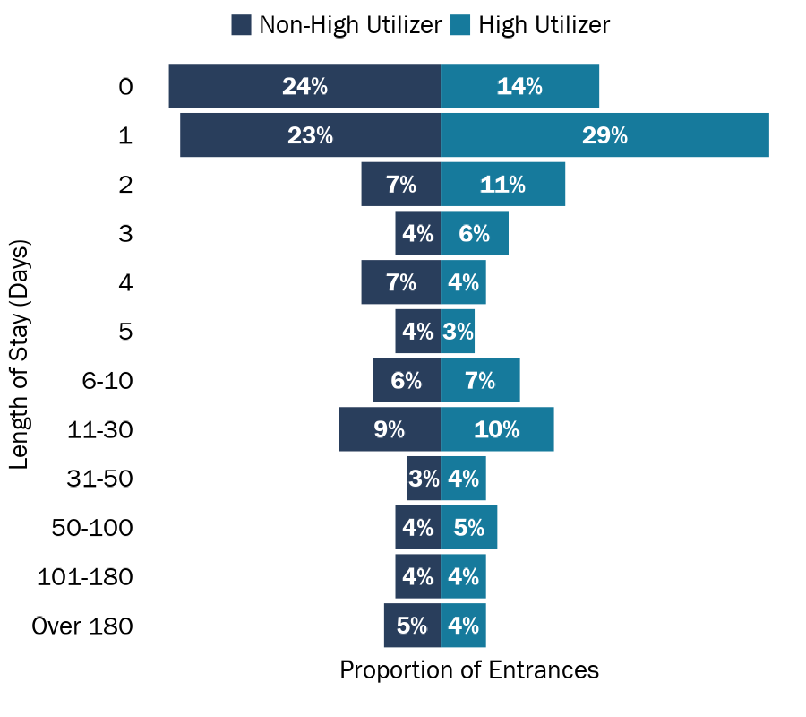
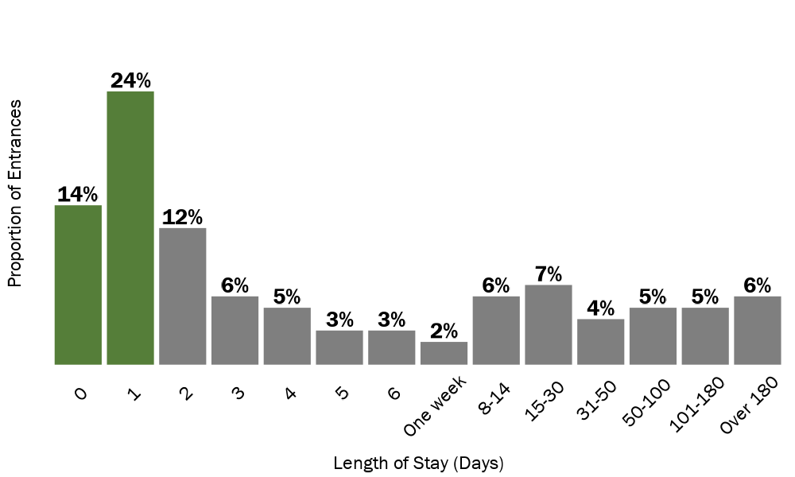
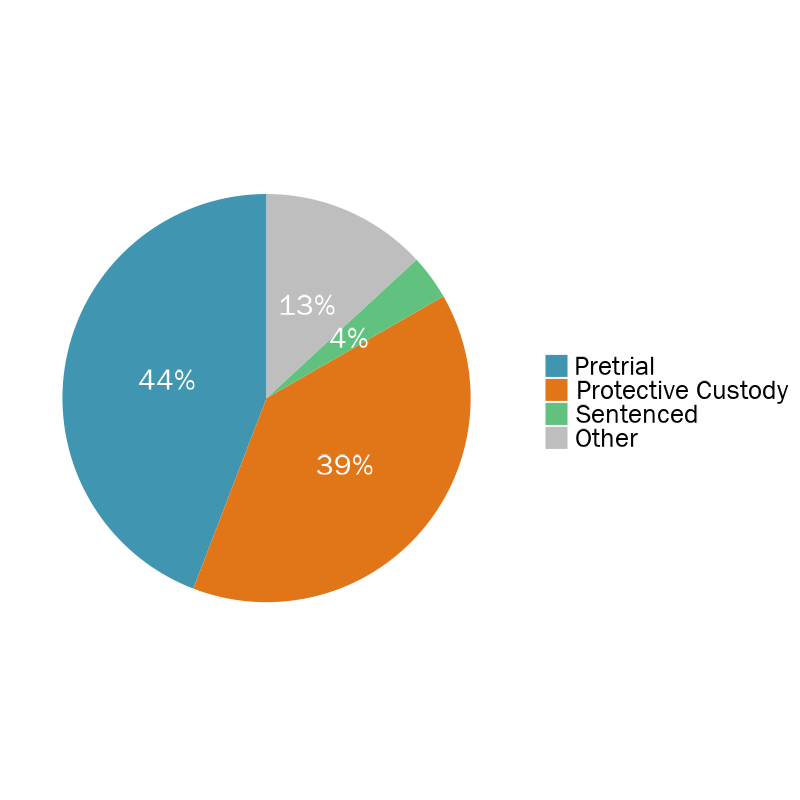
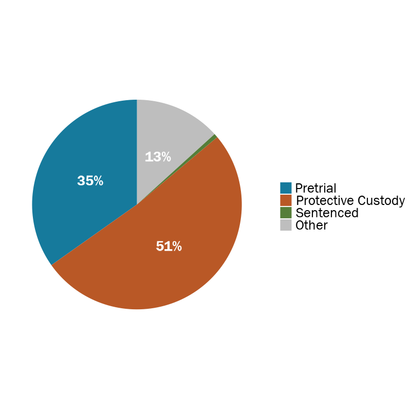
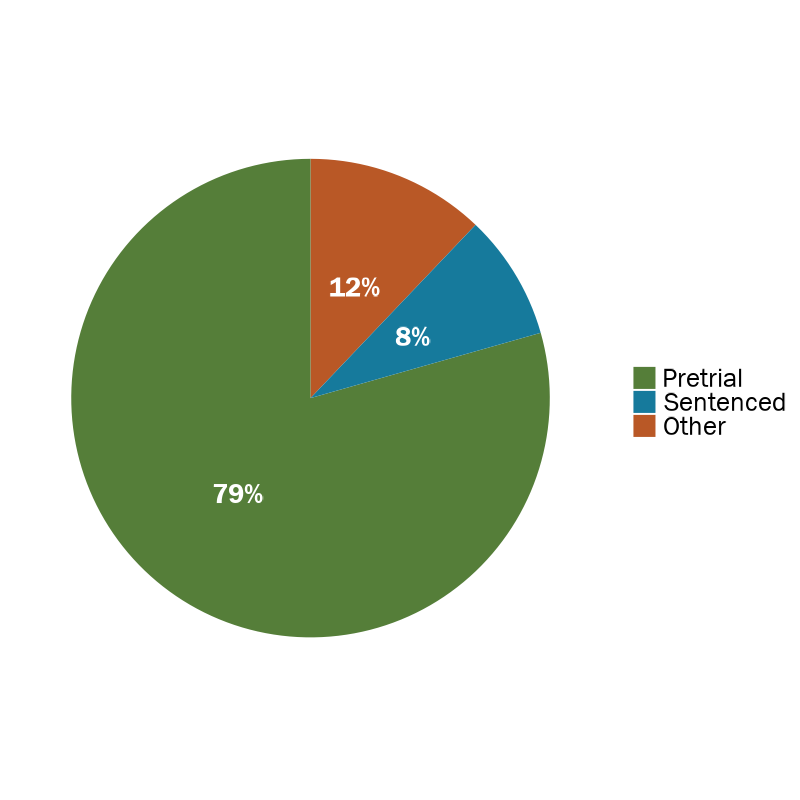
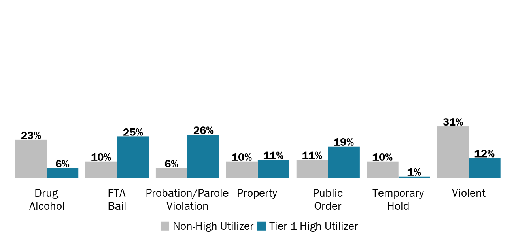

```{r setup, include=FALSE}
knitr::opts_chunk$set(
  echo=FALSE, 
  message=FALSE, 
  warning=FALSE,
  dev = "ragg_png",
  cache = FALSE
  )

# Load packages, functions, jail data, and Medicaid data
source("data_cleaning/00_library.R")
source("data_cleaning/01_functions.R")
source("data_cleaning/rdas.R")
medicaid_jail_all <- read_rds("D:/Analytic/medicaid_jail_all.rds") 

# Change HU variable to Tier 1 = 1 percent, Tier 2 = 2-5 percent, Tier 3 = 6-10 percent
medicaid_jail_all <- fnc_hu_group_exclusive(medicaid_jail_all)
adm_all           <- fnc_hu_group_exclusive(adm_all) 

# DHHS data
# Rename variables
# Get fiscal year based on booking date
# Get los and create los category
entrances_dhhs <- medicaid_jail_all %>% 
  mutate(id = unique_person_id,
         fy = case_when(booking_date > "2018-06-30" & booking_date < "2019-07-01" ~ 2019,
                        booking_date > "2019-06-30" & booking_date < "2020-07-01" ~ 2020,
                        booking_date > "2020-06-30" & booking_date < "2021-07-01" ~ 2021),
         booking_date = ymd(as_date(booking_date)),
         release_date = ymd(as_date(release_date)), 
         jail_los = as.numeric(difftime(release_date,
                                        booking_date,
                                        units="days"))) %>% 
    mutate(los_category =
           case_when(jail_los == 0 ~ "0",
                     jail_los == 1 ~ "1",
                     jail_los == 2 ~ "2",
                     jail_los == 3 ~ "3",
                     jail_los == 4 ~ "4",
                     jail_los == 5 ~ "5",
                     jail_los >= 6   & jail_los <= 10  ~ "6-10",
                     jail_los >= 11  & jail_los <= 30  ~ "11-30",
                     jail_los >= 31  & jail_los <= 50  ~ "31-50",
                     jail_los >= 50  & jail_los <= 100 ~ "50-100",
                     jail_los >= 101 & jail_los <= 180 ~ "101-180",
                     jail_los >  180                   ~ "Over 180")) %>%
  mutate(los_category = factor(los_category,
                               levels = c("0",
                                          "1",
                                          "2",
                                          "3",
                                          "4",
                                          "5",
                                          "6-10",
                                          "11-30",
                                          "31-50",
                                          "50-100",
                                          "101-180",
                                          "Over 180")))
```

# Length of Stay, Statewide from 2019 to 2021 (DHHS data)

Length of stay was calculated by the number of days between the booking date and release date (regardless of time). Some jails provided time stamps while others only provided month, day, and year. High utilizers have shorter lengths of stay compared to non-high utilizers.   

```{r}
# length of stay for all people
# remove instances where release date is earlier than booking date and NAs
dhhs_jail_los_entrances <- entrances_dhhs %>%
  select(fy,
         county,
         id,
         booking_id,
         jail_los,
         los_category,
         hu_group_exclusive) %>%
  distinct() %>%
  filter(!is.na(jail_los) & jail_los >= 0)

# get min med mean max of jail entrances for all 
overall_los_summary <- dhhs_jail_los_entrances %>%
  group_by() %>%
  summarise(
    min    = min(jail_los, na.rm = T),
    median = median(jail_los, na.rm = T),
    mean   = mean(c(jail_los, na.rm = T)),
    max    = max(jail_los, na.rm = T)) %>%
  mutate(mean = round(mean, 1)) %>% 
  mutate(hu_group_exclusive = "All (HU's and non-HU's)") %>% select(hu_group_exclusive, everything())

# get min med mean max of jail entrances for high utilizers
hu_los_summary <- dhhs_jail_los_entrances %>%
  group_by(hu_group_exclusive) %>%
  summarise(
    min    = min(jail_los, na.rm = T),
    median = median(jail_los, na.rm = T),
    mean   = mean(c(jail_los, na.rm = T)),
    max    = max(jail_los, na.rm = T)) %>%
  mutate(mean = round(mean, 1)) 

# add together
hu_los_summary <- rbind(hu_los_summary, overall_los_summary)

# reactable table
reactable(hu_los_summary,
          pagination = FALSE,
          style = list(fontFamily = "Franklin Gothic Book", fontSize = "1.0rem"),
          theme = reactableTheme(cellStyle = list(display = "flex", flexDirection = "column", justifyContent = "center")),
          defaultColDef = reactable::colDef(
            format = colFormat(separators = TRUE), align = "left"),
          compact = TRUE,
          fullWidth = FALSE,
          rowStyle = function(index) {
            if (index %in% c(5)) {
              list(`border-top` = "thin solid",
                   fontWeight = "bold")
            }
          },
          columns = list(
            hu_group_exclusive = colDef(minWidth = 190, name = "",
                                 style = list(fontWeight = "bold", position = "sticky", borderRight = "1px solid #d3d3d3")),
            min    = colDef(minWidth = 90, name = "Minimum"),
            median = colDef(minWidth = 90, name = "Median"),
            mean   = colDef(minWidth = 90, name = "Mean"),
            max    = colDef(minWidth = 90, name = "Maximum")))
```

```{r}
# Create new LOS categories for graph
data1 <- dhhs_jail_los_entrances %>% 
    mutate(los_category =
         case_when(jail_los == 0 ~ "0",
                   jail_los == 1 ~ "1",
                   jail_los == 2 ~ "2",
                   jail_los == 3 ~ "3",
                   jail_los == 4 ~ "4",
                   jail_los == 5 ~ "5",
                   jail_los >= 6   & jail_los <= 10  ~ "6-10",
                   jail_los >= 11  & jail_los <= 30  ~ "11-30",
                   jail_los >= 31  & jail_los <= 50  ~ "31-50",
                   jail_los >= 50  & jail_los <= 100 ~ "50-100",
                   jail_los >= 101 & jail_los <= 180 ~ "101-180",
                   jail_los >= 181 & jail_los <= 365 ~ "181-365",
                   jail_los >= 366 & jail_los <= 600 ~ "366-600",
                   jail_los >= 601 & jail_los <= 1317 ~ "601-1,317")) %>%
    group_by(los_category) %>% 
    summarise(total = n()) %>% 
    mutate(pct = total/sum(total)) %>%
    mutate(pct = round(pct, 2),
           pct_label = paste0(round(pct*100,0), "%")) %>% 
    mutate(los_category = factor(los_category,
                   levels = c("0",
                              "1",
                              "2",
                              "3",
                              "4",
                              "5",
                              "6-10",
                              "11-30",
                              "31-50",
                              "50-100",
                              "101-180",
                              "181-365",
                              "366-600",
                              "601-1,317"))) 

# Ggplot highlighting that almost half of entrances are between 0-1 days  
PRES_gg_los_category <- data1 %>%
  ggplot(aes(x = los_category, y = pct, fill=factor(ifelse(los_category=="0" | los_category=="1","Highlighted","Normal")))) +
  geom_bar(stat = "identity") +
  labs(x = "Length of Stay (Days)", y = "Proportion of Entrances\n") +
  geom_text(aes(#label = ifelse(pct > .02 | pct < 0, pct_label, "")),
           label = pct_label),
           size = 7.5, family = "Franklin Gothic Book",
           position=position_dodge(width=0.9), vjust=-0.25,
           color = "black",
           fontface = "bold") + 
  # scale_fill_manual(values=c(jri_green)) +
  scale_fill_manual(name = "area", values=c(jri_orange,"grey50")) +
  scale_y_continuous(limits = c(0,0.3)) +
  theme_no_grid_no_labels +
  theme(
    axis.text.x = element_text(size = 18, color = "black", angle = 45, hjust = 0.75),
    axis.text.y = element_blank(),
    axis.title.x = element_text(size = 18, color = "black"),
    axis.title.y = element_text(angle = 90, size = 18, color = "black"),
    panel.grid.major.x = element_blank(),
    panel.grid.minor.x = element_blank(),
    legend.position = "none"
  )
```

**Nearly half of jail entrances (DHHS data) had LOS between 0-1 days.**

```{r, out.width="100%", echo=FALSE, layout = "l-body"}
ggsave(PRES_gg_los_category, file="img/PRES_gg_los_category.png", width = 10,  height = 6, dpi = 100)
knitr::include_graphics("img/PRES_gg_los_category.png")
```

**Proportion of entrances for HU's with each LOS category**

```{r}
# Filter to LOS for all HU's and calculate number of entrances/prop of entrances with los category
hu_los_prop <- dhhs_jail_los_entrances %>% 
  filter(hu_group_exclusive != "Non-HU") %>% 
  group_by(los_category) %>% 
  summarise(total = n()) %>% 
  mutate(pct = total/sum(total)) %>%
  mutate(pct = round(pct, 2),
         pct_label = paste0(round(pct*100,0), "%"),
         hu_group_exclusive = "High Utilizer")

PRES_gg_los_prop <- ggplot(hu_los_prop, aes(x = los_category, y = pct, fill = jri_orange)) +

  geom_bar(stat="identity", width = 0.75) +
  labs(x = "Length of Stay (Days)", y = "Proportion of Entrances\n") +
  
  geom_text(aes(label = pct_label, fontface = 'bold'), #position = position_fill(vjust = 0.5),
            vjust = -1,
          size = 7.5, family = "Franklin Gothic Book",
          color = "black") +
  
  scale_fill_manual(values=c(jri_orange)) +
  scale_y_continuous(labels = scales::percent, limits = c(0, .4)) +
  theme_no_grid_no_labels +
  theme(axis.text.x = element_text(angle = 45,size = 22, color = "black",
                                   hjust=1),
        axis.text.y = element_blank(),
        axis.title.y = element_text(angle = 90, size = 22, color = "black"),
        axis.title.x = element_text(size = 22, color = "black"),
        panel.grid.major.x = element_blank(),
        panel.grid.minor.x = element_blank(),
        legend.position = "none")

```

```{r, out.width="50%", echo=FALSE, layout = "l-body"}
ggsave(PRES_gg_los_prop, file="img/PRES_gg_los_prop.png", width = 12,  height = 5, dpi = 100)
knitr::include_graphics("img/PRES_gg_los_prop.png")
```

**Proportion of entrances for non-HU's with each LOS category**

```{r}
# Filter to LOS for all non-HU's and calculate number of entrances/prop of entrances with los category
non_hu_los_prop <- dhhs_jail_los_entrances %>% 
  filter(hu_group_exclusive == "Non-HU") %>% 
  group_by(los_category) %>% 
  summarise(total = n()) %>% 
  mutate(pct = total/sum(total)) %>%
  mutate(pct = round(pct, 2),
         pct_label = paste0(round(pct*100,0), "%"),
         hu_group_exclusive = "Non-High Utilizer")

PRES_gg_nonhu_los_prop <- ggplot(non_hu_los_prop, aes(x = los_category, y = pct, fill = jri_orange)) +

  geom_bar(stat="identity", width = 0.75) +
  labs(x = "Length of Stay (Days)", y = "Proportion of Entrances\n") +
  
  geom_text(aes(label = pct_label, fontface = 'bold'), #position = position_fill(vjust = 0.5),
            vjust = -1,
          size = 7.5, family = "Franklin Gothic Book",
          color = "black") +
  
  scale_fill_manual(values=c(jri_dark_blue)) +
  scale_y_continuous(labels = scales::percent, limits = c(0, .4)) +
  theme_no_grid_no_labels +
  theme(axis.text.x = element_text(angle = 45,size = 22, color = "black",
                                   hjust=1),
        axis.text.y = element_blank(),
        axis.title.y = element_text(angle = 90, size = 22, color = "black"),
        axis.title.x = element_text(size = 22, color = "black"),
        panel.grid.major.x = element_blank(),
        panel.grid.minor.x = element_blank(),
        legend.position = "none")

```

```{r, out.width="50%", echo=FALSE, layout = "l-body"}
ggsave(PRES_gg_nonhu_los_prop, file="img/PRES_gg_nonhu_los_prop.png", width = 12,  height = 5, dpi = 100)
knitr::include_graphics("img/PRES_gg_nonhu_los_prop.png")
```

```{r}
# Filter to LOS for all HU's and calculate number of entrances/prop of entrances with los category
hu_1pct_los_prop <- dhhs_jail_los_entrances %>% 
  filter(hu_group_exclusive == "Tier 1 HU") %>% 
  group_by(los_category) %>% 
  summarise(total = n()) %>% 
  mutate(pct = total/sum(total)) %>%
  mutate(pct = round(pct, 2),
         pct_label = paste0(round(pct*100,0), "%"),
         hu_group_exclusive = "Tier 1 HU")

hu_1pct_los_prop <- rbind(non_hu_los_prop, hu_1pct_los_prop)
hu_1pct_los_prop <- hu_1pct_los_prop %>%
  mutate(los_category = factor(los_category,
                   levels = c("Over 180",
                              "101-180",
                              "50-100",
                              "31-50",
                              "11-30",
                              "6-10",
                              "5",
                              "4",
                              "3",
                              "2",
                              "1",
                              "0"))) 

PRES_gg_diverge_nonhu_1pct_hu_los_prop <- hu_1pct_los_prop %>%
  mutate(pct = ifelse(hu_group_exclusive == "Tier 1 HU", pct, -1*pct)) %>% 
  ggplot(aes(x = los_category, y = pct, fill = hu_group_exclusive))+
  geom_bar(stat = "identity") +
  labs(x = "Length of Stay (Days)", y = "Proportion of Entrances\n") +
  geom_text(aes(label = ifelse(pct > .02 | pct < 0, pct_label, "")),
           size = 7.5, family = "Franklin Gothic Book",
           position = position_stack(vjust = 0.5),
           color = "white",
           fontface = "bold") + 
  scale_fill_manual(values=c("gray50", jri_light_blue)) +
  theme_no_grid_no_labels +
  coord_flip() +
  theme(axis.text.x = element_blank(),
        #axis.text.y = element_blank(),
        axis.title.y = element_text(angle = 90, size = 22, color = "black"),
        axis.title.x = element_text(size = 22, color = "black"),
        panel.grid.major.x = element_blank(),
        panel.grid.minor.x = element_blank(),
        legend.position = "top",
        legend.justification = c(0.1, 0),
        legend.title=element_blank())
```

```{r, out.width="100%", echo=FALSE, layout = "l-body"}
ggsave(PRES_gg_diverge_nonhu_1pct_hu_los_prop, file="img/PRES_gg_diverge_nonhu_1pct_hu_los_prop.png", width = 9,  height = 8, dpi = 100)
knitr::include_graphics("img/PRES_gg_diverge_nonhu_1pct_hu_los_prop.png")
```

```{r}
# Filter to LOS for all HU's and calculate number of entrances/prop of entrances with los category
hu_overall_los_prop <- entrances_dhhs %>%
  select(fy,
         county,
         id,
         booking_id,
         jail_los,
         los_category,
         hu_group_overall) %>%
  distinct() %>%
  filter(!is.na(jail_los) & jail_los >= 0) %>%  
  filter(hu_group_overall == "High Utilizer") %>% 
  group_by(los_category) %>% 
  summarise(total = n()) %>% 
  mutate(pct = total/sum(total)) %>%
  mutate(pct = round(pct, 2),
         pct_label = paste0(round(pct*100,0), "%"),
         hu_group_overall = "High Utilizer")

# Filter to LOS for all non-HU's and calculate number of entrances/prop of entrances with los category
non_hu_los_prop <- entrances_dhhs %>%
  select(fy,
         county,
         id,
         booking_id,
         jail_los,
         los_category,
         hu_group_overall) %>%
  distinct() %>%
  filter(!is.na(jail_los) & jail_los >= 0) %>% 
  filter(hu_group_overall == "Non-High Utilizer") %>% 
  group_by(los_category) %>% 
  summarise(total = n()) %>% 
  mutate(pct = total/sum(total)) %>%
  mutate(pct = round(pct, 2),
         pct_label = paste0(round(pct*100,0), "%"),
         hu_group_overall = "Non-High Utilizer")

hu_overall_los_prop <- rbind(non_hu_los_prop, hu_overall_los_prop)
hu_overall_los_prop <- hu_overall_los_prop %>%
  mutate(los_category = factor(los_category,
                   levels = c("Over 180",
                              "101-180",
                              "50-100",
                              "31-50",
                              "11-30",
                              "6-10",
                              "5",
                              "4",
                              "3",
                              "2",
                              "1",
                              "0"),
                   labels = c(
                            "Over 180 Days",
                            "101-180 Days",
                            "50-100 Days",
                            "31-50 Days",
                            "11-30 Days",
                            "6-10 Days",
                            "5 Days",
                            "4 Days",
                            "3 Days",
                            "2 Days",
                            "1 Day",
                            "0 Days"
                   ))) 

PRES_gg_diverge_hu_overall_los_prop <- hu_overall_los_prop %>%
  mutate(pct = ifelse(hu_group_overall == "High Utilizer", pct, -1*pct)) %>% 
  ggplot(aes(x = los_category, y = pct, fill = hu_group_overall))+
  geom_bar(stat = "identity") +
  labs(x = "Length of Stay (Days)", y = "Proportion of Entrances\n") +
   geom_text(aes(label = ifelse(pct > .02 | pct < 0, pct_label, "")),
            size = 7.5, family = "Franklin Gothic Book",
            hjust = ifelse(hu_overall_los_prop$hu_group_overall == "High Utilizer", -.1, 1.1),
            color = ifelse(hu_overall_los_prop$hu_group_overall == "High Utilizer", jri_orange, "black"),
            fontface = "bold"
              ) +
  scale_y_continuous(limits = c(-.35, .35)) +
  scale_fill_manual(values=c(jri_orange, "gray")) +
  theme_no_grid_no_labels +
  coord_flip() +
  guides(fill = guide_legend(reverse = TRUE)) +
  theme(axis.text.x = element_blank(),
        axis.text.y = element_text(face = "bold"),
        axis.title.y = element_text(angle = 90, size = 22, color = "black"),
        axis.title.x = element_text(size = 22, color = "black"),
        panel.grid.major.x = element_blank(),
        panel.grid.minor.x = element_blank(),
        legend.position = "top",
        legend.justification = c(0.3, 0),
        legend.title=element_blank())
```

```{r, out.width="100%", echo=FALSE, layout = "l-body"}
ggsave(PRES_gg_diverge_hu_overall_los_prop, file="img/PRES_gg_diverge_hu_overall_los_prop.png", width = 8,  height = 8, dpi = 100)

```

<br>


# Length of Stay, Statewide from 2019 to 2021 (Jail data)

```{r}
# Get los and create los category for jail data
jail_booking_entrances_los_sentence_status <- adm_all %>% 
  filter(pc_hold == "Non-PC Hold") %>% 
  mutate(jail_los = as.numeric(difftime(release_date,
                                        booking_date,
                                        units="days"))) %>% 
    mutate(los_category =
           case_when(jail_los == 0 ~ "0",
                     jail_los == 1 ~ "1",
                     jail_los == 2 ~ "2",
                     jail_los == 3 ~ "3",
                     jail_los == 4 ~ "4",
                     jail_los == 5 ~ "5",
                     jail_los >= 6   & jail_los <= 10  ~ "6-10",
                     jail_los >= 11  & jail_los <= 30  ~ "11-30",
                     jail_los >= 31  & jail_los <= 50  ~ "31-50",
                     jail_los >= 50  & jail_los <= 100 ~ "50-100",
                     jail_los >= 101 & jail_los <= 180 ~ "101-180",
                     jail_los >  180                   ~ "Over 180")) %>%
  mutate(los_category = factor(los_category,
                               levels = c("0",
                                          "1",
                                          "2",
                                          "3",
                                          "4",
                                          "5",
                                          "6-10",
                                          "11-30",
                                          "31-50",
                                          "50-100",
                                          "101-180",
                                          "Over 180"))) %>% 
  mutate(sentence_status_standard = ifelse(sentence_status_standard == "UNKNOWN", NA, sentence_status_standard)) %>% 
  group_by(sentence_status_standard, los_category) %>% 
  summarise(total = n_distinct(booking_id)) %>% 
  mutate(state = "New Hampshire",
         sentence_status_standard = str_to_title(sentence_status_standard)) %>% 
  mutate(sentence_status_standard = factor(sentence_status_standard, levels = c("Pretrial", "Protective Custody","Sentenced", "Other")))

# Get bookings that were 0 days
jail_booking_entrances_los_0_day <- jail_booking_entrances_los_sentence_status %>% 
  filter(los_category == "0") %>% 
  filter(!is.na(sentence_status_standard))
sum <- sum(jail_booking_entrances_los_0_day$total)
jail_booking_entrances_los_0_day <- jail_booking_entrances_los_0_day %>% 
  mutate(pct = total/sum*100) %>%
  mutate(pct = round(pct, 0)) %>% 
  mutate(pct = paste0(pct, "%"))

# Get bookings that were 1 days
jail_booking_entrances_los_1_day <- jail_booking_entrances_los_sentence_status %>% 
  filter(los_category == "1") %>% 
  filter(!is.na(sentence_status_standard))
sum <- sum(jail_booking_entrances_los_1_day$total)
jail_booking_entrances_los_1_day <- jail_booking_entrances_los_1_day %>% 
  mutate(pct = total/sum*100) %>%
  mutate(pct = round(pct, 0)) %>% 
  mutate(pct = paste0(pct, "%"))

# Get bookings that were 0-1 days
jail_booking_entrances_los_0_1_day <- jail_booking_entrances_los_sentence_status %>% 
  filter(los_category == "1" | los_category == "0") %>% 
  filter(!is.na(sentence_status_standard)) %>%
  group_by(sentence_status_standard) %>% 
  summarise(total = sum(total))
sum <- sum(jail_booking_entrances_los_0_1_day$total)
jail_booking_entrances_los_0_1_day <- jail_booking_entrances_los_0_1_day %>% 
  mutate(pct = total/sum*100) %>%
  mutate(pct = round(pct, 0)) %>% 
  mutate(pct = paste0(pct, "%")) %>% 
  mutate(state = "New Hampshire",
         sentence_status_standard = str_to_title(sentence_status_standard)) %>% 
  mutate(sentence_status_standard = factor(sentence_status_standard, levels = c("Pretrial", "Protective Custody","Sentenced", "Other")))
```


```{r}
# Calculate LOS
# Create new LOS categories for graph
# Remove PC holds
jail_booking_entrances_los <- adm_all %>% 
    mutate(jail_los = as.numeric(difftime(release_date,
                                          booking_date,
                                          units="days"))) %>% 
    filter(pc_hold == "Non-PC Hold") %>% 
    mutate(los_category =
         case_when(jail_los == 0 ~ "0",
                   jail_los == 1 ~ "1",
                   jail_los == 2 ~ "2",
                   jail_los == 3 ~ "3",
                   jail_los == 4 ~ "4",
                   jail_los == 5 ~ "5",
                   jail_los >= 6   & jail_los <= 10  ~ "6-10",
                   jail_los >= 11  & jail_los <= 30  ~ "11-30",
                   jail_los >= 31  & jail_los <= 50  ~ "31-50",
                   jail_los >= 50  & jail_los <= 100 ~ "50-100",
                   jail_los >= 101 & jail_los <= 180 ~ "101-180",
                   jail_los >= 181 & jail_los <= 365 ~ "181-365",
                   jail_los >= 366 & jail_los <= 600 ~ "366-600",
                   jail_los >= 601 & jail_los <= 1317 ~ "601-1,317")) %>%
    filter(!is.na(jail_los)) %>% 
    group_by(los_category) %>% 
    summarise(total = n()) %>% 
    mutate(pct = total/sum(total)) %>%
    mutate(pct = round(pct, 2),
           pct_label = paste0(round(pct*100,0), "%")) %>% 
    mutate(los_category = factor(los_category,
                   levels = c("0",
                              "1",
                              "2",
                              "3",
                              "4",
                              "5",
                              "6-10",
                              "11-30",
                              "31-50",
                              "50-100",
                              "101-180",
                              "181-365",
                              "366-600",
                              "601-1,317"))) 

# Ggplot highlighting that almost half of entrances are between 0-1 days  
PRES_gg_jail_los_category <- jail_booking_entrances_los %>%
  ggplot(aes(x = los_category, y = pct, fill=factor(ifelse(los_category=="0" | los_category=="1","Highlighted","Normal")))) +
  geom_bar(stat = "identity") +
  labs(x = "Length of Stay (Days)", y = "Proportion of Entrances\n") +
  geom_text(aes(#label = ifelse(pct > .02 | pct < 0, pct_label, "")),
           label = pct_label),
           size = 7.5, family = "Franklin Gothic Book",
           position=position_dodge(width=0.9), vjust=-0.25,
           color = "black",
           fontface = "bold") + 
  # scale_fill_manual(values=c(jri_green)) +
  scale_fill_manual(name = "area", values=c(jri_green,"grey50")) +
  scale_y_continuous(limits = c(0,0.3)) +
  theme_no_grid_no_labels +
  theme(
    axis.text.x = element_text(size = 18, color = "black", angle = 45, hjust = 0.75),
    axis.text.y = element_blank(),
    axis.title.x = element_text(size = 18, color = "black"),
    axis.title.y = element_text(angle = 90, size = 18, color = "black"),
    panel.grid.major.x = element_blank(),
    panel.grid.minor.x = element_blank(),
    legend.position = "none"
  )
```

38% of jail bookings (non-PC holds) had lengths of stay between 0-1 days.  

```{r, out.width="100%", echo=FALSE, layout = "l-body"}
ggsave(PRES_gg_jail_los_category, file="img/PRES_gg_jail_los_category.png", width = 10,  height = 6, dpi = 100)

```

**Sentence Statuses for People Entering Jail for 0-1 Days**

The majority of sentence statuses for people entering jail for 0-1 days were pretrial.  

```{r}
PRES_gg_pie_0_1_los_bookings <- ggplot(jail_booking_entrances_los_0_1_day, aes(x = state, y = total, fill = sentence_status_standard)) +
  geom_col(colour = NA, position = "fill") +
  scale_y_continuous(labels = scales::percent) +
  scale_fill_manual(values=c(jri_green, jri_light_blue, jri_orange, "gray")) +
  geom_text(aes(label = ifelse(total > 100, pct, ""), fontface = 'bold'), position = position_fill(vjust = 0.5),
            size = 8, family = "Franklin Gothic Book",
            color = ifelse(jail_booking_entrances_los_0_1_day$sentence_status_standard == "NA", "gray", "white")
            ) +
  
  theme(legend.position = "top",
        legend.justification = c(0, 0),
        legend.title=element_blank(),
        axis.title.y = element_blank()) +
  coord_polar("y", start=0) +
  theme_no_grid_no_labels +
  theme(
    axis.title.x = element_blank(),
    axis.title.y = element_blank(),
    panel.border = element_blank(),
    panel.grid=element_blank(),
    axis.ticks = element_blank(),
    plot.title=element_text(size=14, face="bold"),
    axis.text.x=element_blank(),
    axis.text.y=element_blank(),
    legend.title = element_blank(),
    legend.text = element_text(family = "Franklin Gothic Book", size = 20, color = "black"))
```
```{r, out.width="50%", echo=FALSE, layout = "l-body"}
ggsave(PRES_gg_pie_0_1_los_bookings, file="img/PRES_gg_pie_0_1_los_bookings.png", width = 8,  height = 8, dpi = 100)

```

**Sentence Statuses for People Entering Jail for 0 Days**

The majority of sentence statuses for people entering jail for 0 days were pretrial.  

```{r}
PRES_gg_pie_0_los_bookings <- ggplot(jail_booking_entrances_los_0_day, aes(x = state, y = total, fill = sentence_status_standard)) +
  geom_col(colour = NA, position = "fill") +
  scale_y_continuous(labels = scales::percent) +
  scale_fill_manual(values=c(jri_green, jri_light_blue, jri_orange, "gray")) +
  geom_text(aes(label = ifelse(total > 100, pct, ""), fontface = 'bold'), position = position_fill(vjust = 0.5),
            size = 7.5, family = "Franklin Gothic Book",
            color = ifelse(jail_booking_entrances_los_0_day$sentence_status_standard == "NA", "gray", "white")
            ) +
  
  theme(legend.position = "top",
        legend.justification = c(0, 0),
        legend.title=element_blank(),
        axis.title.y = element_blank()) +
  coord_polar("y", start=0) +
  theme_no_grid_no_labels +
  theme(
    axis.title.x = element_blank(),
    axis.title.y = element_blank(),
    panel.border = element_blank(),
    panel.grid=element_blank(),
    axis.ticks = element_blank(),
    plot.title=element_text(size=14, face="bold"),
    axis.text.x=element_blank(),
    axis.text.y=element_blank(),
    legend.title = element_blank(),
    legend.text = element_text(family = "Franklin Gothic Book", size = 20, color = "black"))
```
```{r, out.width="50%", echo=FALSE, layout = "l-body"}
ggsave(PRES_gg_pie_0_los_bookings, file="img/PRES_gg_pie_0_los_bookings.png", width = 8,  height = 8, dpi = 100)

```

**Sentence Statuses for People Entering Jail for 1 Day**

The majority of sentence statuses for people entering jail for 1 day were pretrial.  

```{r}
PRES_gg_pie_1_los_bookings <- ggplot(jail_booking_entrances_los_1_day, aes(x = state, y = total, fill = sentence_status_standard)) +
  geom_col(colour = NA, position = "fill") +
  scale_y_continuous(labels = scales::percent) +
  scale_fill_manual(values=c(jri_green, jri_light_blue, jri_orange, "gray")) +
  geom_text(aes(label = ifelse(total > 100, pct, ""), fontface = 'bold'), position = position_fill(vjust = 0.5),
            size = 7.5, family = "Franklin Gothic Book",
            color = ifelse(jail_booking_entrances_los_1_day$sentence_status_standard == "NA", "gray", "white")
            ) +
  
  theme(legend.position = "top",
        legend.justification = c(0, 0),
        legend.title=element_blank(),
        axis.title.y = element_blank()) +
  coord_polar("y", start=0) +
  theme_no_grid_no_labels +
  theme(
    axis.title.x = element_blank(),
    axis.title.y = element_blank(),
    panel.border = element_blank(),
    panel.grid=element_blank(),
    axis.ticks = element_blank(),
    plot.title=element_text(size=14, face="bold"),
    axis.text.x=element_blank(),
    axis.text.y=element_blank(),
    legend.title = element_blank(),
    legend.text = element_text(family = "Franklin Gothic Book", size = 20, color = "black"))
```
```{r, out.width="50%", echo=FALSE, layout = "l-body"}
ggsave(PRES_gg_pie_1_los_bookings, file="img/PRES_gg_pie_1_los_bookings.png", width = 8,  height = 8, dpi = 100)

```

<br>

**Charge Types for LOS of 0-1 Days (For All Bookings)**

```{r}
# Calculate los
# Create new LOS categories for graph
# Remove PC holds
# Filter to los of 0 to 1 days
jail_booking_entrances_los_0_1_day_crime <- adm_all %>% 
    mutate(jail_los = as.numeric(difftime(release_date,
                                          booking_date,
                                          units="days"))) %>% 
    filter(pc_hold == "Non-PC Hold") %>% 
    mutate(los_category =
         case_when(jail_los == 0 ~ "0",
                   jail_los == 1 ~ "1",
                   jail_los == 2 ~ "2",
                   jail_los == 3 ~ "3",
                   jail_los == 4 ~ "4",
                   jail_los == 5 ~ "5",
                   jail_los >= 6   & jail_los <= 10   ~ "6-10",
                   jail_los >= 11  & jail_los <= 30   ~ "11-30",
                   jail_los >= 31  & jail_los <= 50   ~ "31-50",
                   jail_los >= 50  & jail_los <= 100  ~ "50-100",
                   jail_los >= 101 & jail_los <= 180  ~ "101-180",
                   jail_los >= 181 & jail_los <= 365  ~ "181-365",
                   jail_los >= 366 & jail_los <= 600  ~ "366-600",
                   jail_los >= 601 & jail_los <= 1317 ~ "601-1,317")) %>%
    filter(!is.na(jail_los)) %>% 
    filter(!is.na(crime_type_lookup)) %>%
    filter(los_category == "0" | los_category == "1") 

# Filter to people who were tier 1 hus
tier1hu <- jail_booking_entrances_los_0_1_day_crime %>%
    filter(hu_group_exclusive == "Tier 1 HU") %>%
    group_by(crime_type_lookup) %>%
    summarise(total = n_distinct(booking_id)) %>%
    mutate(pct = total/sum(total)) %>%
    mutate(pct = round(pct, 2),
           pct_label = paste0(round(pct*100,0), "%"),
           group = "Tier 1 High Utilizer")

# Filter to people who were not hus for comparison
nonhu <- jail_booking_entrances_los_0_1_day_crime %>%
    filter(hu_group_exclusive == "Non-HU") %>%
    group_by(crime_type_lookup) %>%
    summarise(total = n_distinct(booking_id)) %>%
    mutate(pct = total/sum(total)) %>%
    mutate(pct = round(pct, 2),
           pct_label = paste0(round(pct*100,0), "%"),
           group = "Non-High Utilizer")

# Add data together
los_0_1_day_crime_tier1hu_nonhu <- rbind(tier1hu, nonhu)

# Ggplot grouped to show the differences in crime types by Tier 1 HU vs non-HU
PRES_gg_los_0_1_crime_type <- ggplot(los_0_1_day_crime_tier1hu_nonhu, aes(fill=group, y=pct, x=crime_type_lookup)) + 
  geom_bar(position="dodge", stat="identity") +
  labs(x = "Length of Stay (Days)", y = "Proportion of Entrances\n") +
  geom_text(aes(#label = ifelse(pct > .02 | pct < 0, pct_label, "")),
           label = pct_label),
           size = 7.5, family = "Franklin Gothic Book",
           position=position_dodge(width=0.9),
           # hjust = -.1,
           vjust = -.1,
           color = "black",
           fontface = "bold") + 
  scale_fill_manual(name = "area", values=c("grey", jri_light_blue)) +
  expand_limits(y = 1) +
  expand_limits(x = 1) +
  scale_x_discrete(breaks=unique(los_0_1_day_crime_tier1hu_nonhu$crime_type_lookup), 
    labels=fnc_addline_format(c("Drug Alcohol", 
                            "FTA Bail", 
                            "Probation/Parole Violation",
                            "Property",
                            "Public Order",
                            "Temporary Hold",
                            "Violent"))) +
  theme_no_grid_no_labels +
  # guides(fill = guide_legend(reverse = TRUE)) +

  # coord_flip() +
  theme(
    panel.grid.major.x = element_blank(),
    panel.grid.minor.x = element_blank(),
    legend.justification = c(0.5, 0.5),
    #legend.direction = "vertical",
    legend.box = "horizontal",
    legend.position = "bottom",
    axis.text.y = element_blank()
    # axis.text.x = element_blank()
  )
```

For those with LOS between 0-1 days, tier 1 high utilizers were more likely to be booked for probation and parole violations compared to non-high utilizers.     

```{r, out.width="100%", echo=FALSE, layout = "l-body"}
ggsave(PRES_gg_los_0_1_crime_type, file="img/PRES_gg_los_0_1_crime_type.png", width = 13,  height = 6, dpi = 100)

```


<br><br>
