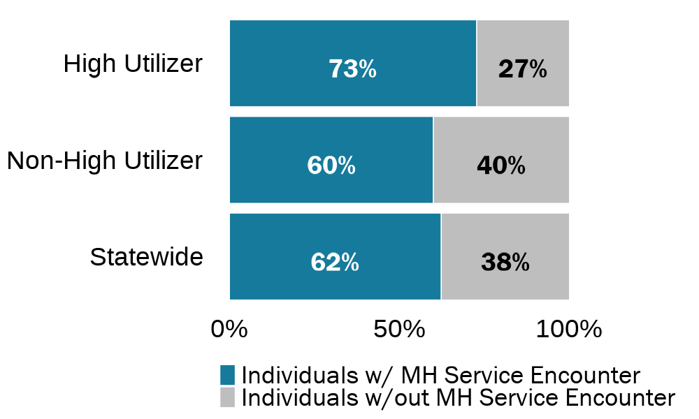
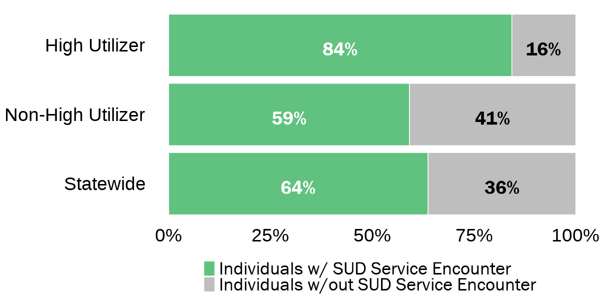
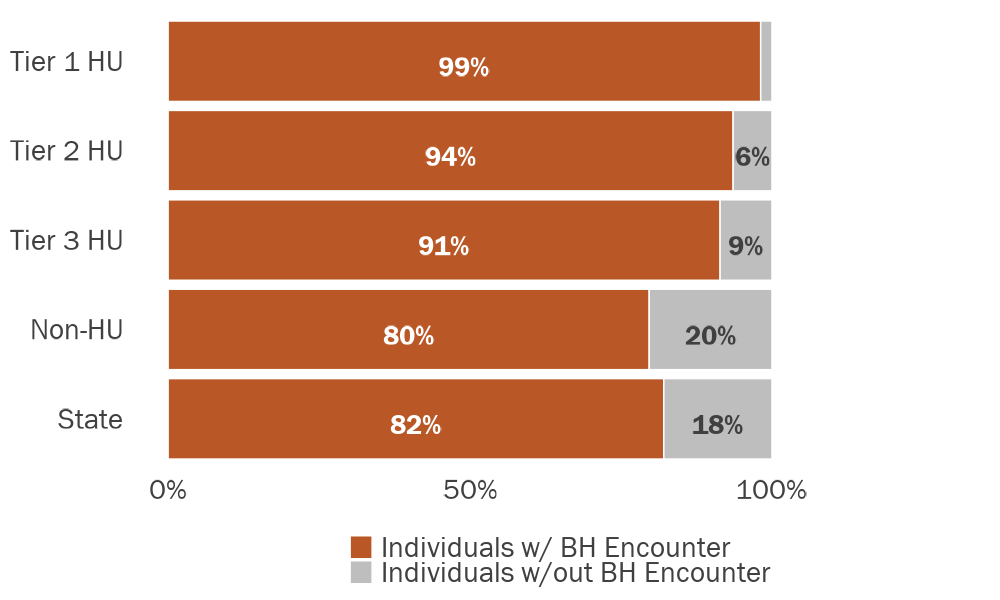
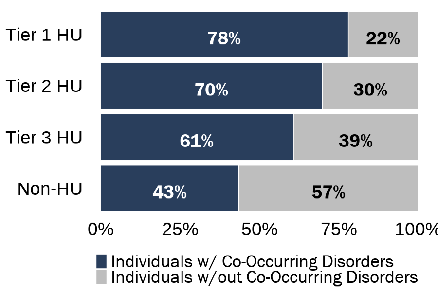

```{r include=FALSE}
# Load packages, functions, and data
source("data_cleaning/00_library.R")
source("data_cleaning/01_functions.R")
source("data_cleaning/rdas.R")

# Set chunk output 
knitr::opts_chunk$set(
  echo=FALSE, 
  message=FALSE, 
  warning=FALSE,
  dev = "ragg_png",
  cache = FALSE
  )
```

```{r include=FALSE}
# Load medicaid data
jail_medicaid_analytic_individual_booking_level <- read_rds("D:/Analytic/jail_medicaid_analytic_individual_booking_level.rds") 

# De-dup (there are a few duplicate bookings) and create booking id for analysis
jail_medicaid_analytic_individual_booking_level_dedup <- jail_medicaid_analytic_individual_booking_level %>% 
  distinct(unique_person_id, booking_id, .keep_all = TRUE) %>% 
  mutate(unique_person_booking_id = paste0(unique_person_id, booking_id)) 

# Recode high utilize percentile grouping, we don't need to group_by as the percentile grouping is already grouped across individual from Mari's cleaning
jail_medicaid_analytic_individual_booking_level_dedup_hu_recode <- jail_medicaid_analytic_individual_booking_level_dedup %>% 
  
  # Recoded HU variable
  mutate(hu_group_exclusive = case_when(high_utilizer_10_pct =="No"     ~ 4,
                                        high_utilizer_10_pct =="Yes" & 
                                          high_utilizer_5_pct=="No" & 
                                          high_utilizer_1_pct=="No"     ~ 3,
                                        high_utilizer_5_pct  =="Yes" & 
                                          high_utilizer_1_pct=="No"     ~ 2,
                                        high_utilizer_1_pct  =="Yes"    ~ 1,
                                        TRUE ~ as.numeric(NA)),
         hu_group_exclusive = factor(hu_group_exclusive, 
                                     levels = c(1,2,3,4),
                                     labels = c("Tier 1 HU", "Tier 2 HU", "Tier 3 HU", "Non-HU"))) %>% 
  # Overall HU variable
  mutate(hu_group_overall = case_when(high_utilizer_10_pct == "No"  ~ 2,
                                      high_utilizer_10_pct == "Yes" ~ 1,
                                      TRUE ~ as.numeric(NA)),
         hu_group_overall = factor(hu_group_overall,
                                   levels = c(1,2),
                                   labels = c("High Utilizer", "Non-High Utilizer")))
```         

# DHHS Medicaid Match and Jail Booking Descriptive Analysis: Behavioral Health Encounters by High Jail Utilizer Grouping

<br>

## Tables

### Table 1a: Mental Health and Substance Use Disorder Service Medicaid Encounters by **Overall** High Utilizer Grouping

Note: Co-Occurring Disorders indicates that individual had at least one Mental Health- and one Substance Use Disorder-related primary diagnoses in the Medicaid data.

**Update**: I am currently using all behavioral health data from the Medicaid Encounter file that occurred either before or during the study period (Medicaid eligibility start date <= 6/30/2021). Percentages reflect the percentage of the Medicaid sample unless otherwise stated (e.g. "% of Overall Sample")

```{r echo=FALSE,message=FALSE,warning=FALSE} 
# by hu_group_exclusive
medicaid_jail_county_bh_service_type_hu_table <- jail_medicaid_analytic_individual_booking_level_dedup_hu_recode %>% 
  dplyr::group_by(hu_group_overall) %>% 
  dplyr::summarise(`Overall Individuals (N)` = n_distinct(unique_person_id),
                   `Individuals w/ any Medicaid Match (% of Overall Sample)` = scales::percent(n_distinct(unique_person_id[pre_or_study_window_medicaid_match_flag_overall==1])/`Overall Individuals (N)`),
                   `Individuals w/ BH Encounter (%)` = scales::percent(n_distinct(unique_person_id[pre_or_study_bh_flag==1])/n_distinct(unique_person_id[pre_or_study_window_medicaid_match_flag_overall==1])),
                   
                   `Individuals w/ MH Service Encounter, Primary Diagnosis (N)` = n_distinct(unique_person_id[pre_or_study_mh_service_primary_dx_flag==1]),
                   `Individuals w/ MH Service Encounter, Primary Diagnosis (%)` = scales::percent(`Individuals w/ MH Service Encounter, Primary Diagnosis (N)`/n_distinct(unique_person_id[pre_or_study_window_medicaid_match_flag_overall==1])),
                   
                   `Individuals w/ SUD Service Encounter, Primary Diagnosis (N)` = n_distinct(unique_person_id[pre_or_study_sud_service_primary_dx_flag==1]),
                   `Individuals w/ SUD Service Encounter, Primary Diagnosis (%)` = scales::percent(`Individuals w/ SUD Service Encounter, Primary Diagnosis (N)`/n_distinct(unique_person_id[pre_or_study_window_medicaid_match_flag_overall==1])),
                   
                   `Individuals w/ MH and SUD Service Encounters, Co-Occurring Disorders (N)` = n_distinct(unique_person_id[pre_or_study_mh_service_primary_dx_flag==1 & pre_or_study_sud_service_primary_dx_flag==1]),
                   `Individuals w/ MH and SUD Service Encounters, Co-Occurring Disorders (%)` = scales::percent(`Individuals w/ MH and SUD Service Encounters, Co-Occurring Disorders (N)`/n_distinct(unique_person_id[pre_or_study_window_medicaid_match_flag_overall==1])),
                   
                   `Individuals w/ MH or SUD Service Encounter, Secondary Diagnosis (N)` = n_distinct(unique_person_id[pre_or_study_bh_mh_or_sud_service_secondary_dx_flag==1]),
                   `Individuals w/ MH or SUD Service Encounter, Secondary Diagnosis (%)` = scales::percent(`Individuals w/ MH or SUD Service Encounter, Secondary Diagnosis (N)`/n_distinct(unique_person_id[pre_or_study_window_medicaid_match_flag_overall==1]))) %>% 
  ungroup() %>% 
  dplyr::rename(`High Utilizer Status` = hu_group_overall) 

# statewide
medicaid_jail_overall_bh_service_type_hu_table <- jail_medicaid_analytic_individual_booking_level_dedup_hu_recode %>% 
  dplyr::summarise(`Overall Individuals (N)` = n_distinct(unique_person_id),
                   `Individuals w/ any Medicaid Match (% of Overall Sample)` = scales::percent(n_distinct(unique_person_id[pre_or_study_window_medicaid_match_flag_overall==1])/`Overall Individuals (N)`),
                   `Individuals w/ BH Encounter (%)` = scales::percent(n_distinct(unique_person_id[pre_or_study_bh_flag==1])/n_distinct(unique_person_id[pre_or_study_window_medicaid_match_flag_overall==1])),
                   
                   `Individuals w/ MH Service Encounter, Primary Diagnosis (N)` = n_distinct(unique_person_id[pre_or_study_mh_service_primary_dx_flag==1]),
                   `Individuals w/ MH Service Encounter, Primary Diagnosis (%)` = scales::percent(`Individuals w/ MH Service Encounter, Primary Diagnosis (N)`/n_distinct(unique_person_id[pre_or_study_window_medicaid_match_flag_overall==1])),
                   
                   `Individuals w/ SUD Service Encounter, Primary Diagnosis (N)` = n_distinct(unique_person_id[pre_or_study_sud_service_primary_dx_flag==1]),
                   `Individuals w/ SUD Service Encounter, Primary Diagnosis (%)` = scales::percent(`Individuals w/ SUD Service Encounter, Primary Diagnosis (N)`/n_distinct(unique_person_id[pre_or_study_window_medicaid_match_flag_overall==1])),
                  
                   `Individuals w/ MH and SUD Service Encounters, Co-Occurring Disorders (N)` = n_distinct(unique_person_id[pre_or_study_mh_service_primary_dx_flag==1 & pre_or_study_sud_service_primary_dx_flag==1]),
                   `Individuals w/ MH and SUD Service Encounters, Co-Occurring Disorders (%)` = scales::percent(`Individuals w/ MH and SUD Service Encounters, Co-Occurring Disorders (N)`/n_distinct(unique_person_id[pre_or_study_window_medicaid_match_flag_overall==1])),
                   
                   `Individuals w/ MH or SUD Service Encounter, Secondary Diagnosis (N)` = n_distinct(unique_person_id[pre_or_study_bh_mh_or_sud_service_secondary_dx_flag==1]),
                   `Individuals w/ MH or SUD Service Encounter, Secondary Diagnosis (%)` = scales::percent(`Individuals w/ MH or SUD Service Encounter, Secondary Diagnosis (N)`/n_distinct(unique_person_id[pre_or_study_window_medicaid_match_flag_overall==1]))) %>% 
  ungroup() %>% 
  dplyr::mutate(`High Utilizer Status` = "Statewide") 

# rbind county and statewide files 
medicaid_jail_county_statewide_bh_service_type_hu_table <- rbind(medicaid_jail_county_bh_service_type_hu_table,
                                                                 medicaid_jail_overall_bh_service_type_hu_table)

### print table via kableextra
kable(medicaid_jail_county_statewide_bh_service_type_hu_table, 
      format.args = list(big.mark = ","), 
      align=rep('c')) %>%
  kable_styling(bootstrap_options = c("striped", 
                                       "hover", 
                                       "condensed", 
                                       "responsive"), 
                 row_label_position = "l") %>% 
  row_spec(3, bold = TRUE) %>% 
  column_spec(4, bold = TRUE) %>% 
  column_spec(6, bold = TRUE) %>% 
  column_spec(8, bold = TRUE) %>% 
  column_spec(10, bold = TRUE) %>% 
  column_spec(12, bold = TRUE) %>% 
  scroll_box(width = "130%")
```

<br>

**Mental Health Encounters**

```{r}
# By HU group
df_medicaid_match_mh_hu <- jail_medicaid_analytic_individual_booking_level_dedup_hu_recode %>% 
  dplyr::group_by(hu_group_overall) %>% 
  summarise(`Individuals w/ MH Service Encounter, Primary Diagnosis (N)` = n_distinct(unique_person_id[pre_or_study_mh_service_primary_dx_flag==1]),
            `Individuals w/ MH Service Encounter, Primary Diagnosis` = `Individuals w/ MH Service Encounter, Primary Diagnosis (N)`/n_distinct(unique_person_id[pre_or_study_window_medicaid_match_flag_overall==1]),
            `Individuals w/out MH Service Encounter, Primary Diagnosis (N)` = n_distinct(unique_person_id[pre_or_study_mh_service_primary_dx_flag==0]),
            `Individuals w/out MH Service Encounter, Primary Diagnosis` = `Individuals w/out MH Service Encounter, Primary Diagnosis (N)`/n_distinct(unique_person_id[pre_or_study_window_medicaid_match_flag_overall==1])
            )

# By state
df_medicaid_match_mh_state <- jail_medicaid_analytic_individual_booking_level_dedup_hu_recode %>% 
  summarise(`Individuals w/ MH Service Encounter, Primary Diagnosis (N)` = n_distinct(unique_person_id[pre_or_study_mh_service_primary_dx_flag==1]),
            `Individuals w/ MH Service Encounter, Primary Diagnosis` = `Individuals w/ MH Service Encounter, Primary Diagnosis (N)`/n_distinct(unique_person_id[pre_or_study_window_medicaid_match_flag_overall==1]),
            `Individuals w/out MH Service Encounter, Primary Diagnosis (N)` = n_distinct(unique_person_id[pre_or_study_mh_service_primary_dx_flag==0]),
            `Individuals w/out MH Service Encounter, Primary Diagnosis` = `Individuals w/out MH Service Encounter, Primary Diagnosis (N)`/n_distinct(unique_person_id[pre_or_study_window_medicaid_match_flag_overall==1])
            ) %>%  
  mutate(hu_group_overall = "Statewide") 

# Rbind HU group and state
df_medicaid_match_mh_all <- rbind(df_medicaid_match_mh_hu, df_medicaid_match_mh_state)

# Change from wide to long format
df_medicaid_match_mh_all <- df_medicaid_match_mh_all %>% 
  select(hu_group_overall,
         `Individuals w/ MH Service Encounter, Primary Diagnosis`,
         `Individuals w/out MH Service Encounter, Primary Diagnosis`) 
df_medicaid_match_mh_all <- gather(df_medicaid_match_mh_all, population, pct, `Individuals w/ MH Service Encounter, Primary Diagnosis`:`Individuals w/out MH Service Encounter, Primary Diagnosis`, factor_key=TRUE)

# Change from wide to long format
df_medicaid_match_mh_all <- df_medicaid_match_mh_all %>% 
  mutate(population = factor(population, 
                             levels = c("Individuals w/out MH Service Encounter, Primary Diagnosis",
                                        "Individuals w/ MH Service Encounter, Primary Diagnosis"),
                             labels = c("Individuals w/out MH Service Encounter",
                                        "Individuals w/ MH Service Encounter"))) %>% 
  mutate(pct1 = round(pct*100, 0))
```

```{r}
PRES_gg_medicaid_mh <- ggplot(df_medicaid_match_mh_all, aes(x = reorder(hu_group_overall, desc(hu_group_overall)), y = pct, fill = population)) +
  geom_col(colour = "white", position = "fill") +
  scale_y_continuous(labels = scales::percent) +
  scale_fill_manual(values=c("gray",jri_light_blue),
                    na.value = "white") +
  geom_text(aes(label = paste(round(pct*100, 0), "%", sep = ""), 
                fontface = 'bold'),
            position = position_fill(vjust = 0.5),
            vjust = 0.8,
            size = 10, family = "Franklin Gothic Book",
            color = case_when(df_medicaid_match_mh_all$population == "Individuals w/ MH Service Encounter" ~ "white",
                              TRUE ~ "black")) +
  theme_minimal() +
  coord_flip() +
  guides(fill = guide_legend(reverse = TRUE)) +
  theme(panel.grid.minor.y = element_blank(),
        panel.grid.major.y = element_blank(),
        panel.grid.major.x = element_blank(),
        panel.grid.minor.x = element_blank(),
        axis.title.y = element_blank(),
        axis.title.x = element_blank(),
        axis.text.x = element_text(size = 28, color = "black"),
        axis.text.y = element_text(size = 28, color = "black"),
        # legend.position = "right",
        legend.justification = c(0.5, 0.5),
        legend.direction = "vertical",
        legend.box = "horizontal",
        legend.position = "bottom",
        legend.title=element_blank(),
        legend.text = element_text(family = "Franklin Gothic Book", size = 28, color = "black"))
```

```{r, out.width="100%", echo=FALSE, layout = "l-body"}
ggsave(PRES_gg_medicaid_mh, file="img/PRES_gg_medicaid_mh.png", width = 12,  height = 6, dpi = 100)

```

<br>

**Substance Use Disorder Encounters**

```{r}
# By HU group
df_medicaid_match_sud_hu <- jail_medicaid_analytic_individual_booking_level_dedup_hu_recode %>% 
  dplyr::group_by(hu_group_overall) %>% 
  summarise(`Individuals w/ SUD Service Encounter, Primary Diagnosis (N)` = n_distinct(unique_person_id[pre_or_study_sud_service_primary_dx_flag==1]),
            `Individuals w/ SUD Service Encounter, Primary Diagnosis` = `Individuals w/ SUD Service Encounter, Primary Diagnosis (N)`/n_distinct(unique_person_id[pre_or_study_window_medicaid_match_flag_overall==1]),
            `Individuals w/out SUD Service Encounter, Primary Diagnosis (N)` = n_distinct(unique_person_id[pre_or_study_sud_service_primary_dx_flag==0]),
            `Individuals w/out SUD Service Encounter, Primary Diagnosis` = `Individuals w/out SUD Service Encounter, Primary Diagnosis (N)`/n_distinct(unique_person_id[pre_or_study_window_medicaid_match_flag_overall==1])
  )

# By state
df_medicaid_match_sud_state <- jail_medicaid_analytic_individual_booking_level_dedup_hu_recode %>% 
  summarise(`Individuals w/ SUD Service Encounter, Primary Diagnosis (N)` = n_distinct(unique_person_id[pre_or_study_sud_service_primary_dx_flag==1]),
            `Individuals w/ SUD Service Encounter, Primary Diagnosis` = `Individuals w/ SUD Service Encounter, Primary Diagnosis (N)`/n_distinct(unique_person_id[pre_or_study_window_medicaid_match_flag_overall==1]),
            `Individuals w/out SUD Service Encounter, Primary Diagnosis (N)` = n_distinct(unique_person_id[pre_or_study_sud_service_primary_dx_flag==0]),
            `Individuals w/out SUD Service Encounter, Primary Diagnosis` = `Individuals w/out SUD Service Encounter, Primary Diagnosis (N)`/n_distinct(unique_person_id[pre_or_study_window_medicaid_match_flag_overall==1])
  ) %>%  
  mutate(hu_group_overall = "Statewide") 

# Rbind HU group and state
df_medicaid_match_sud_all <- rbind(df_medicaid_match_sud_hu, df_medicaid_match_sud_state)

# Change from wide to long format
df_medicaid_match_sud_all <- df_medicaid_match_sud_all %>% 
  select(hu_group_overall,
         `Individuals w/ SUD Service Encounter, Primary Diagnosis`,
         `Individuals w/out SUD Service Encounter, Primary Diagnosis`) 
df_medicaid_match_sud_all <- gather(df_medicaid_match_sud_all, population, pct, `Individuals w/ SUD Service Encounter, Primary Diagnosis`:`Individuals w/out SUD Service Encounter, Primary Diagnosis`, factor_key=TRUE)

# Change from wide to long format
df_medicaid_match_sud_all <- df_medicaid_match_sud_all %>% 
  mutate(population = factor(population, 
                             levels = c("Individuals w/out SUD Service Encounter, Primary Diagnosis",
                                        "Individuals w/ SUD Service Encounter, Primary Diagnosis"),
                             labels = c("Individuals w/out SUD Service Encounter",
                                        "Individuals w/ SUD Service Encounter"))) %>% 
  mutate(pct1 = round(pct*100, 0))
```

```{r}
PRES_gg_medicaid_sud <- ggplot(df_medicaid_match_sud_all, aes(x = reorder(hu_group_overall, desc(hu_group_overall)), y = pct, fill = population)) +
  geom_col(colour = "white", position = "fill") +
  scale_y_continuous(labels = scales::percent) +
  scale_fill_manual(values=c("gray",jri_green),
                    na.value = "white") +
  geom_text(aes(label = paste(round(pct*100, 0), "%", sep = ""), 
                fontface = 'bold'),
            position = position_fill(vjust = 0.5),
            vjust = 0.8,
            size = 10, family = "Franklin Gothic Book",
            color = case_when(df_medicaid_match_sud_all$population == "Individuals w/ SUD Service Encounter" ~ "white",
                              TRUE ~ "black")) +
  theme_minimal() +
  coord_flip() +
  guides(fill = guide_legend(reverse = TRUE)) +
  theme(panel.grid.minor.y = element_blank(),
        panel.grid.major.y = element_blank(),
        panel.grid.major.x = element_blank(),
        panel.grid.minor.x = element_blank(),
        axis.title.y = element_blank(),
        axis.title.x = element_blank(),
        axis.text.x = element_text(size = 28, color = "black"),
        axis.text.y = element_text(size = 28, color = "black"),
        # legend.position = "right",
        legend.justification = c(0.5, 0.5),
        legend.direction = "vertical",
        legend.box = "horizontal",
        legend.position = "bottom",
        legend.title=element_blank(),
        legend.text = element_text(family = "Franklin Gothic Book", size = 28, color = "black"))
```

```{r, out.width="100%", echo=FALSE, layout = "l-body"}
ggsave(PRES_gg_medicaid_sud, file="img/PRES_gg_medicaid_sud.png", width = 12,  height = 6, dpi = 100)

```

<br><br>

### Table 1b: Mental Health and Substance Use Disorder Service Medicaid Encounters by High Utilizer Grouping

Note: Co-Occurring Disorders indicates that individual had at least one Mental Health- and one Substance Use Disorder-related primary diagnoses in the Medicaid data.

**Update**: I am currently using all behavioral health data from the Medicaid Encounter file that occurred either before or during  the study period (Medicaid eligibility start date <= 6/30/2021). Percentages reflect the percentage of the Medicaid sample unless otherwise stated (e.g. "% of Overall Sample")

```{r echo=FALSE,message=FALSE,warning=FALSE} 
# by hu_group_exclusive
medicaid_jail_county_bh_service_type_hu_table <- jail_medicaid_analytic_individual_booking_level_dedup_hu_recode %>% 
  dplyr::group_by(hu_group_exclusive) %>% 
  dplyr::summarise(`Overall Individuals (N)` = n_distinct(unique_person_id),
                   `Individuals w/ any Medicaid Match (% of Overall Sample)` = scales::percent(n_distinct(unique_person_id[pre_or_study_window_medicaid_match_flag_overall==1])/`Overall Individuals (N)`),
                   `Individuals w/ BH Encounter (%)` = scales::percent(n_distinct(unique_person_id[pre_or_study_bh_flag==1])/n_distinct(unique_person_id[pre_or_study_window_medicaid_match_flag_overall==1])),
                   `Individuals w/ MH Service Encounter, Primary Diagnosis (N)` = n_distinct(unique_person_id[pre_or_study_mh_service_primary_dx_flag==1]),
                   `Individuals w/ MH Service Encounter, Primary Diagnosis (%)` = scales::percent(`Individuals w/ MH Service Encounter, Primary Diagnosis (N)`/n_distinct(unique_person_id[pre_or_study_window_medicaid_match_flag_overall==1])),
                   `Individuals w/ SUD Service Encounter, Primary Diagnosis (N)` = n_distinct(unique_person_id[pre_or_study_sud_service_primary_dx_flag==1]),
                   `Individuals w/ SUD Service Encounter, Primary Diagnosis (%)` = scales::percent(`Individuals w/ SUD Service Encounter, Primary Diagnosis (N)`/n_distinct(unique_person_id[pre_or_study_window_medicaid_match_flag_overall==1])),
                   `Individuals w/ MH and SUD Service Encounters, Co-Occurring Disorders (N)` = n_distinct(unique_person_id[pre_or_study_mh_service_primary_dx_flag==1 & pre_or_study_sud_service_primary_dx_flag==1]),
                   `Individuals w/ MH and SUD Service Encounters, Co-Occurring Disorders (%)` = scales::percent(`Individuals w/ MH and SUD Service Encounters, Co-Occurring Disorders (N)`/n_distinct(unique_person_id[pre_or_study_window_medicaid_match_flag_overall==1])),
                   `Individuals w/ MH or SUD Service Encounter, Secondary Diagnosis (N)` = n_distinct(unique_person_id[pre_or_study_bh_mh_or_sud_service_secondary_dx_flag==1]),
                   `Individuals w/ MH or SUD Service Encounter, Secondary Diagnosis (%)` = scales::percent(`Individuals w/ MH or SUD Service Encounter, Secondary Diagnosis (N)`/n_distinct(unique_person_id[pre_or_study_window_medicaid_match_flag_overall==1]))) %>% 
  ungroup() %>% 
  dplyr::rename(`High Utilizer Percentiles` = hu_group_exclusive) 

# statewide
medicaid_jail_overall_bh_service_type_hu_table <- jail_medicaid_analytic_individual_booking_level_dedup_hu_recode %>% 
  dplyr::summarise(`Overall Individuals (N)` = n_distinct(unique_person_id),
                   `Individuals w/ any Medicaid Match (% of Overall Sample)` = scales::percent(n_distinct(unique_person_id[pre_or_study_window_medicaid_match_flag_overall==1])/`Overall Individuals (N)`),
                   `Individuals w/ BH Encounter (%)` = scales::percent(n_distinct(unique_person_id[pre_or_study_bh_flag==1])/n_distinct(unique_person_id[pre_or_study_window_medicaid_match_flag_overall==1])),
                   `Individuals w/ MH Service Encounter, Primary Diagnosis (N)` = n_distinct(unique_person_id[pre_or_study_mh_service_primary_dx_flag==1]),
                   `Individuals w/ MH Service Encounter, Primary Diagnosis (%)` = scales::percent(`Individuals w/ MH Service Encounter, Primary Diagnosis (N)`/n_distinct(unique_person_id[pre_or_study_window_medicaid_match_flag_overall==1])),
                   `Individuals w/ SUD Service Encounter, Primary Diagnosis (N)` = n_distinct(unique_person_id[pre_or_study_sud_service_primary_dx_flag==1]),
                   `Individuals w/ SUD Service Encounter, Primary Diagnosis (%)` = scales::percent(`Individuals w/ SUD Service Encounter, Primary Diagnosis (N)`/n_distinct(unique_person_id[pre_or_study_window_medicaid_match_flag_overall==1])),
                   `Individuals w/ MH and SUD Service Encounters, Co-Occurring Disorders (N)` = n_distinct(unique_person_id[pre_or_study_mh_service_primary_dx_flag==1 & pre_or_study_sud_service_primary_dx_flag==1]),
                   `Individuals w/ MH and SUD Service Encounters, Co-Occurring Disorders (%)` = scales::percent(`Individuals w/ MH and SUD Service Encounters, Co-Occurring Disorders (N)`/n_distinct(unique_person_id[pre_or_study_window_medicaid_match_flag_overall==1])),
                   `Individuals w/ MH or SUD Service Encounter, Secondary Diagnosis (N)` = n_distinct(unique_person_id[pre_or_study_bh_mh_or_sud_service_secondary_dx_flag==1]),
                   `Individuals w/ MH or SUD Service Encounter, Secondary Diagnosis (%)` = scales::percent(`Individuals w/ MH or SUD Service Encounter, Secondary Diagnosis (N)`/n_distinct(unique_person_id[pre_or_study_window_medicaid_match_flag_overall==1]))) %>% 
  ungroup() %>% 
  dplyr::mutate(`High Utilizer Percentiles` = "Statewide") 

# rbind county and statewide files 
medicaid_jail_county_statewide_bh_service_type_hu_table <- rbind(medicaid_jail_county_bh_service_type_hu_table,
                                                                 medicaid_jail_overall_bh_service_type_hu_table)

### print table via kableextra
kable(medicaid_jail_county_statewide_bh_service_type_hu_table, 
      format.args = list(big.mark = ","), 
      align=rep('c')) %>%
  kable_styling(bootstrap_options = c("striped", 
                                       "hover", 
                                       "condensed", 
                                       "responsive"), 
                 row_label_position = "l") %>% 
  row_spec(5, bold = TRUE) %>% 
  column_spec(4, bold = TRUE) %>% 
  column_spec(6, bold = TRUE) %>% 
  column_spec(8, bold = TRUE) %>% 
  column_spec(10, bold = TRUE) %>% 
  column_spec(12, bold = TRUE) %>% 
  scroll_box(width = "130%")

```

<br>

```{r}
# Calculate proportion of individuals that matched to Medicaid from 2014-2021
df_medicaid_match_bh <- jail_medicaid_analytic_individual_booking_level_dedup_hu_recode %>% 

  dplyr::group_by(hu_group_exclusive) %>% 
  dplyr::summarise(`Individuals w/ BH Encounter`    = n_distinct(unique_person_id[pre_or_study_bh_flag==1])/n_distinct(unique_person_id[pre_or_study_window_medicaid_match_flag_overall==1]),
                   `Individuals w/out BH Encounter` = n_distinct(unique_person_id[pre_or_study_bh_flag==0])/n_distinct(unique_person_id[pre_or_study_window_medicaid_match_flag_overall==1])) %>% 
  ungroup() %>% 
  select(hu_group_exclusive,
         `Individuals w/ BH Encounter`,
         `Individuals w/out BH Encounter`)

# Change from wide to long format
df_medicaid_match_bh <- gather(df_medicaid_match_bh, population, pct, `Individuals w/ BH Encounter`:`Individuals w/out BH Encounter`, factor_key=TRUE) 
df_medicaid_match_bh <- df_medicaid_match_bh %>% 
  mutate(population = factor(population, 
                             levels = c("Individuals w/out BH Encounter",
                                        "Individuals w/ BH Encounter")))
  
# Stacked bar chart showing the proportion of people matched to Medicaid by hu_group_exclusive
PRES_gg_medicaid_match_bh <- ggplot(df_medicaid_match_bh, aes(x = reorder(hu_group_exclusive, desc(hu_group_exclusive)), y = pct, fill = population)) +
  geom_col(colour = "white", position = "fill") +
  scale_y_continuous(labels = scales::percent) +
  scale_fill_manual(values=c("gray",jri_orange),
                    na.value = "white") +
  geom_text(aes(label = ifelse(pct > .03, paste(round(pct*100, 0), "%", sep = ""), ""), 
                fontface = 'bold'),
            position = position_fill(vjust = 0.5),
            vjust = 0.8,
            size = 10, family = "Franklin Gothic Book",
            color = case_when(df_medicaid_match_bh$population == "Individuals w/ BH Encounter" ~ "white",
                              TRUE ~ "black")) +
  theme_minimal() +
  coord_flip() +
  guides(fill = guide_legend(reverse = TRUE)) +
  theme(panel.grid.minor.y = element_blank(),
        panel.grid.major.y = element_blank(),
        panel.grid.major.x = element_blank(),
        panel.grid.minor.x = element_blank(),
        axis.title.y = element_blank(),
        axis.title.x = element_blank(),
        axis.text.x = element_text(size = 28, color = "black"),
        axis.text.y = element_text(size = 28, color = "black"),
        legend.position = "right",
        legend.justification = c(1, 0.5),
        legend.title=element_blank(),
        legend.text = element_text(family = "Franklin Gothic Book", size = 28, color = "black")) 
  #geom_hline(yintercept = mean(df_medicaid_match$pct), color="black", linetype='dotted', lwd=1.5)
```

```{r, out.width="100%", echo=FALSE, layout = "l-body"}
ggsave(PRES_gg_medicaid_match_bh, file="img/PRES_gg_medicaid_match_bh.png", width = 15,  height = 5, dpi = 100)

```
<br>

```{r}
# by hu_group_exclusive
df_medicaid_match_cooccurring <- jail_medicaid_analytic_individual_booking_level_dedup_hu_recode %>% 
  dplyr::group_by(hu_group_exclusive) %>% 
  dplyr::summarise(`Individuals w/ MH and SUD Service Encounters, Co-Occurring Disorders (N)` = n_distinct(unique_person_id[pre_or_study_mh_service_primary_dx_flag==1 & pre_or_study_sud_service_primary_dx_flag==1]),
                   `Individuals w/ MH and SUD Service Encounters, Co-Occurring Disorders` = `Individuals w/ MH and SUD Service Encounters, Co-Occurring Disorders (N)`/n_distinct(unique_person_id[pre_or_study_window_medicaid_match_flag_overall==1]),
                   `Individuals w/out MH and SUD Service Encounters, Co-Occurring Disorders` = 1-`Individuals w/ MH and SUD Service Encounters, Co-Occurring Disorders`) %>% 
  ungroup() %>% 
  select(-`Individuals w/ MH and SUD Service Encounters, Co-Occurring Disorders (N)`)

# change from wide to long format
df_medicaid_match_cooccurring <- gather(df_medicaid_match_cooccurring, population, pct, `Individuals w/ MH and SUD Service Encounters, Co-Occurring Disorders`:`Individuals w/out MH and SUD Service Encounters, Co-Occurring Disorders`, factor_key=TRUE) 
df_medicaid_match_cooccurring <- df_medicaid_match_cooccurring %>% 
  mutate(population = factor(population, 
                             levels = c("Individuals w/out MH and SUD Service Encounters, Co-Occurring Disorders",
                                        "Individuals w/ MH and SUD Service Encounters, Co-Occurring Disorders"),
                             labels = c("Individuals w/out Co-Occurring Disorders",
                                        "Individuals w/ Co-Occurring Disorders")))

# Stacked bar chart showing the proportion of people matched to Medicaid by hu_group_exclusive
PRES_gg_medicaid_match_cooccurring <- ggplot(df_medicaid_match_cooccurring, aes(x = reorder(hu_group_exclusive, desc(hu_group_exclusive)), y = pct, fill = population)) +
  geom_col(colour = "white", position = "fill") +
  scale_y_continuous(labels = scales::percent) +
  scale_fill_manual(values=c("gray",jri_dark_blue),
                    na.value = "white") +
  geom_text(aes(label = ifelse(pct > .03, paste(round(pct*100, 0), "%", sep = ""), ""), 
                fontface = 'bold'),
            position = position_fill(vjust = 0.5),
            vjust = 0.8,
            size = 10, family = "Franklin Gothic Book",
            color = case_when(df_medicaid_match_cooccurring$population == "Individuals w/ Co-Occurring Disorders" ~ "white",
                              TRUE ~ "black")) +
  theme_minimal() +
  coord_flip() +
  guides(fill = guide_legend(reverse = TRUE)) +
  theme(panel.grid.minor.y = element_blank(),
        panel.grid.major.y = element_blank(),
        panel.grid.major.x = element_blank(),
        panel.grid.minor.x = element_blank(),
        axis.title.y = element_blank(),
        axis.title.x = element_blank(),
        axis.text.x = element_text(size = 28, color = "black"),
        axis.text.y = element_text(size = 28, color = "black"),
        legend.justification = c(0.5, 0.5),
        legend.direction = "vertical",
        legend.box = "horizontal",
        legend.position = "bottom",
        legend.title=element_blank(),
        legend.text = element_text(family = "Franklin Gothic Book", size = 28, color = "black"))
```

```{r, out.width="100%", echo=FALSE, layout = "l-body"}
ggsave(PRES_gg_medicaid_match_cooccurring, file="img/PRES_gg_medicaid_match_cooccurring.png", width = 9,  height = 6, dpi = 100)

```

<br><br>


### Table 2a: Percentage of Individuals with SMI or Opioid-related Primary Diagnoses (Individual-level) by **Overall** High Utilizer Grouping

**Update**: Percentages reflect the percentage of the Medicaid sample unless otherwise stated (e.g. "% of Overall Sample"). I am currently using all behavioral health data from the Medicaid Encounter file that occurred either before or during the study period. The following primary diagnoses are coded as "SMI" -- based on National Alliance on Mental Illness New Hampshire's definition (NAMI NH), which David shared:

*	Schizophrenia (dx_prmry_clinical_classification = "Schizophrenia and other psychotic disorders", "Schizophrenia spectrum and other psychotic disorders")

*	Bipolar Disorder (dx_prmry_clinical_classification = "Bipolar and related disorders")

*	Major Depression (dx_prmry_clinical_classification = "Depressive disorders")

*	Post-Traumatic Stress Disorder (dx_prmry_clinical_classification = "Trauma- and stressor-related disorders")

*	Borderline Personality Disorder (dx_prmry_clinical_classification = "Personality disorders")

*	Obsessive-Compulsive Disorder (dx_prmry_clinical_classification = "Obsessive-compulsive and related disorders", "Disruptive, impulse-control and conduct disorder")

*	Panic Disorder (nothing coded)

*	Phobias (nothing coded)

*	Eating Disorders (nothing coded)

*	I also included the following diagnoses because it seems like they fit within the definition: dx_prmry_clinical_classification = "Mood disorders" or "Other specified and unspecified mood disorders"


```{r echo=FALSE,message=FALSE,warning=FALSE} 
# by hu_group_exclusive
medicaid_jail_smi_opioid_hu_grouping <- jail_medicaid_analytic_individual_booking_level_dedup_hu_recode %>% 
  dplyr::group_by(hu_group_overall) %>% 
  dplyr::summarise(`Overall Individuals (N)` = n_distinct(unique_person_id),
                   `Individuals w/ any Medicaid Match (N)` = n_distinct(unique_person_id[pre_or_study_window_medicaid_match_flag_overall==1]),
                   `Individuals w/ any Medicaid Match (% of Overall Sample)` = scales::percent(`Individuals w/ any Medicaid Match (N)`/`Overall Individuals (N)`),
                   `Individuals w/ BH Encounter (N)` = n_distinct(unique_person_id[pre_or_study_mh_service_primary_dx_flag==1]),
                   `Individuals w/ BH Encounter (%)` = scales::percent(`Individuals w/ BH Encounter (N)`/`Individuals w/ any Medicaid Match (N)`),
                   `Individuals w/ SMI Primary Diagnosis (N)` = n_distinct(unique_person_id[pre_or_study_smi_flag==1]),
                   `Individuals w/ SMI Primary Diagnosis (%)` = scales::percent(`Individuals w/ SMI Primary Diagnosis (N)`/`Individuals w/ any Medicaid Match (N)`),
                   `Individuals w/ Opioid-related Primary Diagnosis (N)` = n_distinct(unique_person_id[pre_or_study_opioid_related_flag==1]),
                   `Individuals w/ Opioid-related Primary Diagnosis (%)` = scales::percent(`Individuals w/ Opioid-related Primary Diagnosis (N)`/`Individuals w/ any Medicaid Match (N)`)) %>% 
  ungroup() %>% 
  dplyr::rename(`High Utilizer Status` = hu_group_overall) 

# statewide
medicaid_jail_smi_opioid_statewide <- jail_medicaid_analytic_individual_booking_level_dedup_hu_recode %>% 
  dplyr::summarise(`Overall Individuals (N)` = n_distinct(unique_person_id),
                   `Individuals w/ any Medicaid Match (N)` = n_distinct(unique_person_id[pre_or_study_window_medicaid_match_flag_overall==1]),
                   `Individuals w/ any Medicaid Match (% of Overall Sample)` = scales::percent(`Individuals w/ any Medicaid Match (N)`/`Overall Individuals (N)`),
                   `Individuals w/ BH Encounter (N)` = n_distinct(unique_person_id[pre_or_study_mh_service_primary_dx_flag==1]),
                   `Individuals w/ BH Encounter (%)` = scales::percent(`Individuals w/ BH Encounter (N)`/`Individuals w/ any Medicaid Match (N)`),
                   `Individuals w/ SMI Primary Diagnosis (N)` = n_distinct(unique_person_id[pre_or_study_smi_flag==1]),
                   `Individuals w/ SMI Primary Diagnosis (%)` = scales::percent(`Individuals w/ SMI Primary Diagnosis (N)`/`Individuals w/ any Medicaid Match (N)`),
                   `Individuals w/ Opioid-related Primary Diagnosis (N)` = n_distinct(unique_person_id[pre_or_study_opioid_related_flag==1]),
                   `Individuals w/ Opioid-related Primary Diagnosis (%)` = scales::percent(`Individuals w/ Opioid-related Primary Diagnosis (N)`/`Individuals w/ any Medicaid Match (N)`)) %>% 
  dplyr::mutate(`High Utilizer Status` = "Statewide") 

# rbind county and statewide files 
medicaid_jail_smi_opioid_hu_grouping_statewide_table <- rbind(medicaid_jail_smi_opioid_hu_grouping,
                                                               medicaid_jail_smi_opioid_statewide)

### print table via kableextra
kable(medicaid_jail_smi_opioid_hu_grouping_statewide_table, 
      format.args = list(big.mark = ","), 
      align=rep('c')) %>%
  kable_styling(bootstrap_options = c("striped", 
                                       "hover", 
                                       "condensed", 
                                       "responsive"), 
                 row_label_position = "l") %>% 
  row_spec(3, bold = TRUE) %>% 
  column_spec(8, bold = TRUE) %>% 
  column_spec(10, bold = TRUE) %>% 
  scroll_box(width = "130%")

```

<br><br>

### Table 2b: Percentage of Individuals with SMI or Opioid-related Primary Diagnoses (Individual-level)

**Update**: Percentages reflect the percentage of the Medicaid sample unless otherwise stated (e.g. "% of Overall Sample"). I am currently using all behavioral health data from the Medicaid Encounter file that occurred either before or during the study period. The following primary diagnoses are coded as "SMI" -- based on National Alliance on Mental Illness New Hampshire's definition (NAMI NH), which David shared:

*	Schizophrenia (dx_prmry_clinical_classification = "Schizophrenia and other psychotic disorders", "Schizophrenia spectrum and other psychotic disorders")

*	Bipolar Disorder (dx_prmry_clinical_classification = "Bipolar and related disorders")

*	Major Depression (dx_prmry_clinical_classification = "Depressive disorders")

*	Post-Traumatic Stress Disorder (dx_prmry_clinical_classification = "Trauma- and stressor-related disorders")

*	Borderline Personality Disorder (dx_prmry_clinical_classification = "Personality disorders")

*	Obsessive-Compulsive Disorder (dx_prmry_clinical_classification = "Obsessive-compulsive and related disorders", "Disruptive, impulse-control and conduct disorder")

*	Panic Disorder (nothing coded)

*	Phobias (nothing coded)

*	Eating Disorders (nothing coded)

*	I also included the following diagnoses because it seems like they fit within the definition: dx_prmry_clinical_classification = "Mood disorders" or "Other specified and unspecified mood disorders"

```{r echo=FALSE,message=FALSE,warning=FALSE} 
# by hu_group_exclusive
medicaid_jail_smi_opioid_hu_grouping <- jail_medicaid_analytic_individual_booking_level_dedup_hu_recode %>% 
  dplyr::group_by(hu_group_exclusive) %>% 
  dplyr::summarise(`Overall Individuals (N)` = n_distinct(unique_person_id),
                   `Individuals w/ any Medicaid Match (N)` = n_distinct(unique_person_id[pre_or_study_window_medicaid_match_flag_overall==1]),
                   `Individuals w/ any Medicaid Match (% of Overall Sample)` = scales::percent(`Individuals w/ any Medicaid Match (N)`/`Overall Individuals (N)`),
                   `Individuals w/ BH Encounter (N)` = n_distinct(unique_person_id[pre_or_study_mh_service_primary_dx_flag==1]),
                   `Individuals w/ BH Encounter (%)` = scales::percent(`Individuals w/ BH Encounter (N)`/`Individuals w/ any Medicaid Match (N)`),
                   `Individuals w/ SMI Primary Diagnosis (N)` = n_distinct(unique_person_id[pre_or_study_smi_flag==1]),
                   `Individuals w/ SMI Primary Diagnosis (%)` = scales::percent(`Individuals w/ SMI Primary Diagnosis (N)`/`Individuals w/ any Medicaid Match (N)`),
                   `Individuals w/ Opioid-related Primary Diagnosis (N)` = n_distinct(unique_person_id[pre_or_study_opioid_related_flag==1]),
                   `Individuals w/ Opioid-related Primary Diagnosis (%)` = scales::percent(`Individuals w/ Opioid-related Primary Diagnosis (N)`/`Individuals w/ any Medicaid Match (N)`)) %>% 
  ungroup() %>% 
  dplyr::rename(`High Utilizer Percentiles` = hu_group_exclusive) 

# statewide
medicaid_jail_smi_opioid_statewide <- jail_medicaid_analytic_individual_booking_level_dedup_hu_recode %>% 
  dplyr::summarise(`Overall Individuals (N)` = n_distinct(unique_person_id),
                   `Individuals w/ any Medicaid Match (N)` = n_distinct(unique_person_id[pre_or_study_window_medicaid_match_flag_overall==1]),
                   `Individuals w/ any Medicaid Match (% of Overall Sample)` = scales::percent(`Individuals w/ any Medicaid Match (N)`/`Overall Individuals (N)`),
                   `Individuals w/ BH Encounter (N)` = n_distinct(unique_person_id[pre_or_study_mh_service_primary_dx_flag==1]),
                   `Individuals w/ BH Encounter (%)` = scales::percent(`Individuals w/ BH Encounter (N)`/`Individuals w/ any Medicaid Match (N)`),
                   `Individuals w/ SMI Primary Diagnosis (N)` = n_distinct(unique_person_id[pre_or_study_smi_flag==1]),
                   `Individuals w/ SMI Primary Diagnosis (%)` = scales::percent(`Individuals w/ SMI Primary Diagnosis (N)`/`Individuals w/ any Medicaid Match (N)`),
                   `Individuals w/ Opioid-related Primary Diagnosis (N)` = n_distinct(unique_person_id[pre_or_study_opioid_related_flag==1]),
                   `Individuals w/ Opioid-related Primary Diagnosis (%)` = scales::percent(`Individuals w/ Opioid-related Primary Diagnosis (N)`/`Individuals w/ any Medicaid Match (N)`)) %>% 
  dplyr::mutate(`High Utilizer Percentiles` = "Statewide") 

# rbind county and statewide files 
medicaid_jail_smi_opioid_hu_grouping_statewide_table <- rbind(medicaid_jail_smi_opioid_hu_grouping,
                                                               medicaid_jail_smi_opioid_statewide)

### print table via kableextra
kable(medicaid_jail_smi_opioid_hu_grouping_statewide_table, 
      format.args = list(big.mark = ","), 
      align=rep('c')) %>%
  kable_styling(bootstrap_options = c("striped", 
                                       "hover", 
                                       "condensed", 
                                       "responsive"), 
                 row_label_position = "l") %>% 
  row_spec(5, bold = TRUE) %>% 
  column_spec(8, bold = TRUE) %>% 
  column_spec(10, bold = TRUE) %>% 
  scroll_box(width = "130%")

```

<br><br>

**See full notes and business rules for variable creation in data dictionary for individual-level analytic file here: https://csgorg.sharepoint.com/:x:/s/Team-JC-Research/EUJfEABIuNNBvKARa4Kq1nwBvSLwsK4aH7K9oZDOWxbc1w?e=zLytTB**

<br><br>
