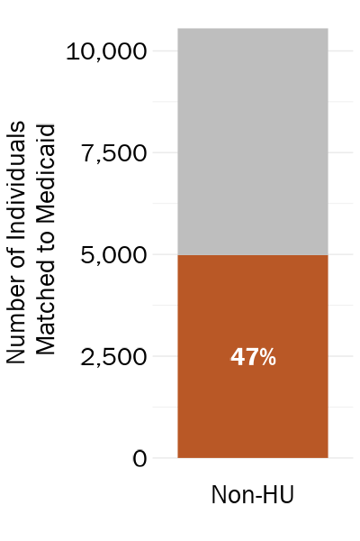
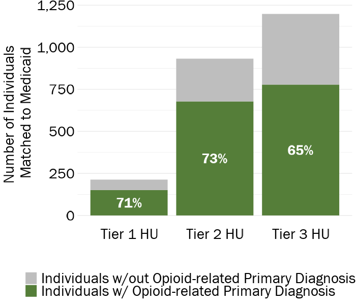
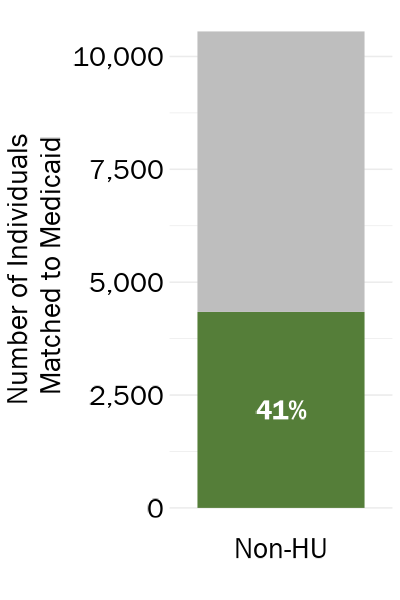
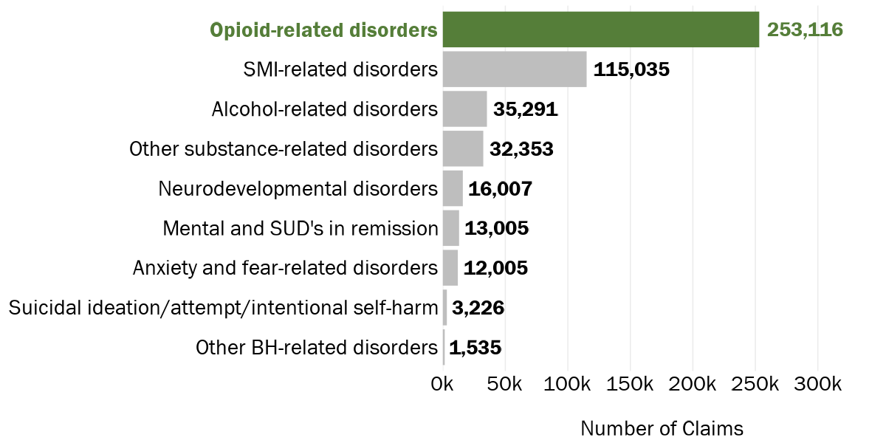

```{r include=FALSE}
# Load packages, functions, and data
source("data_cleaning/00_library.R")
source("data_cleaning/01_functions.R")
source("data_cleaning/rdas.R")

# Set chunk output 
knitr::opts_chunk$set(
  echo=FALSE, 
  message=FALSE, 
  warning=FALSE,
  dev = "ragg_png",
  cache = FALSE
  )
```

```{r include=FALSE}
##########
# Import files
##########

# Import medicaid_jail_all -- medicaid jail data that we'll compare to the numbers from the jail administrative files
# This file lives on the external hard drive (created and exported in `14_medicaid.R`)
medicaid_jail_all <- read_rds("D:/Analytic/medicaid_jail_all.rds") 

# Import jail_medicaid_analytic_individual_booking_level -- the individual-level analytic file created with all DHHS files
# File is unique by individual/booking
# This file lives on the external hard drive (created and exported in `14_medicaid.R`)
jail_medicaid_analytic_individual_booking_level <- read_rds("D:/Analytic/jail_medicaid_analytic_individual_booking_level.rds") 

# Import medicaid encounters with costs and individual diagnoses created in `14_medicaid.R`
medicaid_encounters_costs_all <- read_rds("D:/Analytic/medicaid_enrollment_categories_encounters.rds") 

##########
# Set up files
##########

# De-dup (there are a few duplicate bookings) and create booking id for analysis
medicaid_jail_all_dedup <- medicaid_jail_all %>% 
  distinct(unique_person_id, 
           booking_id,
           .keep_all = TRUE) %>% 
  mutate(unique_person_booking_id = paste0(unique_person_id,
                                    booking_id)) ### creating unique booking id with both individual and booking IDs


# De-dup (there are a few duplicate bookings) and create booking id for analysis
jail_medicaid_analytic_individual_booking_level_dedup <- jail_medicaid_analytic_individual_booking_level %>% 
  distinct(unique_person_id, 
           booking_id,
           .keep_all = TRUE) %>% 
  mutate(unique_person_booking_id = paste0(unique_person_id,
                                    booking_id)) ### creating unique booking id with both individual and booking IDs

# Recode high utilizer percentile grouping
jail_medicaid_analytic_individual_booking_level_dedup_hu_recode <- fnc_hu_group_exclusive(jail_medicaid_analytic_individual_booking_level_dedup) 

# Create unique booking id using id and dose date
medicaid_encounters_costs <- medicaid_encounters_costs_all
medicaid_encounters_costs$claim_id <- medicaid_encounters_costs %>% 
  dplyr::group_indices(unique_person_id, first_dos_dt) 

# Reorganize variables
medicaid_encounters_costs <- medicaid_encounters_costs %>% 
  dplyr::select(unique_person_id,
                claim_id,
                everything())

# Create data of just primary diagnosis costs by subsetting to claims that are MH or SUD or both
medicaid_encounters_costs_primary_dx_2018_2021 <- medicaid_encounters_costs %>% 
  filter(mh_service_categorized_using_primary_dx_code  == 1 | 
         sud_service_categorized_using_primary_dx_code == 1) %>% 
  # Subset to FY 2019 to FY 2021
  filter(first_dos_dt > "2018-06-30" & first_dos_dt < "2021-07-01")
```         

# DHHS Medicaid Match and Jail Booking Descriptive Analysis: Behavioral Health Encounters by High Jail Utilizer Grouping

<br>

## Tables

### Table 1a: Mental Health and Substance Use Disorder Service Medicaid Encounters by **Overall** High Utilizer Grouping

Note: Co-Occurring Disorders indicates that individual had at least one Mental Health- and one Substance Use Disorder-related primary diagnoses in the Medicaid data.

**Update**: I am currently using all behavioral health data from the Medicaid Encounter file that occurred either before or during the study period (Medicaid eligibility start date <= 6/30/2021). Percentages reflect the percentage of the Medicaid sample unless otherwise stated (e.g. "% of Overall Sample")

```{r echo=FALSE,message=FALSE,warning=FALSE} 
# by hu_group_exclusive
medicaid_jail_county_bh_service_type_hu_table <- jail_medicaid_analytic_individual_booking_level_dedup_hu_recode %>% 
  dplyr::group_by(hu_group_overall) %>% 
  dplyr::summarise(`Overall Individuals (N)` = n_distinct(unique_person_id),
                   `Individuals w/ any Medicaid Match (% of Overall Sample)` = scales::percent(n_distinct(unique_person_id[pre_or_study_window_medicaid_match_flag_overall==1])/`Overall Individuals (N)`),
                   `Individuals w/ BH Encounter (%)` = scales::percent(n_distinct(unique_person_id[pre_or_study_bh_flag==1])/n_distinct(unique_person_id[pre_or_study_window_medicaid_match_flag_overall==1])),
                   
                   `Individuals w/ MH Service Encounter, Primary Diagnosis (N)` = n_distinct(unique_person_id[pre_or_study_mh_service_primary_dx_flag==1]),
                   `Individuals w/ MH Service Encounter, Primary Diagnosis (%)` = scales::percent(`Individuals w/ MH Service Encounter, Primary Diagnosis (N)`/n_distinct(unique_person_id[pre_or_study_window_medicaid_match_flag_overall==1])),
                   
                   `Individuals w/ SUD Service Encounter, Primary Diagnosis (N)` = n_distinct(unique_person_id[pre_or_study_sud_service_primary_dx_flag==1]),
                   `Individuals w/ SUD Service Encounter, Primary Diagnosis (%)` = scales::percent(`Individuals w/ SUD Service Encounter, Primary Diagnosis (N)`/n_distinct(unique_person_id[pre_or_study_window_medicaid_match_flag_overall==1])),
                   
                   `Individuals w/ MH and SUD Service Encounters, Co-Occurring Disorders (N)` = n_distinct(unique_person_id[pre_or_study_mh_service_primary_dx_flag==1 & pre_or_study_sud_service_primary_dx_flag==1]),
                   `Individuals w/ MH and SUD Service Encounters, Co-Occurring Disorders (%)` = scales::percent(`Individuals w/ MH and SUD Service Encounters, Co-Occurring Disorders (N)`/n_distinct(unique_person_id[pre_or_study_window_medicaid_match_flag_overall==1])),
                   
                   `Individuals w/ MH or SUD Service Encounter, Secondary Diagnosis (N)` = n_distinct(unique_person_id[pre_or_study_bh_mh_or_sud_service_secondary_dx_flag==1]),
                   `Individuals w/ MH or SUD Service Encounter, Secondary Diagnosis (%)` = scales::percent(`Individuals w/ MH or SUD Service Encounter, Secondary Diagnosis (N)`/n_distinct(unique_person_id[pre_or_study_window_medicaid_match_flag_overall==1]))) %>% 
  ungroup() %>% 
  dplyr::rename(`High Utilizer Status` = hu_group_overall) 

# statewide
medicaid_jail_overall_bh_service_type_hu_table <- jail_medicaid_analytic_individual_booking_level_dedup_hu_recode %>% 
  dplyr::summarise(`Overall Individuals (N)` = n_distinct(unique_person_id),
                   `Individuals w/ any Medicaid Match (% of Overall Sample)` = scales::percent(n_distinct(unique_person_id[pre_or_study_window_medicaid_match_flag_overall==1])/`Overall Individuals (N)`),
                   `Individuals w/ BH Encounter (%)` = scales::percent(n_distinct(unique_person_id[pre_or_study_bh_flag==1])/n_distinct(unique_person_id[pre_or_study_window_medicaid_match_flag_overall==1])),
                   
                   `Individuals w/ MH Service Encounter, Primary Diagnosis (N)` = n_distinct(unique_person_id[pre_or_study_mh_service_primary_dx_flag==1]),
                   `Individuals w/ MH Service Encounter, Primary Diagnosis (%)` = scales::percent(`Individuals w/ MH Service Encounter, Primary Diagnosis (N)`/n_distinct(unique_person_id[pre_or_study_window_medicaid_match_flag_overall==1])),
                   
                   `Individuals w/ SUD Service Encounter, Primary Diagnosis (N)` = n_distinct(unique_person_id[pre_or_study_sud_service_primary_dx_flag==1]),
                   `Individuals w/ SUD Service Encounter, Primary Diagnosis (%)` = scales::percent(`Individuals w/ SUD Service Encounter, Primary Diagnosis (N)`/n_distinct(unique_person_id[pre_or_study_window_medicaid_match_flag_overall==1])),
                  
                   `Individuals w/ MH and SUD Service Encounters, Co-Occurring Disorders (N)` = n_distinct(unique_person_id[pre_or_study_mh_service_primary_dx_flag==1 & pre_or_study_sud_service_primary_dx_flag==1]),
                   `Individuals w/ MH and SUD Service Encounters, Co-Occurring Disorders (%)` = scales::percent(`Individuals w/ MH and SUD Service Encounters, Co-Occurring Disorders (N)`/n_distinct(unique_person_id[pre_or_study_window_medicaid_match_flag_overall==1])),
                   
                   `Individuals w/ MH or SUD Service Encounter, Secondary Diagnosis (N)` = n_distinct(unique_person_id[pre_or_study_bh_mh_or_sud_service_secondary_dx_flag==1]),
                   `Individuals w/ MH or SUD Service Encounter, Secondary Diagnosis (%)` = scales::percent(`Individuals w/ MH or SUD Service Encounter, Secondary Diagnosis (N)`/n_distinct(unique_person_id[pre_or_study_window_medicaid_match_flag_overall==1]))) %>% 
  ungroup() %>% 
  dplyr::mutate(`High Utilizer Status` = "Statewide") 

# rbind county and statewide files 
medicaid_jail_county_statewide_bh_service_type_hu_table <- rbind(medicaid_jail_county_bh_service_type_hu_table,
                                                                 medicaid_jail_overall_bh_service_type_hu_table)

### print table via kableextra
kable(medicaid_jail_county_statewide_bh_service_type_hu_table, 
      format.args = list(big.mark = ","), 
      align=rep('c')) %>%
  kable_styling(bootstrap_options = c("striped", 
                                       "hover", 
                                       "condensed", 
                                       "responsive"), 
                 row_label_position = "l") %>% 
  row_spec(3, bold = TRUE) %>% 
  column_spec(4, bold = TRUE) %>% 
  column_spec(6, bold = TRUE) %>% 
  column_spec(8, bold = TRUE) %>% 
  column_spec(10, bold = TRUE) %>% 
  column_spec(12, bold = TRUE) %>% 
  scroll_box(width = "130%")
```

<br>

**Mental Health Encounters**

```{r}
# By HU group
medicaid_match_mh_hu <- jail_medicaid_analytic_individual_booking_level_dedup_hu_recode %>% 
  dplyr::group_by(hu_group_overall) %>% 
  summarise(`Individuals w/ MH Service Encounter, Primary Diagnosis (N)` = n_distinct(unique_person_id[pre_or_study_mh_service_primary_dx_flag==1]),
            `Individuals w/ MH Service Encounter, Primary Diagnosis` = `Individuals w/ MH Service Encounter, Primary Diagnosis (N)`/n_distinct(unique_person_id[pre_or_study_window_medicaid_match_flag_overall==1]),
            `Individuals w/out MH Service Encounter, Primary Diagnosis (N)` = n_distinct(unique_person_id[pre_or_study_mh_service_primary_dx_flag==0]),
            `Individuals w/out MH Service Encounter, Primary Diagnosis` = `Individuals w/out MH Service Encounter, Primary Diagnosis (N)`/n_distinct(unique_person_id[pre_or_study_window_medicaid_match_flag_overall==1])
            )

# By state
medicaid_match_mh_state <- jail_medicaid_analytic_individual_booking_level_dedup_hu_recode %>% 
  summarise(`Individuals w/ MH Service Encounter, Primary Diagnosis (N)` = n_distinct(unique_person_id[pre_or_study_mh_service_primary_dx_flag==1]),
            `Individuals w/ MH Service Encounter, Primary Diagnosis` = `Individuals w/ MH Service Encounter, Primary Diagnosis (N)`/n_distinct(unique_person_id[pre_or_study_window_medicaid_match_flag_overall==1]),
            `Individuals w/out MH Service Encounter, Primary Diagnosis (N)` = n_distinct(unique_person_id[pre_or_study_mh_service_primary_dx_flag==0]),
            `Individuals w/out MH Service Encounter, Primary Diagnosis` = `Individuals w/out MH Service Encounter, Primary Diagnosis (N)`/n_distinct(unique_person_id[pre_or_study_window_medicaid_match_flag_overall==1])
            ) %>%  
  mutate(hu_group_overall = "Statewide") 

# Rbind HU group and state
medicaid_match_mh_all <- rbind(medicaid_match_mh_hu, medicaid_match_mh_state)

# Change from wide to long format
medicaid_match_mh_all <- medicaid_match_mh_all %>% 
  select(hu_group_overall,
         `Individuals w/ MH Service Encounter, Primary Diagnosis`,
         `Individuals w/out MH Service Encounter, Primary Diagnosis`) 
medicaid_match_mh_all <- gather(medicaid_match_mh_all, population, pct, `Individuals w/ MH Service Encounter, Primary Diagnosis`:`Individuals w/out MH Service Encounter, Primary Diagnosis`, factor_key=TRUE)

# Change from wide to long format
medicaid_match_mh_all <- medicaid_match_mh_all %>% 
  mutate(population = factor(population, 
                             levels = c("Individuals w/out MH Service Encounter, Primary Diagnosis",
                                        "Individuals w/ MH Service Encounter, Primary Diagnosis"),
                             labels = c("Individuals w/out MH Service Encounter",
                                        "Individuals w/ MH Service Encounter"))) %>% 
  mutate(pct1 = round(pct*100, 0))
```

```{r}
PRES_gg_medicaid_mh <- ggplot(medicaid_match_mh_all, aes(x = reorder(hu_group_overall, desc(hu_group_overall)), y = pct, fill = population)) +
  geom_col(colour = "white", position = "fill") +
  scale_y_continuous(labels = scales::percent) +
  scale_fill_manual(values=c("gray",jri_light_blue),
                    na.value = "white") +
  geom_text(aes(label = paste(round(pct*100, 0), "%", sep = ""), 
                fontface = 'bold'),
            position = position_fill(vjust = 0.5),
            vjust = 0.8,
            size = 10, family = "Franklin Gothic Book",
            color = case_when(medicaid_match_mh_all$population == "Individuals w/ MH Service Encounter" ~ "white",
                              TRUE ~ "black")) +
  theme_minimal() +
  coord_flip() +
  guides(fill = guide_legend(reverse = TRUE)) +
  theme(panel.grid.minor.y = element_blank(),
        panel.grid.major.y = element_blank(),
        panel.grid.major.x = element_blank(),
        panel.grid.minor.x = element_blank(),
        axis.title.y = element_blank(),
        axis.title.x = element_blank(),
        axis.text.x = element_text(size = 28, color = "black"),
        axis.text.y = element_text(size = 28, color = "black"),
        # legend.position = "right",
        legend.justification = c(0.5, 0.5),
        legend.direction = "vertical",
        legend.box = "horizontal",
        legend.position = "bottom",
        legend.title=element_blank(),
        legend.text = element_text(family = "Franklin Gothic Book", size = 28, color = "black"))
```

```{r, out.width="100%", echo=FALSE, layout = "l-body"}
ggsave(PRES_gg_medicaid_mh, file="img/PRES_gg_medicaid_mh.png", width = 12,  height = 6, dpi = 100)
knitr::include_graphics("img/PRES_gg_medicaid_mh.png")
```

<br>

**Substance Use Disorder Encounters**

```{r}
# By HU group
medicaid_match_sud_hu <- jail_medicaid_analytic_individual_booking_level_dedup_hu_recode %>% 
  dplyr::group_by(hu_group_overall) %>% 
  summarise(`Individuals w/ SUD Service Encounter, Primary Diagnosis (N)` = n_distinct(unique_person_id[pre_or_study_sud_service_primary_dx_flag==1]),
            `Individuals w/ SUD Service Encounter, Primary Diagnosis` = `Individuals w/ SUD Service Encounter, Primary Diagnosis (N)`/n_distinct(unique_person_id[pre_or_study_window_medicaid_match_flag_overall==1]),
            `Individuals w/out SUD Service Encounter, Primary Diagnosis (N)` = n_distinct(unique_person_id[pre_or_study_sud_service_primary_dx_flag==0]),
            `Individuals w/out SUD Service Encounter, Primary Diagnosis` = `Individuals w/out SUD Service Encounter, Primary Diagnosis (N)`/n_distinct(unique_person_id[pre_or_study_window_medicaid_match_flag_overall==1])
  )

# By state
medicaid_match_sud_state <- jail_medicaid_analytic_individual_booking_level_dedup_hu_recode %>% 
  summarise(`Individuals w/ SUD Service Encounter, Primary Diagnosis (N)` = n_distinct(unique_person_id[pre_or_study_sud_service_primary_dx_flag==1]),
            `Individuals w/ SUD Service Encounter, Primary Diagnosis` = `Individuals w/ SUD Service Encounter, Primary Diagnosis (N)`/n_distinct(unique_person_id[pre_or_study_window_medicaid_match_flag_overall==1]),
            `Individuals w/out SUD Service Encounter, Primary Diagnosis (N)` = n_distinct(unique_person_id[pre_or_study_sud_service_primary_dx_flag==0]),
            `Individuals w/out SUD Service Encounter, Primary Diagnosis` = `Individuals w/out SUD Service Encounter, Primary Diagnosis (N)`/n_distinct(unique_person_id[pre_or_study_window_medicaid_match_flag_overall==1])
  ) %>%  
  mutate(hu_group_overall = "Statewide") 

# Rbind HU group and state
medicaid_match_sud_all <- rbind(medicaid_match_sud_hu, medicaid_match_sud_state)

# Change from wide to long format
medicaid_match_sud_all <- medicaid_match_sud_all %>% 
  select(hu_group_overall,
         `Individuals w/ SUD Service Encounter, Primary Diagnosis`,
         `Individuals w/out SUD Service Encounter, Primary Diagnosis`) 
medicaid_match_sud_all <- gather(medicaid_match_sud_all, population, pct, `Individuals w/ SUD Service Encounter, Primary Diagnosis`:`Individuals w/out SUD Service Encounter, Primary Diagnosis`, factor_key=TRUE)

# Change from wide to long format
medicaid_match_sud_all <- medicaid_match_sud_all %>% 
  mutate(population = factor(population, 
                             levels = c("Individuals w/out SUD Service Encounter, Primary Diagnosis",
                                        "Individuals w/ SUD Service Encounter, Primary Diagnosis"),
                             labels = c("Individuals w/out SUD Service Encounter",
                                        "Individuals w/ SUD Service Encounter"))) %>% 
  mutate(pct1 = round(pct*100, 0))
```

```{r}
PRES_gg_medicaid_sud <- ggplot(medicaid_match_sud_all, aes(x = reorder(hu_group_overall, desc(hu_group_overall)), y = pct, fill = population)) +
  geom_col(colour = "white", position = "fill") +
  scale_y_continuous(labels = scales::percent) +
  scale_fill_manual(values=c("gray",jri_green),
                    na.value = "white") +
  geom_text(aes(label = paste(round(pct*100, 0), "%", sep = ""), 
                fontface = 'bold'),
            position = position_fill(vjust = 0.5),
            vjust = 0.8,
            size = 10, family = "Franklin Gothic Book",
            color = case_when(medicaid_match_sud_all$population == "Individuals w/ SUD Service Encounter" ~ "white",
                              TRUE ~ "black")) +
  theme_minimal() +
  coord_flip() +
  guides(fill = guide_legend(reverse = TRUE)) +
  theme(panel.grid.minor.y = element_blank(),
        panel.grid.major.y = element_blank(),
        panel.grid.major.x = element_blank(),
        panel.grid.minor.x = element_blank(),
        axis.title.y = element_blank(),
        axis.title.x = element_blank(),
        axis.text.x = element_text(size = 28, color = "black"),
        axis.text.y = element_text(size = 28, color = "black"),
        # legend.position = "right",
        legend.justification = c(0.5, 0.5),
        legend.direction = "vertical",
        legend.box = "horizontal",
        legend.position = "bottom",
        legend.title=element_blank(),
        legend.text = element_text(family = "Franklin Gothic Book", size = 28, color = "black"))
```

```{r, out.width="100%", echo=FALSE, layout = "l-body"}
ggsave(PRES_gg_medicaid_sud, file="img/PRES_gg_medicaid_sud.png", width = 12,  height = 6, dpi = 100)
knitr::include_graphics("img/PRES_gg_medicaid_sud.png")
```

<br><br>

### Table 1b: Mental Health and Substance Use Disorder Service Medicaid Encounters by High Utilizer Grouping

Note: Co-Occurring Disorders indicates that individual had at least one Mental Health- and one Substance Use Disorder-related primary diagnoses in the Medicaid data.

**Update**: I am currently using all behavioral health data from the Medicaid Encounter file that occurred either before or during  the study period (Medicaid eligibility start date <= 6/30/2021). Percentages reflect the percentage of the Medicaid sample unless otherwise stated (e.g. "% of Overall Sample")

```{r echo=FALSE,message=FALSE,warning=FALSE} 
# by hu_group_exclusive
medicaid_jail_county_bh_service_type_hu_table <- jail_medicaid_analytic_individual_booking_level_dedup_hu_recode %>% 
  dplyr::group_by(hu_group_exclusive) %>% 
  dplyr::summarise(`Overall Individuals (N)` = n_distinct(unique_person_id),
                   `Individuals w/ any Medicaid Match (% of Overall Sample)` = scales::percent(n_distinct(unique_person_id[pre_or_study_window_medicaid_match_flag_overall==1])/`Overall Individuals (N)`),
                   `Individuals w/ BH Encounter (%)` = scales::percent(n_distinct(unique_person_id[pre_or_study_bh_flag==1])/n_distinct(unique_person_id[pre_or_study_window_medicaid_match_flag_overall==1])),
                   `Individuals w/ MH Service Encounter, Primary Diagnosis (N)` = n_distinct(unique_person_id[pre_or_study_mh_service_primary_dx_flag==1]),
                   `Individuals w/ MH Service Encounter, Primary Diagnosis (%)` = scales::percent(`Individuals w/ MH Service Encounter, Primary Diagnosis (N)`/n_distinct(unique_person_id[pre_or_study_window_medicaid_match_flag_overall==1])),
                   `Individuals w/ SUD Service Encounter, Primary Diagnosis (N)` = n_distinct(unique_person_id[pre_or_study_sud_service_primary_dx_flag==1]),
                   `Individuals w/ SUD Service Encounter, Primary Diagnosis (%)` = scales::percent(`Individuals w/ SUD Service Encounter, Primary Diagnosis (N)`/n_distinct(unique_person_id[pre_or_study_window_medicaid_match_flag_overall==1])),
                   `Individuals w/ MH and SUD Service Encounters, Co-Occurring Disorders (N)` = n_distinct(unique_person_id[pre_or_study_mh_service_primary_dx_flag==1 & pre_or_study_sud_service_primary_dx_flag==1]),
                   `Individuals w/ MH and SUD Service Encounters, Co-Occurring Disorders (%)` = scales::percent(`Individuals w/ MH and SUD Service Encounters, Co-Occurring Disorders (N)`/n_distinct(unique_person_id[pre_or_study_window_medicaid_match_flag_overall==1])),
                   `Individuals w/ MH or SUD Service Encounter, Secondary Diagnosis (N)` = n_distinct(unique_person_id[pre_or_study_bh_mh_or_sud_service_secondary_dx_flag==1]),
                   `Individuals w/ MH or SUD Service Encounter, Secondary Diagnosis (%)` = scales::percent(`Individuals w/ MH or SUD Service Encounter, Secondary Diagnosis (N)`/n_distinct(unique_person_id[pre_or_study_window_medicaid_match_flag_overall==1]))) %>% 
  ungroup() %>% 
  dplyr::rename(`High Utilizer Percentiles` = hu_group_exclusive) 

# statewide
medicaid_jail_overall_bh_service_type_hu_table <- jail_medicaid_analytic_individual_booking_level_dedup_hu_recode %>% 
  dplyr::summarise(`Overall Individuals (N)` = n_distinct(unique_person_id),
                   `Individuals w/ any Medicaid Match (% of Overall Sample)` = scales::percent(n_distinct(unique_person_id[pre_or_study_window_medicaid_match_flag_overall==1])/`Overall Individuals (N)`),
                   `Individuals w/ BH Encounter (%)` = scales::percent(n_distinct(unique_person_id[pre_or_study_bh_flag==1])/n_distinct(unique_person_id[pre_or_study_window_medicaid_match_flag_overall==1])),
                   `Individuals w/ MH Service Encounter, Primary Diagnosis (N)` = n_distinct(unique_person_id[pre_or_study_mh_service_primary_dx_flag==1]),
                   `Individuals w/ MH Service Encounter, Primary Diagnosis (%)` = scales::percent(`Individuals w/ MH Service Encounter, Primary Diagnosis (N)`/n_distinct(unique_person_id[pre_or_study_window_medicaid_match_flag_overall==1])),
                   `Individuals w/ SUD Service Encounter, Primary Diagnosis (N)` = n_distinct(unique_person_id[pre_or_study_sud_service_primary_dx_flag==1]),
                   `Individuals w/ SUD Service Encounter, Primary Diagnosis (%)` = scales::percent(`Individuals w/ SUD Service Encounter, Primary Diagnosis (N)`/n_distinct(unique_person_id[pre_or_study_window_medicaid_match_flag_overall==1])),
                   `Individuals w/ MH and SUD Service Encounters, Co-Occurring Disorders (N)` = n_distinct(unique_person_id[pre_or_study_mh_service_primary_dx_flag==1 & pre_or_study_sud_service_primary_dx_flag==1]),
                   `Individuals w/ MH and SUD Service Encounters, Co-Occurring Disorders (%)` = scales::percent(`Individuals w/ MH and SUD Service Encounters, Co-Occurring Disorders (N)`/n_distinct(unique_person_id[pre_or_study_window_medicaid_match_flag_overall==1])),
                   `Individuals w/ MH or SUD Service Encounter, Secondary Diagnosis (N)` = n_distinct(unique_person_id[pre_or_study_bh_mh_or_sud_service_secondary_dx_flag==1]),
                   `Individuals w/ MH or SUD Service Encounter, Secondary Diagnosis (%)` = scales::percent(`Individuals w/ MH or SUD Service Encounter, Secondary Diagnosis (N)`/n_distinct(unique_person_id[pre_or_study_window_medicaid_match_flag_overall==1]))) %>% 
  ungroup() %>% 
  dplyr::mutate(`High Utilizer Percentiles` = "Statewide") 

# rbind county and statewide files 
medicaid_jail_county_statewide_bh_service_type_hu_table <- rbind(medicaid_jail_county_bh_service_type_hu_table,
                                                                 medicaid_jail_overall_bh_service_type_hu_table)

### print table via kableextra
kable(medicaid_jail_county_statewide_bh_service_type_hu_table, 
      format.args = list(big.mark = ","), 
      align=rep('c')) %>%
  kable_styling(bootstrap_options = c("striped", 
                                       "hover", 
                                       "condensed", 
                                       "responsive"), 
                 row_label_position = "l") %>% 
  row_spec(5, bold = TRUE) %>% 
  column_spec(4, bold = TRUE) %>% 
  column_spec(6, bold = TRUE) %>% 
  column_spec(8, bold = TRUE) %>% 
  column_spec(10, bold = TRUE) %>% 
  column_spec(12, bold = TRUE) %>% 
  scroll_box(width = "130%")

```

<br>

```{r}
# Calculate proportion of individuals that matched to Medicaid from 2014-2021
medicaid_match_bh <- jail_medicaid_analytic_individual_booking_level_dedup_hu_recode %>% 

  dplyr::group_by(hu_group_exclusive) %>% 
  dplyr::summarise(`Individuals w/ BH Encounter`    = n_distinct(unique_person_id[pre_or_study_bh_flag==1])/n_distinct(unique_person_id[pre_or_study_window_medicaid_match_flag_overall==1]),
                   `Individuals w/out BH Encounter` = n_distinct(unique_person_id[pre_or_study_bh_flag==0])/n_distinct(unique_person_id[pre_or_study_window_medicaid_match_flag_overall==1])) %>% 
  ungroup() %>% 
  select(hu_group_exclusive,
         `Individuals w/ BH Encounter`,
         `Individuals w/out BH Encounter`)

# Change from wide to long format
medicaid_match_bh <- gather(medicaid_match_bh, population, pct, `Individuals w/ BH Encounter`:`Individuals w/out BH Encounter`, factor_key=TRUE) 
medicaid_match_bh <- medicaid_match_bh %>% 
  mutate(population = factor(population, 
                             levels = c("Individuals w/out BH Encounter",
                                        "Individuals w/ BH Encounter")))
  
# Stacked bar chart showing the proportion of people matched to Medicaid by hu_group_exclusive
PRES_gg_medicaid_match_bh <- ggplot(medicaid_match_bh, aes(x = reorder(hu_group_exclusive, desc(hu_group_exclusive)), y = pct, fill = population)) +
  geom_col(colour = "white", position = "fill") +
  scale_y_continuous(labels = scales::percent) +
  scale_fill_manual(values=c("gray",jri_orange),
                    na.value = "white") +
  geom_text(aes(label = ifelse(pct > .03, paste(round(pct*100, 0), "%", sep = ""), ""), 
                fontface = 'bold'),
            position = position_fill(vjust = 0.5),
            vjust = 0.8,
            size = 10, family = "Franklin Gothic Book",
            color = case_when(medicaid_match_bh$population == "Individuals w/ BH Encounter" ~ "white",
                              TRUE ~ "black")) +
  theme_minimal() +
  coord_flip() +
  guides(fill = guide_legend(reverse = TRUE)) +
  theme(panel.grid.minor.y = element_blank(),
        panel.grid.major.y = element_blank(),
        panel.grid.major.x = element_blank(),
        panel.grid.minor.x = element_blank(),
        axis.title.y = element_blank(),
        axis.title.x = element_blank(),
        axis.text.x = element_text(size = 28, color = "black"),
        axis.text.y = element_text(size = 28, color = "black"),
        legend.justification = c(0.5, 0.5),
        legend.direction = "vertical",
        legend.box = "horizontal",
        legend.position = "bottom",
        legend.title=element_blank(),
        legend.text = element_text(family = "Franklin Gothic Book", size = 28, color = "black")) 
  #geom_hline(yintercept = mean(medicaid_match$pct), color="black", linetype='dotted', lwd=1.5)
```

```{r, out.width="75%", echo=FALSE, layout = "l-body"}
ggsave(PRES_gg_medicaid_match_bh, file="img/PRES_gg_medicaid_match_bh.png", width = 9,  height = 6, dpi = 100)
knitr::include_graphics("img/PRES_gg_medicaid_match_bh.png")
```
<br>

```{r}
# by hu_group_exclusive
medicaid_match_cooccurring <- jail_medicaid_analytic_individual_booking_level_dedup_hu_recode %>% 
  dplyr::group_by(hu_group_exclusive) %>% 
  dplyr::summarise(`Individuals w/ MH and SUD Service Encounters, Co-Occurring Disorders (N)` = n_distinct(unique_person_id[pre_or_study_mh_service_primary_dx_flag==1 & pre_or_study_sud_service_primary_dx_flag==1]),
                   `Individuals w/ MH and SUD Service Encounters, Co-Occurring Disorders` = `Individuals w/ MH and SUD Service Encounters, Co-Occurring Disorders (N)`/n_distinct(unique_person_id[pre_or_study_window_medicaid_match_flag_overall==1]),
                   `Individuals w/out MH and SUD Service Encounters, Co-Occurring Disorders` = 1-`Individuals w/ MH and SUD Service Encounters, Co-Occurring Disorders`) %>% 
  ungroup() %>% 
  select(-`Individuals w/ MH and SUD Service Encounters, Co-Occurring Disorders (N)`)

# change from wide to long format
medicaid_match_cooccurring <- gather(medicaid_match_cooccurring, population, pct, `Individuals w/ MH and SUD Service Encounters, Co-Occurring Disorders`:`Individuals w/out MH and SUD Service Encounters, Co-Occurring Disorders`, factor_key=TRUE) 
medicaid_match_cooccurring <- medicaid_match_cooccurring %>% 
  mutate(population = factor(population, 
                             levels = c("Individuals w/out MH and SUD Service Encounters, Co-Occurring Disorders",
                                        "Individuals w/ MH and SUD Service Encounters, Co-Occurring Disorders"),
                             labels = c("Individuals w/out Co-Occurring Disorders",
                                        "Individuals w/ Co-Occurring Disorders")))

# Stacked bar chart showing the proportion of people matched to Medicaid by hu_group_exclusive
PRES_gg_medicaid_match_cooccurring <- ggplot(medicaid_match_cooccurring, aes(x = reorder(hu_group_exclusive, desc(hu_group_exclusive)), y = pct, fill = population)) +
  geom_col(colour = "white", position = "fill") +
  scale_y_continuous(labels = scales::percent) +
  scale_fill_manual(values=c("gray",jri_dark_blue),
                    na.value = "white") +
  geom_text(aes(label = ifelse(pct > .03, paste(round(pct*100, 0), "%", sep = ""), ""), 
                fontface = 'bold'),
            position = position_fill(vjust = 0.5),
            vjust = 0.8,
            size = 10, family = "Franklin Gothic Book",
            color = case_when(medicaid_match_cooccurring$population == "Individuals w/ Co-Occurring Disorders" ~ "white",
                              TRUE ~ "black")) +
  theme_minimal() +
  coord_flip() +
  guides(fill = guide_legend(reverse = TRUE)) +
  theme(panel.grid.minor.y = element_blank(),
        panel.grid.major.y = element_blank(),
        panel.grid.major.x = element_blank(),
        panel.grid.minor.x = element_blank(),
        axis.title.y = element_blank(),
        axis.title.x = element_blank(),
        axis.text.x = element_text(size = 28, color = "black"),
        axis.text.y = element_text(size = 28, color = "black"),
        legend.justification = c(0.5, 0.5),
        legend.direction = "vertical",
        legend.box = "horizontal",
        legend.position = "bottom",
        legend.title=element_blank(),
        legend.text = element_text(family = "Franklin Gothic Book", size = 28, color = "black"))
```

```{r, out.width="75%", echo=FALSE, layout = "l-body"}
ggsave(PRES_gg_medicaid_match_cooccurring, file="img/PRES_gg_medicaid_match_cooccurring.png", width = 9,  height = 6, dpi = 100)
knitr::include_graphics("img/PRES_gg_medicaid_match_cooccurring.png")
```

<br><br>


### Table 2a: Percentage of Individuals with SMI or Opioid-related Primary Diagnoses (Individual-level) by **Overall** High Utilizer Grouping

**Update**: Percentages reflect the percentage of the Medicaid sample unless otherwise stated (e.g. "% of Overall Sample"). I am currently using all behavioral health data from the Medicaid Encounter file that occurred either before or during the study period. The following primary diagnoses are coded as "SMI" -- based on National Alliance on Mental Illness New Hampshire's definition (NAMI NH), which David shared:

*	Schizophrenia (dx_prmry_clinical_classification = "Schizophrenia and other psychotic disorders", "Schizophrenia spectrum and other psychotic disorders")

*	Bipolar Disorder (dx_prmry_clinical_classification = "Bipolar and related disorders")

*	Major Depression (dx_prmry_clinical_classification = "Depressive disorders")

*	Post-Traumatic Stress Disorder (dx_prmry_clinical_classification = "Trauma- and stressor-related disorders")

*	Borderline Personality Disorder (dx_prmry_clinical_classification = "Personality disorders")

*	Obsessive-Compulsive Disorder (dx_prmry_clinical_classification = "Obsessive-compulsive and related disorders", "Disruptive, impulse-control and conduct disorder")

*	Panic Disorder (nothing coded)

*	Phobias (nothing coded)

*	Eating Disorders (nothing coded)

*	I also included the following diagnoses because it seems like they fit within the definition: dx_prmry_clinical_classification = "Mood disorders" or "Other specified and unspecified mood disorders"


```{r echo=FALSE,message=FALSE,warning=FALSE} 
# by hu_group_exclusive
medicaid_jail_smi_opioid_hu_grouping <- jail_medicaid_analytic_individual_booking_level_dedup_hu_recode %>% 
  dplyr::group_by(hu_group_overall) %>% 
  dplyr::summarise(`Overall Individuals (N)` = n_distinct(unique_person_id),
                   `Individuals w/ any Medicaid Match (N)` = n_distinct(unique_person_id[pre_or_study_window_medicaid_match_flag_overall==1]),
                   `Individuals w/ any Medicaid Match (% of Overall Sample)` = scales::percent(`Individuals w/ any Medicaid Match (N)`/`Overall Individuals (N)`),
                   `Individuals w/ BH Encounter (N)` = n_distinct(unique_person_id[pre_or_study_mh_service_primary_dx_flag==1]),
                   `Individuals w/ BH Encounter (%)` = scales::percent(`Individuals w/ BH Encounter (N)`/`Individuals w/ any Medicaid Match (N)`),
                   `Individuals w/ SMI Primary Diagnosis (N)` = n_distinct(unique_person_id[pre_or_study_smi_flag==1]),
                   `Individuals w/ SMI Primary Diagnosis (%)` = scales::percent(`Individuals w/ SMI Primary Diagnosis (N)`/`Individuals w/ any Medicaid Match (N)`),
                   `Individuals w/ Opioid-related Primary Diagnosis (N)` = n_distinct(unique_person_id[pre_or_study_opioid_related_flag==1]),
                   `Individuals w/ Opioid-related Primary Diagnosis (%)` = scales::percent(`Individuals w/ Opioid-related Primary Diagnosis (N)`/`Individuals w/ any Medicaid Match (N)`)) %>% 
  ungroup() %>% 
  dplyr::rename(`High Utilizer Status` = hu_group_overall) 

# statewide
medicaid_jail_smi_opioid_statewide <- jail_medicaid_analytic_individual_booking_level_dedup_hu_recode %>% 
  dplyr::summarise(`Overall Individuals (N)` = n_distinct(unique_person_id),
                   `Individuals w/ any Medicaid Match (N)` = n_distinct(unique_person_id[pre_or_study_window_medicaid_match_flag_overall==1]),
                   `Individuals w/ any Medicaid Match (% of Overall Sample)` = scales::percent(`Individuals w/ any Medicaid Match (N)`/`Overall Individuals (N)`),
                   `Individuals w/ BH Encounter (N)` = n_distinct(unique_person_id[pre_or_study_mh_service_primary_dx_flag==1]),
                   `Individuals w/ BH Encounter (%)` = scales::percent(`Individuals w/ BH Encounter (N)`/`Individuals w/ any Medicaid Match (N)`),
                   `Individuals w/ SMI Primary Diagnosis (N)` = n_distinct(unique_person_id[pre_or_study_smi_flag==1]),
                   `Individuals w/ SMI Primary Diagnosis (%)` = scales::percent(`Individuals w/ SMI Primary Diagnosis (N)`/`Individuals w/ any Medicaid Match (N)`),
                   `Individuals w/ Opioid-related Primary Diagnosis (N)` = n_distinct(unique_person_id[pre_or_study_opioid_related_flag==1]),
                   `Individuals w/ Opioid-related Primary Diagnosis (%)` = scales::percent(`Individuals w/ Opioid-related Primary Diagnosis (N)`/`Individuals w/ any Medicaid Match (N)`)) %>% 
  dplyr::mutate(`High Utilizer Status` = "Statewide") 

# rbind county and statewide files 
medicaid_jail_smi_opioid_hu_grouping_statewide_table <- rbind(medicaid_jail_smi_opioid_hu_grouping,
                                                               medicaid_jail_smi_opioid_statewide)

### print table via kableextra
kable(medicaid_jail_smi_opioid_hu_grouping_statewide_table, 
      format.args = list(big.mark = ","), 
      align=rep('c')) %>%
  kable_styling(bootstrap_options = c("striped", 
                                       "hover", 
                                       "condensed", 
                                       "responsive"), 
                 row_label_position = "l") %>% 
  row_spec(3, bold = TRUE) %>% 
  column_spec(8, bold = TRUE) %>% 
  column_spec(10, bold = TRUE) %>% 
  scroll_box(width = "130%")

```

<br><br>

### Table 2b: Percentage of Individuals with SMI or Opioid-related Primary Diagnoses (Individual-level)

**Update**: Percentages reflect the percentage of the Medicaid sample unless otherwise stated (e.g. "% of Overall Sample"). I am currently using all behavioral health data from the Medicaid Encounter file that occurred either before or during the study period. The following primary diagnoses are coded as "SMI" -- based on National Alliance on Mental Illness New Hampshire's definition (NAMI NH), which David shared:

*	Schizophrenia (dx_prmry_clinical_classification = "Schizophrenia and other psychotic disorders", "Schizophrenia spectrum and other psychotic disorders")

*	Bipolar Disorder (dx_prmry_clinical_classification = "Bipolar and related disorders")

*	Major Depression (dx_prmry_clinical_classification = "Depressive disorders")

*	Post-Traumatic Stress Disorder (dx_prmry_clinical_classification = "Trauma- and stressor-related disorders")

*	Borderline Personality Disorder (dx_prmry_clinical_classification = "Personality disorders")

*	Obsessive-Compulsive Disorder (dx_prmry_clinical_classification = "Obsessive-compulsive and related disorders", "Disruptive, impulse-control and conduct disorder")

*	Panic Disorder (nothing coded)

*	Phobias (nothing coded)

*	Eating Disorders (nothing coded)

*	I also included the following diagnoses because it seems like they fit within the definition: dx_prmry_clinical_classification = "Mood disorders" or "Other specified and unspecified mood disorders"

```{r echo=FALSE,message=FALSE,warning=FALSE} 
# by hu_group_exclusive
medicaid_jail_smi_opioid_hu_grouping <- jail_medicaid_analytic_individual_booking_level_dedup_hu_recode %>% 
  dplyr::group_by(hu_group_exclusive) %>% 
  dplyr::summarise(`Overall Individuals (N)` = n_distinct(unique_person_id),
                   `Individuals w/ any Medicaid Match (N)` = n_distinct(unique_person_id[pre_or_study_window_medicaid_match_flag_overall==1]),
                   `Individuals w/ any Medicaid Match (% of Overall Sample)` = scales::percent(`Individuals w/ any Medicaid Match (N)`/`Overall Individuals (N)`),
                   `Individuals w/ BH Encounter (N)` = n_distinct(unique_person_id[pre_or_study_mh_service_primary_dx_flag==1]),
                   `Individuals w/ BH Encounter (%)` = scales::percent(`Individuals w/ BH Encounter (N)`/`Individuals w/ any Medicaid Match (N)`),
                   `Individuals w/ SMI Primary Diagnosis (N)` = n_distinct(unique_person_id[pre_or_study_smi_flag==1]),
                   `Individuals w/ SMI Primary Diagnosis (%)` = scales::percent(`Individuals w/ SMI Primary Diagnosis (N)`/`Individuals w/ any Medicaid Match (N)`),
                   `Individuals w/ Opioid-related Primary Diagnosis (N)` = n_distinct(unique_person_id[pre_or_study_opioid_related_flag==1]),
                   `Individuals w/ Opioid-related Primary Diagnosis (%)` = scales::percent(`Individuals w/ Opioid-related Primary Diagnosis (N)`/`Individuals w/ any Medicaid Match (N)`)) %>% 
  ungroup() %>% 
  dplyr::rename(`High Utilizer Percentiles` = hu_group_exclusive) 

# statewide
medicaid_jail_smi_opioid_statewide <- jail_medicaid_analytic_individual_booking_level_dedup_hu_recode %>% 
  dplyr::summarise(`Overall Individuals (N)` = n_distinct(unique_person_id),
                   `Individuals w/ any Medicaid Match (N)` = n_distinct(unique_person_id[pre_or_study_window_medicaid_match_flag_overall==1]),
                   `Individuals w/ any Medicaid Match (% of Overall Sample)` = scales::percent(`Individuals w/ any Medicaid Match (N)`/`Overall Individuals (N)`),
                   `Individuals w/ BH Encounter (N)` = n_distinct(unique_person_id[pre_or_study_mh_service_primary_dx_flag==1]),
                   `Individuals w/ BH Encounter (%)` = scales::percent(`Individuals w/ BH Encounter (N)`/`Individuals w/ any Medicaid Match (N)`),
                   `Individuals w/ SMI Primary Diagnosis (N)` = n_distinct(unique_person_id[pre_or_study_smi_flag==1]),
                   `Individuals w/ SMI Primary Diagnosis (%)` = scales::percent(`Individuals w/ SMI Primary Diagnosis (N)`/`Individuals w/ any Medicaid Match (N)`),
                   `Individuals w/ Opioid-related Primary Diagnosis (N)` = n_distinct(unique_person_id[pre_or_study_opioid_related_flag==1]),
                   `Individuals w/ Opioid-related Primary Diagnosis (%)` = scales::percent(`Individuals w/ Opioid-related Primary Diagnosis (N)`/`Individuals w/ any Medicaid Match (N)`)) %>% 
  dplyr::mutate(`High Utilizer Percentiles` = "Statewide") 

# rbind county and statewide files 
medicaid_jail_smi_opioid_hu_grouping_statewide_table <- rbind(medicaid_jail_smi_opioid_hu_grouping,
                                                               medicaid_jail_smi_opioid_statewide)

### print table via kableextra
kable(medicaid_jail_smi_opioid_hu_grouping_statewide_table, 
      format.args = list(big.mark = ","), 
      align=rep('c')) %>%
  kable_styling(bootstrap_options = c("striped", 
                                       "hover", 
                                       "condensed", 
                                       "responsive"), 
                 row_label_position = "l") %>% 
  row_spec(5, bold = TRUE) %>% 
  column_spec(8, bold = TRUE) %>% 
  column_spec(10, bold = TRUE) %>% 
  scroll_box(width = "130%")

```

<br>

**High utilizers were more likely to have a serious mental illness (SMI) than non-high utilizers.**

```{r}
# by hu_group_exclusive
medicaid_jail_smi_hu_grouping <- jail_medicaid_analytic_individual_booking_level_dedup_hu_recode %>% 
  dplyr::group_by(hu_group_exclusive) %>% 
  dplyr::summarise(`Individuals w/ any Medicaid Match` = n_distinct(unique_person_id[pre_or_study_window_medicaid_match_flag_overall==1]),
                   `Individuals w/ SMI Primary Diagnosis` = n_distinct(unique_person_id[pre_or_study_smi_flag==1]),
                   `Individuals w/out SMI Primary Diagnosis` = `Individuals w/ any Medicaid Match`-`Individuals w/ SMI Primary Diagnosis`,
                   pct = `Individuals w/ SMI Primary Diagnosis`/`Individuals w/ any Medicaid Match`) %>% 
  ungroup() %>% 
  select(-`Individuals w/ any Medicaid Match`) %>% 
  filter(hu_group_exclusive != "Non-HU")

# change from wide to long format
medicaid_jail_smi_hu_grouping <- gather(medicaid_jail_smi_hu_grouping, population, total, `Individuals w/ SMI Primary Diagnosis`:`Individuals w/out SMI Primary Diagnosis`, factor_key=TRUE) 
medicaid_jail_smi_hu_grouping <- medicaid_jail_smi_hu_grouping %>% 
  mutate(population = factor(population, 
                             levels = c("Individuals w/out SMI Primary Diagnosis",
                                        "Individuals w/ SMI Primary Diagnosis"),
                             labels = c("Individuals w/out SMI Primary Diagnosis",
                                        "Individuals w/ SMI Primary Diagnosis")))

PRES_gg_medicaid_jail_smi_hu_grouping <- ggplot(medicaid_jail_smi_hu_grouping, aes(fill=population, y=total, x=hu_group_exclusive)) + 
    geom_bar(position="stack", stat="identity") +
    geom_text(aes(label = ifelse(medicaid_jail_smi_hu_grouping$population == "Individuals w/ SMI Primary Diagnosis", paste0(round(pct*100, 0), "%", sep = ""), "")),
              # position=position_dodge(width=0.2), vjust=-0.25,
              position = position_stack(vjust = .5),
              size = 7.5, family = "Franklin Gothic Book",
              color = "white",
              fontface = "bold") + 
    scale_fill_manual(values=c("gray",jri_orange),
                    na.value = "white") +
    # expand_limits(y = 1400) +
    scale_y_continuous(labels = label_number(big.mark = ",")) +
    xlab("") + ylab("Number of Individuals\n Matched to Medicaid") +
    theme_with_grid_with_labels +
    theme(legend.justification = c(0.5, 0.5),
          legend.direction = "vertical",
          legend.box = "horizontal",
          legend.position = "bottom",
          legend.title=element_blank(),
          legend.text = element_text(family = "Franklin Gothic Book", size = 22, color = "black"))
```

```{r, out.width="100%", echo=FALSE, layout = "l-body"}
ggsave(PRES_gg_medicaid_jail_smi_hu_grouping, file="img/PRES_gg_medicaid_jail_smi_hu_grouping.png", width = 7,  height = 6, dpi = 100)
# 
```

```{r}
# by non-HU
medicaid_jail_smi_nonhu <- jail_medicaid_analytic_individual_booking_level_dedup_hu_recode %>% 
  dplyr::group_by(hu_group_exclusive) %>% 
  dplyr::summarise(`Individuals w/ any Medicaid Match` = n_distinct(unique_person_id[pre_or_study_window_medicaid_match_flag_overall==1]),
                   `Individuals w/ SMI Primary Diagnosis` = n_distinct(unique_person_id[pre_or_study_smi_flag==1]),
                   `Individuals w/out SMI Primary Diagnosis` = `Individuals w/ any Medicaid Match`-`Individuals w/ SMI Primary Diagnosis`,
                   pct = `Individuals w/ SMI Primary Diagnosis`/`Individuals w/ any Medicaid Match`) %>% 
  ungroup() %>% 
  select(-`Individuals w/ any Medicaid Match`) %>% 
  filter(hu_group_exclusive == "Non-HU")

# change from wide to long format
medicaid_jail_smi_nonhu <- gather(medicaid_jail_smi_nonhu, population, total, `Individuals w/ SMI Primary Diagnosis`:`Individuals w/out SMI Primary Diagnosis`, factor_key=TRUE) 
medicaid_jail_smi_nonhu <- medicaid_jail_smi_nonhu %>% 
  mutate(population = factor(population, 
                             levels = c("Individuals w/out SMI Primary Diagnosis",
                                        "Individuals w/ SMI Primary Diagnosis"),
                             labels = c("Individuals w/out SMI Primary Diagnosis",
                                        "Individuals w/ SMI Primary Diagnosis")))

PRES_gg_medicaid_jail_smi_nonhu <- ggplot(medicaid_jail_smi_nonhu, aes(fill=population, y=total, x=hu_group_exclusive)) + 
    geom_bar(position="stack", stat="identity") +
    geom_text(aes(label = ifelse(medicaid_jail_smi_nonhu$population == "Individuals w/ SMI Primary Diagnosis", paste0(round(pct*100, 0), "%", sep = ""), "")),
              # position=position_dodge(width=0.2), vjust=-0.25,
              position = position_stack(vjust = .5),
              size = 7.5, family = "Franklin Gothic Book",
              color = "white",
              fontface = "bold") + 
    scale_fill_manual(values=c("gray",jri_orange),
                    na.value = "white") +
    # expand_limits(y = 1400) +
    scale_y_continuous(labels = label_number(big.mark = ",")) +
    xlab("") + ylab("Number of Individuals\n Matched to Medicaid") +
    theme_with_grid_with_labels +
    theme(#legend.justification = c(0.5, 0.5),
          #legend.direction = "vertical",
          #legend.box = "horizontal",
          #legend.position = "bottom",
          legend.position = "none",
          legend.title=element_blank(),
          legend.text = element_text(family = "Franklin Gothic Book", size = 22, color = "black"))
```

```{r, out.width="100%", echo=FALSE, layout = "l-body"}
ggsave(PRES_gg_medicaid_jail_smi_nonhu, file="img/PRES_gg_medicaid_jail_smi_nonhu.png", width = 4,  height = 6, dpi = 100)
#
```

```{r, echo=FALSE, fig.align='center'}
knitr::include_graphics(c("img/PRES_gg_medicaid_jail_smi_hu_grouping.png","img/PRES_gg_medicaid_jail_smi_nonhu.png"))
```

<br>

**High utilizers were more likely to have a an opioid-related primary diagnosis than non-high utilizers.**

```{r}
# by hu_group_exclusive
medicaid_jail_opioid_hu_grouping <- jail_medicaid_analytic_individual_booking_level_dedup_hu_recode %>% 
  dplyr::group_by(hu_group_exclusive) %>% 
  dplyr::summarise(`Individuals w/ any Medicaid Match` = n_distinct(unique_person_id[pre_or_study_window_medicaid_match_flag_overall==1]),
                   `Individuals w/ Opioid-related Primary Diagnosis` = n_distinct(unique_person_id[pre_or_study_opioid_related_flag==1]),
                   `Individuals w/out Opioid-related Primary Diagnosis` = `Individuals w/ any Medicaid Match` - `Individuals w/ Opioid-related Primary Diagnosis`,
                   `pct` = `Individuals w/ Opioid-related Primary Diagnosis`/`Individuals w/ any Medicaid Match`) %>% 
  ungroup() %>% 
  select(-`Individuals w/ any Medicaid Match`) %>% 
  filter(hu_group_exclusive != "Non-HU")

# change from wide to long format
medicaid_jail_opioid_hu_grouping <- gather(medicaid_jail_opioid_hu_grouping, population, total, `Individuals w/ Opioid-related Primary Diagnosis`:`Individuals w/out Opioid-related Primary Diagnosis`, factor_key=TRUE) 
medicaid_jail_opioid_hu_grouping <- medicaid_jail_opioid_hu_grouping %>% 
  mutate(population = factor(population, 
                             levels = c("Individuals w/out Opioid-related Primary Diagnosis",
                                        "Individuals w/ Opioid-related Primary Diagnosis"),
                             labels = c("Individuals w/out Opioid-related Primary Diagnosis",
                                        "Individuals w/ Opioid-related Primary Diagnosis")))

PRES_gg_medicaid_jail_opioid_hu_grouping <- ggplot(medicaid_jail_opioid_hu_grouping, aes(fill=population, y=total, x=hu_group_exclusive)) + 
    geom_bar(position="stack", stat="identity") +
    geom_text(aes(label = ifelse(medicaid_jail_opioid_hu_grouping$population == "Individuals w/ Opioid-related Primary Diagnosis", paste0(round(pct*100, 0), "%", sep = ""), "")),
              position = position_stack(vjust = .5),
              size = 7.5, family = "Franklin Gothic Book",
              color = "white",
              fontface = "bold") + 
    scale_fill_manual(values=c("gray",jri_green),
                    na.value = "white") +
    # expand_limits(y = 1400) +
    scale_y_continuous(labels = label_number(big.mark = ",")) +
    xlab("") + ylab("Number of Individuals\n Matched to Medicaid") +
    theme_with_grid_with_labels +
    theme(legend.justification = c(0.85, 0.5),
          legend.direction = "vertical",
          legend.box = "horizontal",
          legend.position = "bottom",
          legend.title=element_blank(),
          legend.text = element_text(family = "Franklin Gothic Book", size = 22, color = "black"))
```

```{r, out.width="100%", echo=FALSE, layout = "l-body"}
ggsave(PRES_gg_medicaid_jail_opioid_hu_grouping, file="img/PRES_gg_medicaid_jail_opioid_hu_grouping.png", width = 7,  height = 6, dpi = 100)
# 
```

```{r}
# by hu_group_exclusive
medicaid_jail_opioid_nonhu <- jail_medicaid_analytic_individual_booking_level_dedup_hu_recode %>% 
  dplyr::group_by(hu_group_exclusive) %>% 
  dplyr::summarise(`Individuals w/ any Medicaid Match` = n_distinct(unique_person_id[pre_or_study_window_medicaid_match_flag_overall==1]),
                   `Individuals w/ Opioid-related Primary Diagnosis` = n_distinct(unique_person_id[pre_or_study_opioid_related_flag==1]),
                   `Individuals w/out Opioid-related Primary Diagnosis` = `Individuals w/ any Medicaid Match` - `Individuals w/ Opioid-related Primary Diagnosis`,
                   `pct` = `Individuals w/ Opioid-related Primary Diagnosis`/`Individuals w/ any Medicaid Match`) %>% 
  ungroup() %>% 
  select(-`Individuals w/ any Medicaid Match`) %>% 
  filter(hu_group_exclusive == "Non-HU")

# change from wide to long format
medicaid_jail_opioid_nonhu <- gather(medicaid_jail_opioid_nonhu, population, total, `Individuals w/ Opioid-related Primary Diagnosis`:`Individuals w/out Opioid-related Primary Diagnosis`, factor_key=TRUE) 
medicaid_jail_opioid_nonhu <- medicaid_jail_opioid_nonhu %>% 
  mutate(population = factor(population, 
                             levels = c("Individuals w/out Opioid-related Primary Diagnosis",
                                        "Individuals w/ Opioid-related Primary Diagnosis"),
                             labels = c("Individuals w/out Opioid-related Primary Diagnosis",
                                        "Individuals w/ Opioid-related Primary Diagnosis")))

PRES_gg_medicaid_jail_opioid_nonhu <- ggplot(medicaid_jail_opioid_nonhu, aes(fill=population, y=total, x=hu_group_exclusive)) + 
    geom_bar(position="stack", stat="identity") +
    geom_text(aes(label = ifelse(medicaid_jail_opioid_nonhu$population == "Individuals w/ Opioid-related Primary Diagnosis", paste0(round(pct*100, 0), "%", sep = ""), "")),
              position = position_stack(vjust = .5),
              size = 7.5, family = "Franklin Gothic Book",
              color = "white",
              fontface = "bold") + 
    scale_fill_manual(values=c("gray",jri_green),
                    na.value = "white") +
    # expand_limits(y = 1400) +
    scale_y_continuous(labels = label_number(big.mark = ",")) +
    xlab("") + ylab("Number of Individuals\n Matched to Medicaid") +
    theme_with_grid_with_labels +
    theme(legend.position = "none",
          legend.title=element_blank(),
          legend.text = element_text(family = "Franklin Gothic Book", size = 22, color = "black"))
```

```{r, out.width="100%", echo=FALSE, layout = "l-body"}
ggsave(PRES_gg_medicaid_jail_opioid_nonhu, file="img/PRES_gg_medicaid_jail_opioid_nonhu.png", width = 4,  height = 6, dpi = 100)
# 
```

```{r, echo=FALSE, fig.align='center'}
knitr::include_graphics(c("img/PRES_gg_medicaid_jail_opioid_hu_grouping.png","img/PRES_gg_medicaid_jail_opioid_nonhu.png"))
```

<br>

# Trends for Medicaid Claims (FY2019-2021) 

### Table 3: Common primary diagnoses for Medicaid claims between FY2019-2021

```{r}
# Group SMI's together 
 medicaid_encounters_cleaned <- medicaid_encounters_costs_primary_dx_2018_2021 %>% 
  mutate(dx_prmry_clinical_classification_new = case_when(
    
    # SMI-related disorders
    dx_prmry_clinical_classification == "Schizophrenia and other psychotic disorders"          ~ "SMI-related disorders",
    dx_prmry_clinical_classification == "Schizophrenia spectrum and other psychotic disorders" ~ "SMI-related disorders",
    dx_prmry_clinical_classification == "Depressive disorders"                                 ~ "SMI-related disorders",
    dx_prmry_clinical_classification == "Bipolar and related disorders"                        ~ "SMI-related disorders",
    dx_prmry_clinical_classification == "Trauma- and stressor-related disorders"               ~ "SMI-related disorders",
    dx_prmry_clinical_classification == "Personality disorders"                                ~ "SMI-related disorders",
    dx_prmry_clinical_classification == "Obsessive-compulsive and related disorders"           ~ "SMI-related disorders",
    dx_prmry_clinical_classification == "Disruptive, impulse-control and conduct disorder"     ~ "SMI-related disorders",
    dx_prmry_clinical_classification == "Mood disorders"                                       ~ "SMI-related disorders",
    dx_prmry_clinical_classification == "Other specified and unspecified mood disorders"       ~ "SMI-related disorders",
    
    # Suicidal ideation/attempt/intentional self-harm
    dx_prmry_clinical_classification == "Suicidal ideation/attempt/intentional self-harm"             ~ "Suicidal ideation/attempt/intentional self-harm",
    dx_prmry_clinical_classification == "Suicide attempt/intentional self-harm; subsequent encounter" ~ "Suicidal ideation/attempt/intentional self-harm",
    
    # Other substance-related disorders
    dx_prmry_clinical_classification == "Sedative-related disorders"                  ~ "Other substance-related disorders",
    dx_prmry_clinical_classification == "Cannabis-related disorders"                  ~ "Other substance-related disorders",
    dx_prmry_clinical_classification == "Tobacco-related disorders"                   ~ "Other substance-related disorders",
    dx_prmry_clinical_classification == "Hallucinogen-related disorders"              ~ "Other substance-related disorders",
    dx_prmry_clinical_classification == "Inhalant-related disorders"                  ~ "Other substance-related disorders",
    dx_prmry_clinical_classification == "Other specified substance-related disorders" ~ "Other substance-related disorders",
    dx_prmry_clinical_classification == "Stimulant-related disorders"                 ~ "Other substance-related disorders",
    dx_prmry_clinical_classification == "Alcohol-related disorders"                   ~ "Other substance-related disorders",

    # Other mh-related disorders
    dx_prmry_clinical_classification == "Adjustment disorders"                                     ~ "Other BH-related disorders",
    dx_prmry_clinical_classification == "Feeding and eating disorders"                             ~ "Other BH-related disorders",
    dx_prmry_clinical_classification == "Somatic disorders"                                        ~ "Other BH-related disorders",
    dx_prmry_clinical_classification == "Disruptive, impulse-control and conduct disorders"        ~ "Other BH-related disorders",
    dx_prmry_clinical_classification == "Miscellaneous mental and behavioral disorders/conditions" ~ "Other BH-related disorders",

    dx_prmry_clinical_classification == "Mental and substance use disorders in remission" ~ "Mental and SUD's in remission",

    
    TRUE ~ dx_prmry_clinical_classification
  )) 

# Find top primary diagnoses and the proportion of claims for each
top_primary_diagnoses_grouped <- medicaid_encounters_cleaned %>% 
  group_by(dx_prmry_clinical_classification_new) %>% 
  summarise(total_claims = n_distinct(claim_id)) %>% 
  ungroup() %>% 
  mutate(pct_claims = (total_claims/sum(total_claims))*100,
         pct_claims = round(pct_claims, 0),
         pct_claims = paste0(pct_claims, "%", sep = ""),
         pct_claims = case_when(pct_claims == "0%" ~ "<0%", TRUE ~ pct_claims)) 

PRES_gg_medicaid_top_diagnoses <- top_primary_diagnoses_grouped %>%
  ggplot(aes(x = reorder(dx_prmry_clinical_classification_new, total_claims), 
             y = total_claims, fill=factor(ifelse(dx_prmry_clinical_classification_new=="Opioid-related disorders","Highlighted","Normal")))) +
  geom_bar(stat = "identity") +
  scale_fill_manual(name = "area", values=c(jri_light_blue,"grey50")) +
      geom_text(aes(label = comma(total_claims), fontface = 'bold'
                    ), 
                color = ifelse(top_primary_diagnoses_grouped$dx_prmry_clinical_classification_new=="Opioid-related disorders", jri_light_blue, "black"), 
                hjust = -.1, size = 7.5, family = "Franklin Gothic Book") +
  xlab("") + ylab("\nNumber of Claims") +
  scale_y_continuous(labels = label_number(suffix = "k", scale = 1e-3, big.mark = ","),
                     expand = c(0,0),
                     limits = c(0,350000),
                     breaks=c(0, 50000, 100000, 150000, 200000, 250000, 300000)) +
  coord_flip() +
  theme_no_grid_no_labels +
  theme(legend.position = "none",
        legend.title=element_blank(),
        legend.text = element_text(family = "Franklin Gothic Book", size = 22, color = "black"),
        
        panel.grid.major.x = element_line(linewidth = 0.5),

        axis.title   = element_text(size = 22, color = "black"),
        axis.title.y = element_text(size = 22, color = "black"),
        axis.title.x = element_text(size = 22, color = "black"),
        axis.text.y  = element_text(size = 22, color = "black" 
                                    #face = "bold"
                                    ),
        axis.text.x  = element_text(size = 22, color = "black"))
```

```{r, out.width="50%", echo=FALSE, layout = "l-body"}
ggsave(PRES_gg_medicaid_top_diagnoses, file="img/PRES_gg_medicaid_top_diagnoses.png", width = 12,  height = 6, dpi = 100)

```


<br><br>

**See full notes and business rules for variable creation in data dictionary for individual-level analytic file here: https://csgorg.sharepoint.com/:x:/s/Team-JC-Research/EUJfEABIuNNBvKARa4Kq1nwBvSLwsK4aH7K9oZDOWxbc1w?e=zLytTB**

<br><br>
