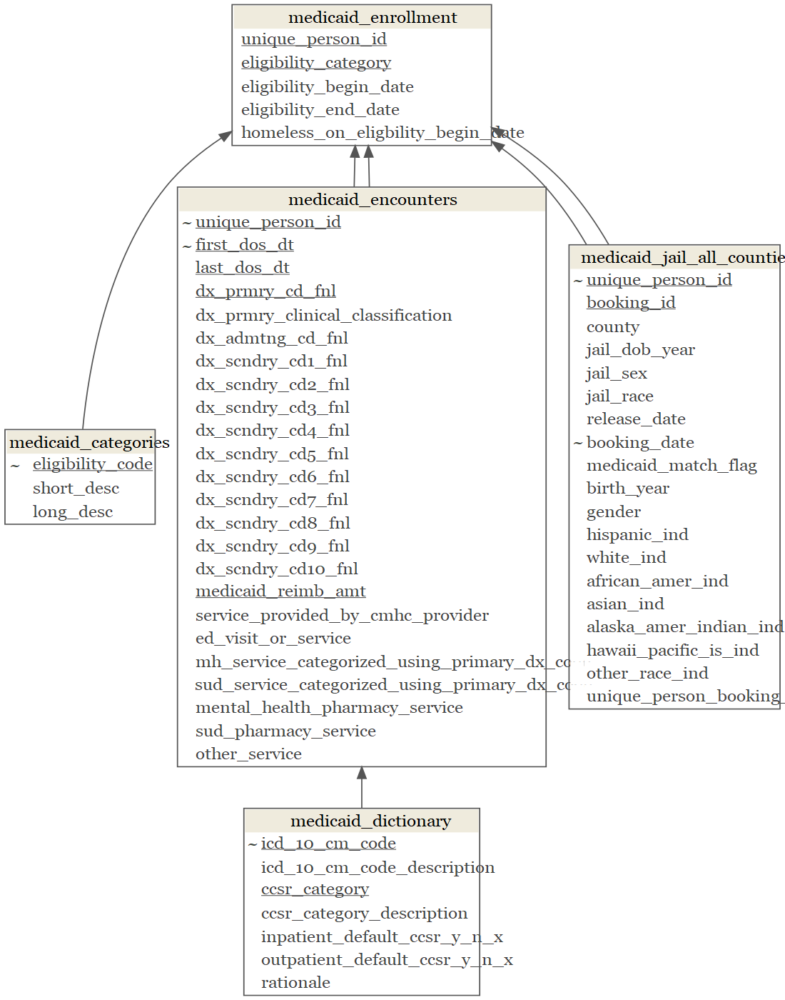

```{r include=FALSE}
### call libraries
library(easypackages)
libraries("tidyverse","foreign","lubridate","reshape2", "ggplot2","RColorBrewer","knitr","forcats","openxlsx","statar","svDialogs","xlsx", "magrittr","stringr", "data.table","janitor","kableExtra","leaflet", "readr", "rmarkdown","rowr", "gganimate", "gifski","tidycensus","sf","htmltools","acs","tigris","mapview","rgeos", "ggrepel", "censusxy","gdata","lavaan","mclust","tmap","rmarkdown", "raster","rgeos","gmapsdistance","viridis","cowplot","lintr","leaflet.extras","censusapi","data.table","gridGraphics","readxl","haven","ggridges","extrafont","extrafontdb","datamodelr","Lahman","DiagrammeR","fs","readxl","rsvg","V8","ragg","distill","DataExplorer","csgjcr")
```

```{r include=FALSE,message=FALSE,warning=FALSE}
### suppress scientific notation
options(scipen=999)

### set chunk output specifications
knitr::opts_chunk$set(
  echo = TRUE,
  dev = "ragg_png",
  cache = FALSE)

### set theme
theme_set(theme_minimal())
```

# Data Diagram 

**Notes:** 

* In addition to the diagnosis classification values provided in `data_dictionary`, which uses ICD-10 lookup values for diagnoses after 2015, we need to use ICD-9 lookup values for diagnoses prior to 2015. I downloaded and incorporated it into ‘14_medicaid’ cleaning syntax. ICD-9 data was downloaded from https://www.cms.gov/medicare/coordination-benefits-recovery-overview/icd-code-lists and currently lives here: JR_NH\Data\Medicaid Data

    + For ICD-9 data, there aren’t CCSR category descriptions that come with the data, but I've downloaded "CCS" category descriptions (CCS category descriptions seem to be the predecessor to CCSR categories: CCS stands for clinical classification software and CCSR is clinical classification software refined). I downloaded additional lookup values from ‘Single Level CSS’ link here: http://healthydatascience.com/ahrq_ccs_icd.html

    + If we’re hoping to use the CCS/CCSR fields for analysis, we may have to do additional manual cleaning to standardize them.

* To create `booking_id` from the data provided by DHHS, we combine `unique_person_id` and `booking_date`.

* To join `medicaid_encounters` to `medicaid_enrollment`, the `medicaid_encounters$first_dos_dt` must be >= `medicaid_enrollment$eligiblity_begin_date` and <= `medicaid_enrollment$eligiblity_end_date`

* Similarly, to join `medicaid_jail_all_counties` to `medicaid_enrollment`, `medicaid_jail_all_counties$booking_date` must be >= `medicaid_enrollment$eligibility_begin_date` and <= `medicaid_enrollment$eligibility_end_date`


**To confirm:**

* There are pure duplicates in the `medicaid_encounters`file -- how do we ensure these are okay? Double check with Uma? 

* What is the exact date cut-off for ICD-9 versus ICD-10?

```{r layout="l-page",echo=FALSE,message=FALSE,warning=FALSE}

```

<br><br>

# Data Codebooks

**For all missing data plots**, here are the % missingness categories: "Good" <= 5% missing, "OK" <= 40% missing, "Bad" <= 80% missing, and "Remove" = 100% missing

```{r include=FALSE}
### set path using csg_sp_path for data folder
sp_data_path <- csg_sp_path(file.path("JR_NH"))

### pull in medicaid data from external hard drive

# medicaid events
medicaid_encounters <- read_csv("D:/CSG-Encounters File 201407-202106.txt") %>% 
  clean_names()

# medicaid enrollment
medicaid_enrollment <- read_csv("D:/Medicaid Enrollment Data For County Matched Members.txt") %>% 
  clean_names()

# eligibility categories descriptions
medicaid_categories <- read_excel("D:/Categories of Eligibility Description.xlsx") %>% 
  clean_names()

# medicaid data dictionary (icd-10)
medicaid_dictionary <- read_excel(paste0(sp_data_path, "/Data/DHHS_data_dictionary.xlsx"), 
                                  sheet = "DX_to_CCSR_Mapping",
                                  skip = 1) %>% 
  clean_names()

### import medicaid_jail_all -- medicaid jail data that we'll compare to the numbers from the jail administrative files
### this file lives on the external hard drive (created and exported in `13_medicaid.R`)
medicaid_jail_all <- read_rds("D:/Analytic/medicaid_jail_all.rds") 

medicaid_jail_all_counties <- medicaid_jail_all %>% 
  clean_names() %>% 
  distinct(unique_person_id, 
           booking_id,
           .keep_all = TRUE) %>% 
  mutate(unique_person_booking_id = paste0(unique_person_id,
                                    booking_id)) ### creating unique booking id with both individual and booking IDs
```

```{r include=FALSE}
### custom function to tweak color output from package (so that green is good and red is something other than good)
plot_missing_2 <-
function (data, group = list(Good = 0.05, Okay = 0.4, Poor = 0.8, 
  Remove =  1), geom_label_args = list(), title = NULL, ggtheme = theme_gray(), 
theme_config = list(legend.position = c("bottom"))) 
{
  pct_missing <- Missingness <- NULL
  missing_value <- data.table(profile_missing(data))
  group <- group[sort.list(unlist(group))]
  invisible(lapply(seq_along(group), function(i) {
    if (i == 1) {
      missing_value[pct_missing <= group[[i]], `:=`(Missingness,
         names(group)[i])]
    } else {
  missing_value[pct_missing > group[[i - 1]] & pct_missing <= 
     group[[i]], `:=`(Missingness, names(group)[i])]
    }
}))
  output <- ggplot(missing_value, aes_string(x = "feature", 
    y = "num_missing", fill = "Missingness")) + geom_bar(stat = "identity") + 
   scale_fill_manual("Missingness", values = c("Good"="green2","Okay"="gold","Poor"="darkorange","Remove"="firebrick2")) + coord_flip() + xlab("Features") + 
   ylab("Missing Rows")
  geom_label_args_list <- list(mapping = aes(label = paste0(round(100 * 
    pct_missing, 2), "%")))
  output <- output + do.call("geom_label", c(geom_label_args_list, 
     geom_label_args))
  class(output) <- c("single", class(output))
  plotDataExplorer(plot_obj = output, title = title, ggtheme = ggtheme, 
   theme_config = theme_config)
}
```

<br>

## Medicaid Enrollment


### Medicaid Enrollment, Data Overview
```{r layout="l-body",echo=FALSE,warning=FALSE,message=FALSE}
### run the `DataExplorer` function introduce()
medicaid_enrollment_table <- DataExplorer::introduce(medicaid_enrollment) %>% 
  pivot_longer(rows:memory_usage, names_to = "Measure", values_to = "Count")

kable(medicaid_enrollment_table, 
      format.args = list(big.mark = ","), 
      align=rep('c')) %>%
   kable_styling(bootstrap_options = c("striped", 
                                       "hover", 
                                       "condensed", 
                                       "responsive"), 
                 row_label_position = "l") 
```

<br>

### Medicaid Enrollment, Fields Included
```{r layout="l-body",echo=FALSE,warning=FALSE,message=FALSE}
### set sharepoint path using csgjcr::csg_sp_path function
medicaid_enrollment_col_names <- as_data_frame(colnames(medicaid_enrollment)) %>% 
  dplyr::rename(`Columns` = value)

### output names via kable table
kable(medicaid_enrollment_col_names, format.args = list(big.mark = ","), align=rep('c')) %>%
   kable_styling(bootstrap_options = c("striped", "hover", "condensed", "responsive"), row_label_position = "l")
```

<br>

### Medicaid Enrollment, Missing Data
```{r layout="l-page",echo=FALSE,warning=FALSE,message=FALSE}
### run the `DataExplorer` function plot_missing()
plot_missing_2(medicaid_enrollment)
```

<br><br>

## Medicaid Categories File 


### Medicaid Categories, Data Overview
```{r layout="l-body",echo=FALSE,warning=FALSE,message=FALSE}
### run the `DataExplorer` function introduce()
medicaid_categories_table <- DataExplorer::introduce(medicaid_categories) %>% 
  pivot_longer(rows:memory_usage, names_to = "Measure", values_to = "Count")

kable(medicaid_categories_table,   
      format.args = list(big.mark = ","), 
      align=rep('c')) %>%
   kable_styling(bootstrap_options = c("striped", 
                                       "hover", 
                                       "condensed", 
                                       "responsive"), 
                 row_label_position = "l") 
```

<br>

### Medicaid Categories, Fields Included
```{r layout="l-body",echo=FALSE,warning=FALSE,message=FALSE}
### set sharepoint path using csgjcr::csg_sp_path function
medicaid_categories_col_names <- as_data_frame(colnames(medicaid_categories)) %>% 
  dplyr::rename(`Columns` = value)

### output names via kable table
kable(medicaid_categories_col_names, format.args = list(big.mark = ","), align=rep('c')) %>%
   kable_styling(bootstrap_options = c("striped", "hover", "condensed", "responsive"), row_label_position = "l")
```

<br>

### Medicaid Categories, Missing Data
```{r layout="l-page",echo=FALSE,warning=FALSE,message=FALSE}
### run the `DataExplorer` function plot_missing()
plot_missing_2(medicaid_categories)
```

<br><br>

## Medicaid Encounters File 


### Medicaid Encounters, Data Overview
```{r layout="l-body",echo=FALSE,warning=FALSE,message=FALSE}
### run the `DataExplorer` function introduce()
medicaid_encounters_table <- DataExplorer::introduce(medicaid_encounters) %>% 
  pivot_longer(rows:memory_usage, names_to = "Measure", values_to = "Count")

kable(medicaid_encounters_table,   
      format.args = list(big.mark = ","), 
      align=rep('c')) %>%
   kable_styling(bootstrap_options = c("striped", 
                                       "hover", 
                                       "condensed", 
                                       "responsive"), 
                 row_label_position = "l")  
```

<br>

### Medicaid Encounters, Fields Included
```{r layout="l-body",echo=FALSE,warning=FALSE,message=FALSE}
### set sharepoint path using csgjcr::csg_sp_path function
medicaid_encounters_col_names <- as_data_frame(colnames(medicaid_encounters)) %>% 
  dplyr::rename(`Columns` = value)

### output names via kable table
kable(medicaid_encounters_col_names, format.args = list(big.mark = ","), align=rep('c')) %>%
   kable_styling(bootstrap_options = c("striped", "hover", "condensed", "responsive"), row_label_position = "l")
```

<br>

### Medicaid Encounters, Missing Data
```{r layout="l-page",echo=FALSE,warning=FALSE,message=FALSE}
### run the `DataExplorer` function plot_missing()
plot_missing_2(medicaid_encounters)
```

<br><br>

## Medicaid Dictionary File 


### Medicaid Dictionary, Data Overview
```{r layout="l-body",echo=FALSE,warning=FALSE,message=FALSE}
### run the `DataExplorer` function introduce()
medicaid_dictionary_table <- DataExplorer::introduce(medicaid_dictionary) %>% 
  pivot_longer(rows:memory_usage, names_to = "Measure", values_to = "Count")

kable(medicaid_dictionary_table,   
      format.args = list(big.mark = ","), 
      align=rep('c')) %>%
   kable_styling(bootstrap_options = c("striped", 
                                       "hover", 
                                       "condensed", 
                                       "responsive"), 
                 row_label_position = "l")  
```

<br>

### Medicaid Dictionary, Fields Included
```{r layout="l-body",echo=FALSE,warning=FALSE,message=FALSE}
### set sharepoint path using csgjcr::csg_sp_path function
medicaid_dictionary_col_names <- as_data_frame(colnames(medicaid_dictionary)) %>% 
  dplyr::rename(`Columns` = value)

### output names via kable table
kable(medicaid_dictionary_col_names, format.args = list(big.mark = ","), align=rep('c')) %>%
   kable_styling(bootstrap_options = c("striped", "hover", "condensed", "responsive"), row_label_position = "l")
```

<br>

### Medicaid Dictionary, Missing Data
```{r layout="l-page",echo=FALSE,warning=FALSE,message=FALSE}
### run the `DataExplorer` function plot_missing_2()
plot_missing_2(medicaid_dictionary)
```

<br><br>

## Medicaid Dictionary File 


### Medicaid Dictionary, Data Overview
```{r layout="l-body",echo=FALSE,warning=FALSE,message=FALSE}
### run the `DataExplorer` function introduce()
medicaid_dictionary_table <- DataExplorer::introduce(medicaid_dictionary) %>% 
  pivot_longer(rows:memory_usage, names_to = "Measure", values_to = "Count")

kable(medicaid_dictionary_table,   
      format.args = list(big.mark = ","), 
      align=rep('c')) %>%
   kable_styling(bootstrap_options = c("striped", 
                                       "hover", 
                                       "condensed", 
                                       "responsive"), 
                 row_label_position = "l")  
```

<br>

### Medicaid Dictionary, Fields Included
```{r layout="l-body",echo=FALSE,warning=FALSE,message=FALSE}
### set sharepoint path using csgjcr::csg_sp_path function
medicaid_dictionary_col_names <- as_data_frame(colnames(medicaid_dictionary)) %>% 
  dplyr::rename(`Columns` = value)

### output names via kable table
kable(medicaid_dictionary_col_names, format.args = list(big.mark = ","), align=rep('c')) %>%
   kable_styling(bootstrap_options = c("striped", "hover", "condensed", "responsive"), row_label_position = "l")
```

<br>

### Medicaid Dictionary, Missing Data
```{r layout="l-page",echo=FALSE,warning=FALSE,message=FALSE}
### run the `DataExplorer` function plot_missing_2()
plot_missing_2(medicaid_dictionary)
```

<br><br>


## Medicaid Jail Data File (this is the analytic file we created from the 9 separate jail files provided by DHHS)


### Medicaid Jail File, Data Overview
```{r layout="l-body",echo=FALSE,warning=FALSE,message=FALSE}
### run the `DataExplorer` function introduce()
medicaid_jail_all_counties_table <- DataExplorer::introduce(medicaid_jail_all_counties) %>% 
  pivot_longer(rows:memory_usage, names_to = "Measure", values_to = "Count")

kable(medicaid_jail_all_counties_table,   
      format.args = list(big.mark = ","), 
      align=rep('c')) %>%
   kable_styling(bootstrap_options = c("striped", 
                                       "hover", 
                                       "condensed", 
                                       "responsive"), 
                 row_label_position = "l")  
```

<br>

### Medicaid Jail File, Fields Included
```{r layout="l-body",echo=FALSE,warning=FALSE,message=FALSE}
### set sharepoint path using csgjcr::csg_sp_path function
medicaid_jail_all_counties_col_names <- as_data_frame(colnames(medicaid_jail_all_counties)) %>% 
  dplyr::rename(`Columns` = value)

### output names via kable table
kable(medicaid_jail_all_counties_col_names, format.args = list(big.mark = ","), align=rep('c')) %>%
   kable_styling(bootstrap_options = c("striped", "hover", "condensed", "responsive"), row_label_position = "l")
```

<br>

### Medicaid Jail File, Missing Data
```{r layout="l-page",echo=FALSE,warning=FALSE,message=FALSE}
### run the `DataExplorer` function plot_missing_2()
plot_missing_2(medicaid_jail_all_counties)
```

<br><br>
