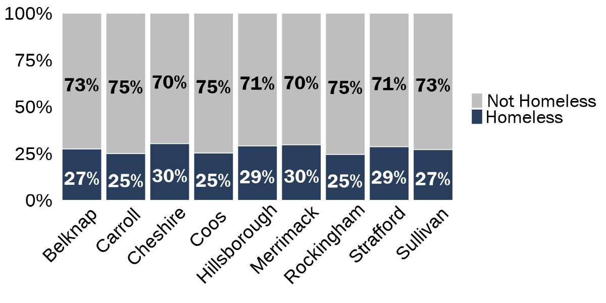

```{r include=FALSE}
### set chunk output 
knitr::opts_chunk$set(
  echo=FALSE, 
  message=FALSE, 
  warning=FALSE,
  dev = "ragg_png",
  cache = FALSE
  )

# Load functions, packages, and data
source("data_cleaning/00_library.R")
source("data_cleaning/01_functions.R")
source("data_cleaning/rdas.R")
```

```{r include=FALSE}
######################
# MEDICAID DATA
######################

### import adm_all -- jail administrative that we'll compare to the numbers from the medicaid match files
load(paste0(sp_data_path, "/Data/r_data/adm_all.Rda", 
            sep = "")) 

### de-dup by individual and booking -- these are the two units of analysis for comparisons to the medicaid data
### here we are de-duping bookings with multiple charges as we don't need that information for this comparison
adm_all_dedup <- adm_all %>% 
  ungroup() %>% 
  distinct(id, 
           booking_id,
           .keep_all = TRUE) %>% 
  mutate(unique_person_booking_id = paste0(id,
                                    booking_id)) ### creating unique booking id with both individual and booking IDs


### import medicaid_jail_all -- medicaid jail data that we'll compare to the numbers from the jail administrative files
### this file lives on the external hard drive (created and exported in `14_medicaid.R`)
medicaid_jail_all <- read_rds("D:/Analytic/medicaid_jail_all.rds") 

### de-dup (there are a few duplicate bookings) and create booking id for analysis
medicaid_jail_all_dedup <- medicaid_jail_all %>% 
  distinct(unique_person_id, 
           booking_id,
           .keep_all = TRUE) %>% 
  mutate(unique_person_booking_id = paste0(unique_person_id,
                                    booking_id)) ### creating unique booking id with both individual and booking IDs

### import jail_medicaid_analytic_individual_booking_level -- the individual-level analytic file created with all DHHS files
### file is unique by individual/booking
### this file lives on the external hard drive (created and exported in `14_medicaid.R`)
jail_medicaid_analytic_individual_booking_level <- read_rds("D:/Analytic/jail_medicaid_analytic_individual_booking_level.rds") 

### de-dup (there are a few duplicate bookings) and create booking id for analysis
jail_medicaid_analytic_individual_booking_level_dedup <- jail_medicaid_analytic_individual_booking_level %>% 
  distinct(unique_person_id, 
           booking_id,
           .keep_all = TRUE) %>% 
  mutate(unique_person_booking_id = paste0(unique_person_id,
                                    booking_id)) ### creating unique booking id with both individual and booking IDs

### to recode high utlizer percentile grouping, we don't need to group_by as the percentile grouping is already grouped across individual from Mari's cleaning
jail_medicaid_analytic_individual_booking_level_dedup_hu_recode <- jail_medicaid_analytic_individual_booking_level_dedup %>% 
  ### to ensure each individual/booking is in correct grouping, start with Non-HU, then 10% and move down to 1%
  mutate(hu_group_exclusive = case_when(
    high_utilizer_10_pct=="No" ~ 4,
    high_utilizer_10_pct=="Yes" & high_utilizer_5_pct=="No" & high_utilizer_1_pct=="No" ~ 3,
    high_utilizer_5_pct=="Yes" & high_utilizer_1_pct=="No" ~ 2,
    high_utilizer_1_pct=="Yes" ~ 1,
    TRUE ~ as.numeric(NA)),
    hu_group_exclusive = factor(hu_group_exclusive,
         levels = c(1,2,3,4),
         labels = c("Top 1%", "Top 5%", "Top 10%", "Non-HU")))

### read in and merge cdc_county_rural_urban_crosswalk: https://www.cdc.gov/nchs/data_access/urban_rural.htm
cdc_county_rural_urban_crosswalk <- openxlsx::read.xlsx(file.path(sp_data_path,"Data/US County Geo Data/CDC_NCHSURCodes2013.xlsx"), 
                                                        sheet = "NCHSURCodes2013") %>%
  clean_names() %>%
  dplyr::filter(state_abr == "NH") %>%
  mutate(cdc_urban_rural_classification = case_when(
    x2013_code=="1" ~ "Urban Center",
    x2013_code=="2" ~ "Suburb",
    x2013_code=="3" ~ "Medium City",
    x2013_code=="4" ~ "Small City",
    x2013_code=="5" ~ "Town", 
    x2013_code=="6" ~ "Rural Area",### see: https://www.cdc.gov/nchs/data/data_acces_files/NCHSUrbruralFileDocumentationInternet2.pd
# from matt:
# Large central metro > Urban centers
# Large fringe metro > Suburbs
# Medium metro > Medium cities
# Small metro > Small cities
# Micropolitan > Towns
# Non-core > Rural areas
    TRUE ~ as.character(NA))) %>% 
  dplyr::select(county_name,cdc_urban_rural_classification) %>% 
  mutate(county = str_remove(county_name,
                             pattern = " County"))

### join cdc_county_rural_urban_crosswalk to jail_medicaid_analytic_individual_booking_level_dedup_hu_recode
jail_medicaid_analytic_individual_booking_level_dedup_hu_recode_cdc <- left_join(jail_medicaid_analytic_individual_booking_level_dedup_hu_recode,
                                                  cdc_county_rural_urban_crosswalk,
                                                  by = "county") 
```         

# DHHS Medicaid Match and Jail Booking Descriptive Analysis: Individuals Experiencing Homelessness

<br>

## Tables


### Table 1. Percentage of Individuals/Bookings who were Experiencing Homelessness at time of Medicaid Eligibility

Note: Since we only have homelessness data for individuals who matched to Medicaid enrollment data, our denominator for these metrics will be the sample of individuals who have at least one Medicaid enrollment during the study window (i.e., individuals who did not match to Medicaid data are excluded here). Because of this decision as well as the fact that the DHHS data notes whether an individual was experiencing homelessness at the beginning of a given Medicaid enrollment period. In other words, we wouldn't know if someone had housing at the beginning of enrollment and then experienced homelessness afterwards). I am currently using all homelessness data from the Medicaid Enrollment files, regardless of timing (before, during, or after the study period). 

**Because of these factors, we should all discuss how we understand and explain this measure. At the very least, we probably want to acknowledge that this is likely an under count** 


```{r echo=FALSE,message=FALSE,warning=FALSE}
### create table of highlighting the percentage of the medicaid sample that experienced homelessness at the beginning of any medicaid enrollment period in DHHS pull

# by county
medicaid_jail_homelessness_county_table <- jail_medicaid_analytic_individual_booking_level_dedup_hu_recode %>% 
  dplyr::group_by(county) %>% 
  dplyr::summarise(`Individuals w/ Medicaid Match (N)` = n_distinct(unique_person_id[medicaid_match_flag==1]),
                   
                   `Individuals w/ any experience of homelessness (N)` = n_distinct(unique_person_id[pre_homeless_on_eligibility_begin_flag==1| 
                                                                                                     study_homeless_on_eligibility_begin_flag==1| 
                                                                                                     post_homeless_on_eligibility_begin_flag==1]),
                   
                   `Individuals w/ any experience of homelessness (%)` = scales::percent(`Individuals w/ any experience of homelessness (N)`/`Individuals w/ Medicaid Match (N)`),
                   
                   `Bookings w/ Medicaid Match (N)` = n_distinct(unique_person_booking_id[medicaid_match_flag==1]),
                   
                   `Bookings w/ any experience of homelessness (N)` = n_distinct(unique_person_booking_id[pre_homeless_on_eligibility_begin_flag==1| 
                                                                                                          study_homeless_on_eligibility_begin_flag==1 | 
                                                                                                          post_homeless_on_eligibility_begin_flag==1]),
                   
                   `Bookings w/ any experience of homelessness (%)` = scales::percent(`Bookings w/ any experience of homelessness (N)`/`Bookings w/ Medicaid Match (N)`))  %>% 
  ungroup() %>% 
  dplyr::rename(`Jail` = county) 

# statewide
medicaid_jail_homelessness_overall_table <- jail_medicaid_analytic_individual_booking_level_dedup_hu_recode %>% 
   dplyr::summarise(`Individuals w/ Medicaid Match (N)` = n_distinct(unique_person_id[medicaid_match_flag==1]),
                   `Individuals w/ any experience of homelessness (N)` = n_distinct(unique_person_id[pre_homeless_on_eligibility_begin_flag==1| 
                                                                                                     study_homeless_on_eligibility_begin_flag==1 | 
                                                                                                     post_homeless_on_eligibility_begin_flag==1]),
                   
                   `Individuals w/ any experience of homelessness (%)` = scales::percent(`Individuals w/ any experience of homelessness (N)`/`Individuals w/ Medicaid Match (N)`),
                   
                   `Bookings w/ Medicaid Match (N)` = n_distinct(unique_person_booking_id[medicaid_match_flag==1]),
                   
                   `Bookings w/ any experience of homelessness (N)` = n_distinct(unique_person_booking_id[pre_homeless_on_eligibility_begin_flag==1| 
                                                                                                          study_homeless_on_eligibility_begin_flag==1 | 
                                                                                                          post_homeless_on_eligibility_begin_flag==1]),
                   
                   `Bookings w/ any experience of homelessness (%)` = scales::percent(`Bookings w/ any experience of homelessness (N)`/`Bookings w/ Medicaid Match (N)`))  %>% 
  dplyr::mutate(`Jail` = "Statewide") 

# rbind county and statewide files 
medicaid_jail_homelessness_county_statewide_table <- rbind(medicaid_jail_homelessness_county_table,
                                                           medicaid_jail_homelessness_overall_table)

### print table via kableextra
kable(medicaid_jail_homelessness_county_statewide_table, 
      format.args = list(big.mark = ","), 
      align=rep('c')) %>%
  kable_styling(bootstrap_options = c("striped", 
                                       "hover", 
                                       "condensed", 
                                       "responsive"), 
                 row_label_position = "l") %>% 
  row_spec(10, bold = TRUE) %>% 
  column_spec(4, bold = TRUE) %>% 
  column_spec(7, bold = TRUE)

```

<br>

```{r include = FALSE}
# Create homeless and not homeless dataframes for ggplot
homeless_by_county <- medicaid_jail_homelessness_county_statewide_table %>% 
  clean_names() %>% 
  select(county    = jail,
         total_pop = individuals_w_medicaid_match_n,
         total     = individuals_w_any_experience_of_homelessness_n) %>% 
  mutate(pct   = total/total_pop,
         type = "Homeless") %>% 
  filter(county != "Statewide") 
not_homeless_by_county <- homeless_by_county %>% 
  mutate(total = total_pop - total,
         pct = total/total_pop,
         type = "Not Homeless") %>% 
  select(county, 
         total_pop,
         total,
         pct,
         type)

# Add data togerther and arrange for display
df_homeless_by_county <- rbind(homeless_by_county, not_homeless_by_county)
arrange(df_homeless_by_county, county)
```


```{r}
# Vertical ggplot showing the proportion of people who experienced homelessness
PRES_gg_homeless_county <- ggplot(df_homeless_by_county, aes(fill=forcats::fct_rev(type), 
                                  y=pct, x=county)) + 
    geom_bar(position="fill", stat="identity") +
    scale_x_discrete(limits = rev) +
    scale_y_continuous(labels = scales::percent) +
    scale_fill_manual(values=c("gray", jri_dark_blue),
                      na.value = "white",
                      guide=guide_legend(reverse=T)) +
    geom_text(aes(label = paste(round(pct*100, 0), "%", sep = ""), 
                  fontface = 'bold'),
              position = position_fill(vjust = 0.5),
              vjust = 0.8,
              size = 10, family = "Franklin Gothic Book",
              color = case_when(df_homeless_by_county$type == "Homeless" ~ "white",
                                TRUE ~ "black")) +
    coord_flip() +
    theme_minimal() +
    theme(panel.grid.minor.y = element_blank(),
          panel.grid.major.y = element_blank(),
          panel.grid.major.x = element_blank(),
          panel.grid.minor.x = element_blank(),
          axis.title.y = element_blank(),
          axis.title.x = element_blank(),
          axis.text.x = element_text(size = 28, color = "black"),
          axis.text.y = element_text(size = 28, color = "black"),
          legend.position = "top",
          # legend.justification = c(1, 0.5),
          legend.title=element_blank(),
          legend.text = element_text(family = "Franklin Gothic Book", size = 28, color = "black")) 

# Horizontal ggplot showing the proportion of people who experienced homelessness
PRES_gg_homeless_county <- ggplot(df_homeless_by_county, aes(x = county, y = pct, fill=forcats::fct_rev(type))) +
  geom_col(colour = "white", position = "fill") +
  scale_y_continuous(labels = scales::percent) +
  scale_fill_manual(values=c("gray",jri_dark_blue),
                    na.value = "white") +
  geom_text(aes(label = paste(round(pct*100, 0), "%", sep = ""), 
                fontface = 'bold'),
            position = position_fill(vjust = 0.5),
            vjust = 0.8,
            size = 10, family = "Franklin Gothic Book",
            color = case_when(df_homeless_by_county$type == "Homeless" ~ "white",
                              TRUE ~ "black")) +
  theme_minimal() +
  theme(panel.grid.minor.y = element_blank(),
        panel.grid.major.y = element_blank(),
        panel.grid.major.x = element_blank(),
        panel.grid.minor.x = element_blank(),
        axis.title.y = element_blank(),
        axis.title.x = element_blank(),
        axis.text.x = element_text(angle = 45, hjust = 0.85, size = 28, color = "black"),
        axis.text.y = element_text(size = 28, color = "black"),
        legend.position = "right",
        legend.justification = c(1, 0.5),
        legend.title=element_blank(),
        legend.text = element_text(family = "Franklin Gothic Book", size = 28, color = "black")) 
```

**From 2019 to 2021, 25% of people who were matched to Medicaid had experienced homelessness.**    

```{r, out.width="100%", echo=FALSE, layout = "l-body"}
ggsave(PRES_gg_homeless_county, file="img/PRES_gg_homeless_county.png", width = 12,  height = 6, dpi = 100)

```

<br><br>

### Table 2. Percentage of Individuals/Bookings who were Experiencing Homelessness at time of Medicaid Eligibility by County Type (by rural/urban classification)

Note: Since we only have homelessness data for individuals who matched to Medicaid enrollment data, our denominator for these metrics will be the sample of individuals who have at least one Medicaid enrollment during the study window (i.e., individuals who did not match to Medicaid data are excluded here). Because of this decision as well as the fact that the DHHS data notes whether an individual was experiencing homelessness at the beginning of a given Medicaid enrollment period. In other words, we wouldn't know if someone had housing at the beginning of enrollment and then experienced homelessness afterwards). I am currently using all homelessness data from the Medicaid Enrollment files, regardless of timing (before, during, or after the study period). 

**Because of these factors, we should all discuss how we understand and explain this measure. At the very least, we probably want to acknowledge that this is likely an under count** 

**County-level CDC rural/urban county classification comes from https://www.cdc.gov/nchs/data_access/urban_rural.htm**

```{r echo=FALSE,message=FALSE,warning=FALSE}
### create table of highlighting the percentage of the medicaid sample that experienced homelessness at the beginning of any medicaid enrollment period in DHHS pull

# by county
medicaid_jail_homelessness_cdc_table <- jail_medicaid_analytic_individual_booking_level_dedup_hu_recode_cdc %>% 
  dplyr::group_by(cdc_urban_rural_classification) %>% 
  dplyr::summarise(`Number of Counties (N)` = n_distinct(county,
                                                         na.rm = TRUE),
                   `Individuals w/ Medicaid Match (N)` = n_distinct(unique_person_id[medicaid_match_flag==1]),
                   `Individuals w/ any experience of homelessness (N)` = n_distinct(unique_person_id[pre_homeless_on_eligibility_begin_flag | study_homeless_on_eligibility_begin_flag==1 | post_homeless_on_eligibility_begin_flag==1]),
                   `Individuals w/ any experience of homelessness (%)` = scales::percent(`Individuals w/ any experience of homelessness (N)`/`Individuals w/ Medicaid Match (N)`),
                   `Bookings w/ Medicaid Match (N)` = n_distinct(unique_person_booking_id[medicaid_match_flag==1]),
                   `Bookings w/ any experience of homelessness (N)` = n_distinct(unique_person_booking_id[pre_homeless_on_eligibility_begin_flag | study_homeless_on_eligibility_begin_flag==1 | post_homeless_on_eligibility_begin_flag==1]),
                   `Bookings w/ any experience of homelessness (%)` = scales::percent(`Bookings w/ any experience of homelessness (N)`/`Bookings w/ Medicaid Match (N)`))  %>% 
  ungroup() %>% 
  dplyr::rename(`CDC County Classification` = cdc_urban_rural_classification) 

# statewide
medicaid_jail_homelessness_overall_table <- jail_medicaid_analytic_individual_booking_level_dedup_hu_recode_cdc %>% 
   dplyr::summarise(`Number of Counties (N)` = n_distinct(county,
                                                         na.rm = TRUE),
                    `Individuals w/ Medicaid Match (N)` = n_distinct(unique_person_id[medicaid_match_flag==1]),
                    `Individuals w/ any experience of homelessness (N)` = n_distinct(unique_person_id[pre_homeless_on_eligibility_begin_flag | study_homeless_on_eligibility_begin_flag==1 | post_homeless_on_eligibility_begin_flag==1]),
                    `Individuals w/ any experience of homelessness (%)` = scales::percent(`Individuals w/ any experience of homelessness (N)`/`Individuals w/ Medicaid Match (N)`),
                    `Bookings w/ Medicaid Match (N)` = n_distinct(unique_person_booking_id[medicaid_match_flag==1]),
                    `Bookings w/ any experience of homelessness (N)` = n_distinct(unique_person_booking_id[pre_homeless_on_eligibility_begin_flag | study_homeless_on_eligibility_begin_flag==1 | post_homeless_on_eligibility_begin_flag==1]),
                    `Bookings w/ any experience of homelessness (%)` = scales::percent(`Bookings w/ any experience of homelessness (N)`/`Bookings w/ Medicaid Match (N)`))  %>% 
  dplyr::mutate(`CDC County Classification` = "Statewide") 

# rbind county and statewide files 
medicaid_jail_homelessness_cdc_statewide_table <- rbind(medicaid_jail_homelessness_cdc_table,
                                                           medicaid_jail_homelessness_overall_table)

### print table via kableextra
kable(medicaid_jail_homelessness_cdc_statewide_table, 
      format.args = list(big.mark = ","), 
      align=rep('c')) %>%
  kable_styling(bootstrap_options = c("striped", 
                                       "hover", 
                                       "condensed", 
                                       "responsive"), 
                 row_label_position = "l") %>% 
  row_spec(5, bold = TRUE) %>% 
  column_spec(5, bold = TRUE) %>% 
  column_spec(8, bold = TRUE)

```

<br><br>

### Table 3. Percentage of High Utilizer Individuals/Bookings who were Experiencing Homelessness at time of Medicaid Eligibility

Note: Since we only have homelessness data for individuals who matched to Medicaid enrollment data, our denominator for these metrics will be the sample of individuals who have at least one Medicaid enrollment during the study window (i.e., individuals who did not match to Medicaid data are excluded here). Because of this decision as well as the fact that the DHHS data notes whether an individual was experiencing homelessness at the beginning of a given Medicaid enrollment period. In other words, we wouldn't know if someone had housing at the beginning of enrollment and then experienced homelessness afterwards). I am currently using all homelessness data from the Medicaid Enrollment files, regardless of timing (before, during, or after the study period). 

**Because of these factors, we should all discuss how we understand and explain this measure. At the very least, we probably want to acknowledge that this is likely an under count** 

**Statistics for individuals who are high utilizers of jail are based on the top 10% percentile of statewide bookings.**


```{r echo=FALSE,message=FALSE,warning=FALSE}
### create table of highlighting the percentage of the medicaid sample that experienced homelessness at the beginning of any medicaid enrollment period in DHHS pull

# by county
medicaid_jail_homelessness_hu_county_table <- jail_medicaid_analytic_individual_booking_level_dedup_hu_recode %>% 
  dplyr::group_by(hu_group_exclusive) %>% 
  dplyr::summarise(`Individuals w/ Medicaid Match (N)` = n_distinct(unique_person_id[medicaid_match_flag==1]),
                   `Individuals w/ any experience of homelessness (N)` = n_distinct(unique_person_id[(pre_homeless_on_eligibility_begin_flag | study_homeless_on_eligibility_begin_flag==1 | post_homeless_on_eligibility_begin_flag==1)]),
                   `Individuals w/ any experience of homelessness (%)` = scales::percent(`Individuals w/ any experience of homelessness (N)`/`Individuals w/ Medicaid Match (N)`),
                   `Bookings w/ Medicaid Match (N)` = n_distinct(unique_person_booking_id[medicaid_match_flag==1]),
                   `Bookings w/ any experience of homelessness (N)` = n_distinct(unique_person_booking_id[(pre_homeless_on_eligibility_begin_flag | study_homeless_on_eligibility_begin_flag==1 | post_homeless_on_eligibility_begin_flag==1)]),
                   `Bookings w/ any experience of homelessness (%)` = scales::percent(`Bookings w/ any experience of homelessness (N)`/`Bookings w/ Medicaid Match (N)`))  %>% 
  ungroup() %>% 
  dplyr::rename(`High Utilizer Percentiles` = hu_group_exclusive) 

# statewide
medicaid_jail_homelessness_hu_overall_table <- jail_medicaid_analytic_individual_booking_level_dedup_hu_recode %>% 
  dplyr::summarise(`Individuals w/ Medicaid Match (N)` = n_distinct(unique_person_id[medicaid_match_flag==1]),
                   `Individuals w/ any experience of homelessness (N)` = n_distinct(unique_person_id[(pre_homeless_on_eligibility_begin_flag | study_homeless_on_eligibility_begin_flag==1 | post_homeless_on_eligibility_begin_flag==1)]),
                   `Individuals w/ any experience of homelessness (%)` = scales::percent(`Individuals w/ any experience of homelessness (N)`/`Individuals w/ Medicaid Match (N)`),
                   `Bookings w/ Medicaid Match (N)` = n_distinct(unique_person_booking_id[medicaid_match_flag==1]),
                   `Bookings w/ any experience of homelessness (N)` = n_distinct(unique_person_booking_id[(pre_homeless_on_eligibility_begin_flag | study_homeless_on_eligibility_begin_flag==1 | post_homeless_on_eligibility_begin_flag==1)]),
                   `Bookings w/ any experience of homelessness (%)` = scales::percent(`Bookings w/ any experience of homelessness (N)`/`Bookings w/ Medicaid Match (N)`))  %>%  
  dplyr::mutate(`High Utilizer Percentiles` = "Statewide") 

# rbind county and statewide files 
medicaid_jail_homelessness_hu_county_statewide_table <- rbind(medicaid_jail_homelessness_hu_county_table,
                                                              medicaid_jail_homelessness_hu_overall_table)

### print table via kableextra
kable(medicaid_jail_homelessness_hu_county_statewide_table, 
      format.args = list(big.mark = ","), 
      align=rep('c')) %>%
  kable_styling(bootstrap_options = c("striped", 
                                       "hover", 
                                       "condensed", 
                                       "responsive"), 
                 row_label_position = "l") %>% 
  row_spec(5, bold = TRUE) %>% 
  column_spec(4, bold = TRUE) %>% 
  column_spec(7, bold = TRUE)

```

<br><br>

### Table 4. Percentage of High Utilizer Individuals/Bookings who were Experiencing Homelessness at time of Medicaid Eligibility (**study period only**)

Note: Since we only have homelessness data for individuals who matched to Medicaid enrollment data, our denominator for these metrics will be the sample of individuals who have at least one Medicaid enrollment during the study window (i.e., individuals who did not match to Medicaid data are excluded here). Because of this decision as well as the fact that the DHHS data notes whether an individual was experiencing homelessness at the beginning of a given Medicaid enrollment period. In other words, we wouldn't know if someone had housing at the beginning of enrollment and then experienced homelessness afterwards).

**Because of these factors, we should all discuss how we understand and explain this measure. At the very least, we probably want to acknowledge that this is likely an under count** 

**Statistics for individuals who are high utilizers of jail are based on the top 10% percentile of statewide bookings.**


```{r echo=FALSE,message=FALSE,warning=FALSE}
### create table of highlighting the percentage of the medicaid sample that experienced homelessness at the beginning of any medicaid enrollment period in DHHS pull

# by county
medicaid_jail_homelessness_hu_county_study_period_table <- jail_medicaid_analytic_individual_booking_level_dedup_hu_recode %>% 
  dplyr::group_by(hu_group_exclusive) %>% 
  dplyr::summarise(`Individuals w/ Medicaid Match (N)` = n_distinct(unique_person_id[study_window_medicaid_match_flag_overall==1]),
                   `Individuals w/ any experience of homelessness (N)` = n_distinct(unique_person_id[(study_homeless_on_eligibility_begin_flag==1)]),
                   `Individuals w/ any experience of homelessness (%)` = scales::percent(`Individuals w/ any experience of homelessness (N)`/`Individuals w/ Medicaid Match (N)`),
                   `Bookings w/ Medicaid Match (N)` = n_distinct(unique_person_booking_id[study_window_medicaid_match_flag_overall==1]),
                   `Bookings w/ any experience of homelessness (N)` = n_distinct(unique_person_booking_id[(study_homeless_on_eligibility_begin_flag==1)]),
                   `Bookings w/ any experience of homelessness (%)` = scales::percent(`Bookings w/ any experience of homelessness (N)`/`Bookings w/ Medicaid Match (N)`))  %>% 
  ungroup() %>% 
  dplyr::rename(`High Utilizer Percentiles` = hu_group_exclusive) 

# statewide
medicaid_jail_homelessness_hu_overall_study_period_table <- jail_medicaid_analytic_individual_booking_level_dedup_hu_recode %>% 
  dplyr::summarise(`Individuals w/ Medicaid Match (N)` = n_distinct(unique_person_id[study_window_medicaid_match_flag_overall==1]),
                   `Individuals w/ any experience of homelessness (N)` = n_distinct(unique_person_id[(study_homeless_on_eligibility_begin_flag==1)]),
                   `Individuals w/ any experience of homelessness (%)` = scales::percent(`Individuals w/ any experience of homelessness (N)`/`Individuals w/ Medicaid Match (N)`),
                   `Bookings w/ Medicaid Match (N)` = n_distinct(unique_person_booking_id[study_window_medicaid_match_flag_overall==1]),
                   `Bookings w/ any experience of homelessness (N)` = n_distinct(unique_person_booking_id[(study_homeless_on_eligibility_begin_flag==1)]),
                   `Bookings w/ any experience of homelessness (%)` = scales::percent(`Bookings w/ any experience of homelessness (N)`/`Bookings w/ Medicaid Match (N)`))  %>%   
  dplyr::mutate(`High Utilizer Percentiles` = "Statewide") 

# rbind county and statewide files 
medicaid_jail_homelessness_hu_county_statewide_study_period_table <- rbind(medicaid_jail_homelessness_hu_county_study_period_table,
                                                              medicaid_jail_homelessness_hu_overall_study_period_table)

### print table via kableextra
kable(medicaid_jail_homelessness_hu_county_statewide_study_period_table, 
      format.args = list(big.mark = ","), 
      align=rep('c')) %>%
  kable_styling(bootstrap_options = c("striped", 
                                       "hover", 
                                       "condensed", 
                                       "responsive"), 
                 row_label_position = "l") %>% 
  row_spec(5, bold = TRUE) %>% 
  column_spec(4, bold = TRUE) %>% 
  column_spec(7, bold = TRUE)

```

<br><br>

### Table 5. Percentage of People with BH needs who were Experiencing Homelessness at time of Medicaid Eligibility by County

```{r}
# Number of people by county
medicaid_bh_homeless_people_county <- jail_medicaid_analytic_individual_booking_level_dedup_hu_recode %>% 
  group_by(county) %>% 
  dplyr::summarise(# Number of people on Medicaid
                   medicaid_n  = n_distinct(unique_person_id[medicaid_match_flag==1]),
                   
                   # Number of people experiencing homelessness
                   homeless_n = n_distinct(unique_person_id[pre_homeless_on_eligibility_begin_flag   == 1 | 
                                                            study_homeless_on_eligibility_begin_flag == 1 | 
                                                            post_homeless_on_eligibility_begin_flag  == 1 ]),
                  
                   ########
                   # People with BH encounters
                   ########
                   
                   # Number of people on Medicaid and BH encounters
                   bh_people_n = n_distinct(unique_person_id[study_bh_flag==1]),
                   
                   # Number of people on Medicaid and BH encounters, and homeless
                   bh_people_homeless_n = n_distinct(unique_person_id[study_bh_flag==1 & (pre_homeless_on_eligibility_begin_flag   == 1 | 
                                                                                          study_homeless_on_eligibility_begin_flag == 1 | 
                                                                                          post_homeless_on_eligibility_begin_flag  == 1)]),
                   # Pct of people who dont have BH and are homeless
                   bh_people_homeless_pct = bh_people_homeless_n/bh_people_n,
                   
                   ########
                   # People without BH encounters
                   ########
                   
                   # Number of people on Medicaid and without BH encounters
                   no_bh_people_n = n_distinct(unique_person_id[study_bh_flag==0]),
                   
                   # Number of people on Medicaid and without BH encounters, and homeless
                   no_bh_people_homeless_n = n_distinct(unique_person_id[study_bh_flag==0 & (pre_homeless_on_eligibility_begin_flag   == 1 | 
                                                                                             study_homeless_on_eligibility_begin_flag == 1 | 
                                                                                             post_homeless_on_eligibility_begin_flag  == 1)]),
                  
                   # Pct of people who dont have BH and are homeless
                   no_bh_people_homeless_pct = no_bh_people_homeless_n/no_bh_people_n
                   ) 

# Number of people by state
medicaid_bh_homeless_people_state <- jail_medicaid_analytic_individual_booking_level_dedup_hu_recode %>% 
  dplyr::summarise(# Number of people on Medicaid
                   medicaid_n  = n_distinct(unique_person_id[medicaid_match_flag==1]),
                   
                   # Number of people experiencing homelessness
                   homeless_n = n_distinct(unique_person_id[pre_homeless_on_eligibility_begin_flag   == 1 | 
                                                            study_homeless_on_eligibility_begin_flag == 1 | 
                                                            post_homeless_on_eligibility_begin_flag  == 1 ]),
                  
                   ########
                   # People with BH encounters
                   ########
                   
                   # Number of people on Medicaid and BH encounters
                   bh_people_n = n_distinct(unique_person_id[study_bh_flag==1]),
                   
                   # Number of people on Medicaid and BH encounters, and homeless
                   bh_people_homeless_n = n_distinct(unique_person_id[study_bh_flag==1 & (pre_homeless_on_eligibility_begin_flag   == 1 | 
                                                                                          study_homeless_on_eligibility_begin_flag == 1 | 
                                                                                          post_homeless_on_eligibility_begin_flag  == 1)]),
                   # Pct of people who dont have BH and are homeless
                   bh_people_homeless_pct = bh_people_homeless_n/bh_people_n,
                   
                   ########
                   # People without BH encounters
                   ########
                   
                   # Number of people on Medicaid and without BH encounters
                   no_bh_people_n = n_distinct(unique_person_id[study_bh_flag==0]),
                   
                   # Number of people on Medicaid and without BH encounters, and homeless
                   no_bh_people_homeless_n = n_distinct(unique_person_id[study_bh_flag==0 & (pre_homeless_on_eligibility_begin_flag   == 1 | 
                                                                                             study_homeless_on_eligibility_begin_flag == 1 | 
                                                                                             post_homeless_on_eligibility_begin_flag  == 1)]),
                  
                   # Pct of people who dont have BH and are homeless
                   no_bh_people_homeless_pct = no_bh_people_homeless_n/no_bh_people_n
                   ) %>% 
  mutate(county = "State")

medicaid_bh_homeless_people_overview <- rbind(medicaid_bh_homeless_people_county, medicaid_bh_homeless_people_state)
```

```{r}
# Reactable table
reactable(medicaid_bh_homeless_people_overview,
          style = list(fontFamily = "Franklin Gothic Book", fontSize = "1.0rem"),
          pagination = FALSE,
          theme = reactableTheme(cellStyle = list(display = "flex", flexDirection = "column", justifyContent = "center"),
                                 headerStyle = list(display = "flex", flexDirection = "column", justifyContent = "center")),
          defaultColDef = reactable::colDef(
            format = colFormat(separators = TRUE), align = "left", minWidth = 150
          ),
          rowStyle = function(index) {
              if (index %in% c(10)) {
                list(`border-top` = "thin solid",
                     fontWeight = "bold")
              }
            },
          compact = TRUE,
          fullWidth = FALSE,
          columnGroups = list(
            colGroup(name = "People with BH Encounters", columns = c("bh_people_n", "bh_people_homeless_n", "bh_people_homeless_pct")),
            colGroup(name = "People without BH Encounters", columns = c("no_bh_people_n", "no_bh_people_homeless_n", "no_bh_people_homeless_pct"))),
          columns = list(
            county                    = colDef(name = "County", minWidth = 200, style = list(fontWeight = "bold")),
            
            medicaid_n                = colDef(name = "People Matched to Medicaid (N)"),
            homeless_n                = colDef(name = "People Experiencing Homelessness (N)",
                                               style = list(position = "sticky", borderRight = "1px solid #d3d3d3")),
            
            bh_people_n               = colDef(name = "People Matched to Medicaid and with BH Encounters (N)"),
            bh_people_homeless_n      = colDef(name = "People Experiencing Homelessness and with BH Encounters (N)"),
            bh_people_homeless_pct    = colDef(name = "People Experiencing Homelessness and with BH Encounters(%)", format = colFormat(percent = TRUE, digits = 0),
                                               style = list(position = "sticky", borderRight = "1px solid #d3d3d3",
                                                            color = jri_orange)),
            
            no_bh_people_n            = colDef(name = "People Matched to Medicaid and without BH Encounters (N)"),
            no_bh_people_homeless_n   = colDef(name = "People Experiencing Homelessness and without BH Encounters (N)"),
            no_bh_people_homeless_pct = colDef(name = "People Experiencing Homelessness and without BH Encounters (%)", format = colFormat(percent = TRUE, digits = 0),
                                            style = list(position = "sticky", borderRight = "1px solid #d3d3d3",
                                                         color = jri_green))
            )
          ) %>%
add_source(paste(""), font_style = "italic", font_size = 14)
```

<br><br>

<br><br>

### Table 6. Percentage of People with BH needs who were Experiencing Homelessness at time of Medicaid Eligibility by HU Group

```{r}
# Number of people by hu_group_exclusive
medicaid_bh_homeless_people_hu <- jail_medicaid_analytic_individual_booking_level_dedup_hu_recode %>% 
  group_by(hu_group_exclusive) %>% 
  dplyr::summarise(# Number of people on Medicaid
    medicaid_n  = n_distinct(unique_person_id[medicaid_match_flag==1]),
    
    # Number of people experiencing homelessness
    homeless_n = n_distinct(unique_person_id[pre_homeless_on_eligibility_begin_flag   == 1 | 
                                               study_homeless_on_eligibility_begin_flag == 1 | 
                                               post_homeless_on_eligibility_begin_flag  == 1 ]),
    
    ########
    # People with BH encounters
    ########
    
    # Number of people on Medicaid and BH encounters
    bh_people_n = n_distinct(unique_person_id[study_bh_flag==1]),
    
    # Number of people on Medicaid and BH encounters, and homeless
    bh_people_homeless_n = n_distinct(unique_person_id[study_bh_flag==1 & (pre_homeless_on_eligibility_begin_flag   == 1 | 
                                                                             study_homeless_on_eligibility_begin_flag == 1 | 
                                                                             post_homeless_on_eligibility_begin_flag  == 1)]),
    # Pct of people who dont have BH and are homeless
    bh_people_homeless_pct = bh_people_homeless_n/bh_people_n,
    
    ########
    # People without BH encounters
    ########
    
    # Number of people on Medicaid and without BH encounters
    no_bh_people_n = n_distinct(unique_person_id[study_bh_flag==0]),
    
    # Number of people on Medicaid and without BH encounters, and homeless
    no_bh_people_homeless_n = n_distinct(unique_person_id[study_bh_flag==0 & (pre_homeless_on_eligibility_begin_flag   == 1 | 
                                                                                study_homeless_on_eligibility_begin_flag == 1 | 
                                                                                post_homeless_on_eligibility_begin_flag  == 1)]),
    
    # Pct of people who dont have BH and are homeless
    no_bh_people_homeless_pct = no_bh_people_homeless_n/no_bh_people_n
  ) 

# Number of people by state
medicaid_bh_homeless_people_state <- jail_medicaid_analytic_individual_booking_level_dedup_hu_recode %>% 
  dplyr::summarise(# Number of people on Medicaid
    medicaid_n  = n_distinct(unique_person_id[medicaid_match_flag==1]),
    
    # Number of people experiencing homelessness
    homeless_n = n_distinct(unique_person_id[pre_homeless_on_eligibility_begin_flag   == 1 | 
                                               study_homeless_on_eligibility_begin_flag == 1 | 
                                               post_homeless_on_eligibility_begin_flag  == 1 ]),
    
    ########
    # People with BH encounters
    ########
    
    # Number of people on Medicaid and BH encounters
    bh_people_n = n_distinct(unique_person_id[study_bh_flag==1]),
    
    # Number of people on Medicaid and BH encounters, and homeless
    bh_people_homeless_n = n_distinct(unique_person_id[study_bh_flag==1 & (pre_homeless_on_eligibility_begin_flag   == 1 | 
                                                                             study_homeless_on_eligibility_begin_flag == 1 | 
                                                                             post_homeless_on_eligibility_begin_flag  == 1)]),
    # Pct of people who dont have BH and are homeless
    bh_people_homeless_pct = bh_people_homeless_n/bh_people_n,
    
    ########
    # People without BH encounters
    ########
    
    # Number of people on Medicaid and without BH encounters
    no_bh_people_n = n_distinct(unique_person_id[study_bh_flag==0]),
    
    # Number of people on Medicaid and without BH encounters, and homeless
    no_bh_people_homeless_n = n_distinct(unique_person_id[study_bh_flag==0 & (pre_homeless_on_eligibility_begin_flag   == 1 | 
                                                                                study_homeless_on_eligibility_begin_flag == 1 | 
                                                                                post_homeless_on_eligibility_begin_flag  == 1)]),
    
    # Pct of people who dont have BH and are homeless
    no_bh_people_homeless_pct = no_bh_people_homeless_n/no_bh_people_n
  ) %>% 
  mutate(hu_group_exclusive = "State")

medicaid_bh_homeless_people_overview <- rbind(medicaid_bh_homeless_people_hu, medicaid_bh_homeless_people_state)
```

```{r}
# Reactable table
reactable(medicaid_bh_homeless_people_overview,
          style = list(fontFamily = "Franklin Gothic Book", fontSize = "1.0rem"),
          pagination = FALSE,
          theme = reactableTheme(cellStyle = list(display = "flex", flexDirection = "column", justifyContent = "center"),
                                 headerStyle = list(display = "flex", flexDirection = "column", justifyContent = "center")),
          defaultColDef = reactable::colDef(
            format = colFormat(separators = TRUE), align = "left", minWidth = 150
          ),
          rowStyle = function(index) {
            if (index %in% c(5)) {
              list(`border-top` = "thin solid",
                   fontWeight = "bold")
            }
          },
          compact = TRUE,
          fullWidth = FALSE,
          columnGroups = list(
            colGroup(name = "People with BH Encounters", columns = c("bh_people_n", "bh_people_homeless_n", "bh_people_homeless_pct")),
            colGroup(name = "People without BH Encounters", columns = c("no_bh_people_n", "no_bh_people_homeless_n", "no_bh_people_homeless_pct"))),
          columns = list(
            hu_group_exclusive        = colDef(name = "", minWidth = 200),
            
            medicaid_n                = colDef(name = "People Matched to Medicaid (N)"),
            homeless_n                = colDef(name = "People Experiencing Homelessness (N)",
                                               style = list(position = "sticky", borderRight = "1px solid #d3d3d3")),
            
            bh_people_n               = colDef(name = "People Matched to Medicaid and with BH Encounters (N)"),
            bh_people_homeless_n      = colDef(name = "People Experiencing Homelessness and with BH Encounters (N)"),
            bh_people_homeless_pct    = colDef(name = "People Experiencing Homelessness and with BH Encounters(%)", format = colFormat(percent = TRUE, digits = 0),
                                               style = list(position = "sticky", borderRight = "1px solid #d3d3d3",
                                                            color = jri_orange,
                                                            fontWeight = "bold")),
            
            no_bh_people_n            = colDef(name = "People Matched to Medicaid and without BH Encounters (N)"),
            no_bh_people_homeless_n   = colDef(name = "People Experiencing Homelessness and without BH Encounters (N)"),
            no_bh_people_homeless_pct = colDef(name = "People Experiencing Homelessness and without BH Encounters (%)", format = colFormat(percent = TRUE, digits = 0),
                                               style = list(position = "sticky", borderRight = "1px solid #d3d3d3",
                                                            color = jri_green,
                                                            fontWeight = "bold"))
          )
) %>%
  add_source(paste(""), font_style = "italic", font_size = 14)
```


<br><br>

<br><br>

## Comparing Jail Data and Medicaid Data


```{r include=FALSE}

######################
# MEDICAID DATA
######################

# by county
dhhs_housing_hu_pct <- jail_medicaid_analytic_individual_booking_level_dedup_hu_recode %>% 
  dplyr::group_by(hu_group_exclusive) %>% 
  dplyr::summarise(medicaid_match_n = n_distinct(unique_person_id[medicaid_match_flag==1]),
                   homeless_n       = n_distinct(unique_person_id[(pre_homeless_on_eligibility_begin_flag ==1 | study_homeless_on_eligibility_begin_flag==1 | post_homeless_on_eligibility_begin_flag==1)]),
                   homeless_pct     = homeless_n/medicaid_match_n,
                   not_homeless_n   = n_distinct(unique_person_id[(pre_homeless_on_eligibility_begin_flag ==0 & study_homeless_on_eligibility_begin_flag==0 & post_homeless_on_eligibility_begin_flag==0)]),
                   not_homeless_pct = not_homeless_n/medicaid_match_n) %>% 
  select(hu_group_exclusive,
         homeless = homeless_pct,
         not_homeless = not_homeless_pct) %>% 
  mutate(data = "Medicaid Data")

# Change from wide to long format
dhhs_housing_hu_pct <- gather(dhhs_housing_hu_pct, population, pct, homeless:not_homeless, factor_key=TRUE)

######################
# JAIL DATA
######################

# Save dataframe for this analysis
# See if someone was homeless at any booking
jail_housing_entrances <- bookings_entrances %>% 
  filter(county != "Cheshire" & county != "Strafford" & county != "Carroll") %>% 
  filter(housing != "Unknown" & !is.na(housing)) %>% 
  dplyr::group_by(id) %>%
  mutate(all_housing_types=paste(sort(unique(housing)), collapse="&")) %>%
  mutate(housing_in_booking = case_when(all_housing_types == 'Housed&Unhoused' | 
                                        all_housing_types == 'Unhoused'          ~ "Homeless",
                                        all_housing_types == "Housed"            ~ "Not Homeless"))

# Count number and proportion of HUs who were homeless by county and by fiscal year
jail_housing_hu_pct <- jail_housing_entrances %>% 
  select(id, housing_in_booking, hu_group_exclusive) %>% 
  distinct() %>% 
  group_by(housing_in_booking, hu_group_exclusive) %>% 
  summarise(total = n()) %>% 
  spread(housing_in_booking, total) %>% 
  clean_names() %>% 
  adorn_totals("row") %>% 
  mutate(number_of_people = homeless + not_homeless,
         pct_homeless     = homeless/number_of_people,
         pct_not_homeless = not_homeless/number_of_people,
         data = "Jail Data") %>% 
  select(hu_group_exclusive, homeless = pct_homeless, not_homeless = pct_not_homeless) %>% 
  filter(hu_group_exclusive != "Total") %>% 
  mutate(data = "Jail Data")

# Change from wide to long format
jail_housing_hu_pct <- gather(jail_housing_hu_pct, population, pct, homeless:not_homeless, factor_key=TRUE)

# Add jail and Medicaid data together
jail_medicaid_housing_hu_pct <- rbind(jail_housing_hu_pct,
                                      dhhs_housing_hu_pct)
```


<br><br>
<br><br>
