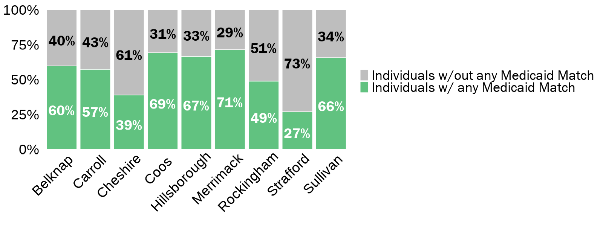
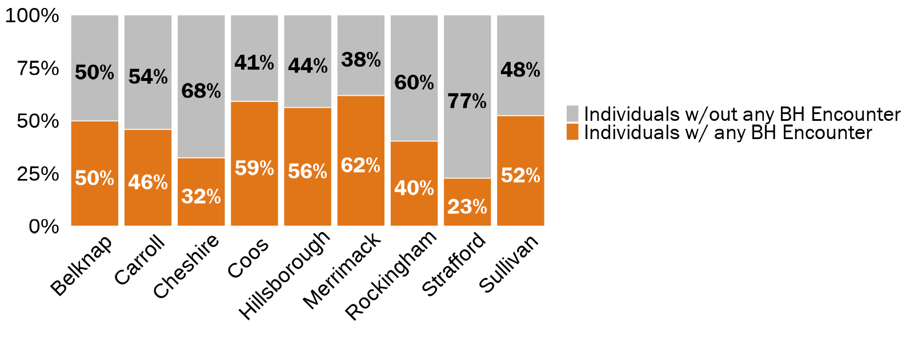

```{r include=FALSE}
# Load functions, packages, and data
source("data_cleaning/00_library.R")
source("data_cleaning/01_functions.R")
source("data_cleaning/rdas.R")

### set chunk output 
knitr::opts_chunk$set(
  echo=FALSE, 
  message=FALSE, 
  warning=FALSE,
  dev = "ragg_png",
  cache = FALSE
  )
```

```{r include=FALSE}
##########
# Jail Admin Data
##########

### de-dup by individual and booking -- these are the two units of analysis for comparisons to the medicaid data
### here we are de-duping bookings with multiple charges as we don't need that information for this comparison
adm_all_dedup <- adm_all %>% 
  ungroup() %>% 
  distinct(id, 
           booking_id,
           .keep_all = TRUE) %>% 
  mutate(unique_person_booking_id = paste0(id,
                                    booking_id)) ### creating unique booking id with both individual and booking IDs


##########
# Medicaid data
##########

### import medicaid_jail_all -- medicaid jail data that we'll compare to the numbers from the jail administrative files
### this file lives on the external hard drive (created and exported in `14_medicaid.R`)
medicaid_jail_all <- read_rds("D:/Analytic/medicaid_jail_all.rds") 

### de-dup (there are a few duplicate bookings) and create booking id for analysis
medicaid_jail_all_dedup <- medicaid_jail_all %>% 
  distinct(unique_person_id, 
           booking_id,
           .keep_all = TRUE) %>% 
  mutate(unique_person_booking_id = paste0(unique_person_id,
                                    booking_id)) ### creating unique booking id with both individual and booking IDs

### import jail_medicaid_analytic_individual_booking_level -- the individual-level analytic file created with all DHHS files
### file is unique by individual/booking
### this file lives on the external hard drive (created and exported in `14_medicaid.R`)
jail_medicaid_analytic_individual_booking_level <- read_rds("D:/Analytic/jail_medicaid_analytic_individual_booking_level.rds") 

##########
# Final Medicaid data - jail_medicaid_analytic_individual_booking_level_dedup
##########

### de-dup (there are a few duplicate bookings) and create booking id for analysis
jail_medicaid_analytic_individual_booking_level_dedup <- jail_medicaid_analytic_individual_booking_level %>% 
  distinct(unique_person_id, 
           booking_id,
           .keep_all = TRUE) %>% 
  mutate(unique_person_booking_id = paste0(unique_person_id,
                                    booking_id)) ### creating unique booking id with both individual and booking IDs

### read in and merge cdc_county_rural_urban_crosswalk: https://www.cdc.gov/nchs/data_access/urban_rural.htm
cdc_county_rural_urban_crosswalk <- openxlsx::read.xlsx(file.path(sp_data_path,"Data/US County Geo Data/CDC_NCHSURCodes2013.xlsx"), 
                                                        sheet = "NCHSURCodes2013") %>%
  clean_names() %>%
  dplyr::filter(state_abr == "NH") %>%
  mutate(cdc_urban_rural_classification = case_when(
    x2013_code=="1" ~ "Urban Center",
    x2013_code=="2" ~ "Suburb",
    x2013_code=="3" ~ "Medium City",
    x2013_code=="4" ~ "Small City",
    x2013_code=="5" ~ "Town", 
    x2013_code=="6" ~ "Rural Area",### see: https://www.cdc.gov/nchs/data/data_acces_files/NCHSUrbruralFileDocumentationInternet2.pd
# from matt:
# Large central metro > Urban centers
# Large fringe metro > Suburbs
# Medium metro > Medium cities
# Small metro > Small cities
# Micropolitan > Towns
# Non-core > Rural areas
    TRUE ~ as.character(NA))) %>% 
  dplyr::select(county_name,cdc_urban_rural_classification) %>% 
  mutate(county = str_remove(county_name,
                             pattern = " County"))

##########
# Final Medicaid data with CDC urban vs rural - jail_medicaid_analytic_individual_booking_level_dedup_cdc
##########

### join cdc_county_rural_urban_crosswalk to jail_medicaid_analytic_individual_booking_level_dedup_hu_recode
jail_medicaid_analytic_individual_booking_level_dedup_cdc <- 
  left_join(jail_medicaid_analytic_individual_booking_level_dedup,
            cdc_county_rural_urban_crosswalk,
            by = "county") 
```         

# DHHS Medicaid Match and Jail Booking Descriptive Analysis: Medicaid Match and Behaviorial Health Overview

<br>

## Tables


### Table 1. Data Check: Unique Individuals and Bookings in Administrative Jail Data versus Medicaid Jail Data

Note: With Medicaid data, the count of unique individuals in each jail will not add up to the statewide total as some individuals were booked at multiple jails. Thus, they appear in multiple individual jail counts, but only once in the statewide count. For this reason, it is probably best to only compare differences in unique individuals at the jail-level. 

```{r echo=FALSE,message=FALSE,warning=FALSE}
### create table of unique individuals and bookings by county using the adm_all_dedup file

# by county
adm_all_dedup_county_table <- adm_all_dedup %>% 
  dplyr::group_by(county) %>% 
  dplyr::summarise(`Unique Individuals, Jail Data (N)` = n_distinct(id),
                   `Unique Bookings, Jail Data (N)`    = n_distinct(unique_person_booking_id))  %>% 
  ungroup() %>% 
  dplyr::rename(`Jail` = county) 

# statewide
adm_all_dedup_overall_table <- adm_all_dedup %>% 
  dplyr::summarise(`Unique Individuals, Jail Data (N)` = n_distinct(id),
                   `Unique Bookings, Jail Data (N)`    = n_distinct(unique_person_booking_id))  %>% 
  dplyr::mutate(`Jail` = "Statewide") 

# join county and statewide files 
adm_all_dedup_county_statewide_count_table <- rbind(adm_all_dedup_county_table,
                                                    adm_all_dedup_overall_table)

### create table of unique individuals and bookings by county using the medicaid_jail_all file

# by county
medicaid_jail_all_county_table <- medicaid_jail_all_dedup %>% 
  dplyr::group_by(county) %>% 
  dplyr::summarise(`Unique Individuals, Medicaid Data (N)` = n_distinct(unique_person_id),
                   `Unique Bookings, Medicaid Data (N)`    = n_distinct(unique_person_booking_id))  %>% 
  ungroup() %>% 
  dplyr::rename(`Jail` = county) 

# statewide
medicaid_jail_all_overall_table <- medicaid_jail_all_dedup %>% 
  dplyr::summarise(`Unique Individuals, Medicaid Data (N)` = n_distinct(unique_person_id),
                   `Unique Bookings, Medicaid Data (N)`    = n_distinct(unique_person_booking_id))  %>% 
  dplyr::mutate(`Jail` = "Statewide") 

# join county and statewide files 
medicaid_jail_all_county_statewide_count_table <- rbind(medicaid_jail_all_county_table, medicaid_jail_all_overall_table)

### now cbind adm_all_dedup_county_statewide_count_table and medicaid_jail_all_county_statewide_count_table
jail_adm_medicaid_count_table <- inner_join(adm_all_dedup_county_statewide_count_table,
                                       medicaid_jail_all_county_statewide_count_table,
                                       by = "Jail") %>% 
  mutate(`Difference in Unique Individuals (N)` = abs(`Unique Individuals, Jail Data (N)` - `Unique Individuals, Medicaid Data (N)`),
         `Difference in Unique Bookings (N)`    = abs(`Unique Bookings, Jail Data (N)` - `Unique Bookings, Medicaid Data (N)`)) %>% 
  dplyr::select(`Jail`,
                `Unique Individuals, Jail Data (N)`,
                `Unique Individuals, Medicaid Data (N)`,
                `Difference in Unique Individuals (N)`,
                `Unique Bookings, Jail Data (N)`,
                `Unique Bookings, Medicaid Data (N)`,
                `Difference in Unique Bookings (N)`) 
  
### print table via kableextra
kable(jail_adm_medicaid_count_table, 
      format.args = list(big.mark = ","), 
      align=rep('c')) %>%
  kable_styling(bootstrap_options = c("striped", 
                                       "hover", 
                                       "condensed", 
                                       "responsive"), 
                 row_label_position = "l") %>% 
  row_spec(10, bold = TRUE) %>% 
  column_spec(4, bold = TRUE) %>% 
  column_spec(7, bold = TRUE) %>% 
  scroll_box(width = "130%")
```

<br><br>


### Table 2. Percentage of Individuals/Bookings with Medicaid Match and Behavioral Health "Encounters"

Note: "Encounters" include any behavioral health-related medical/clinical or pharmacy visitation. Examples include ED visits or pharmacy services linked to mental health or substance use disorder diagnoses. We should probably ask Uma for a DHHS definition for the presentation. 

**Update**: I am currently using all behavioral health data from the Medicaid Encounter file that occurred either before or during the study period. All percentages reflect the % of the entire sample, not just the Medicaid sample

```{r echo=FALSE,message=FALSE,warning=FALSE}
### create table of highlighting the percentage of the medicaid sample that is matched to medicaid data (using medicaid_match_flag) by county using the medicaid_jail_all file

# by county
medicaid_jail_percent_match_county_table <- jail_medicaid_analytic_individual_booking_level_dedup %>% 
  dplyr::group_by(county) %>% 
  dplyr::summarise(`Overall Individuals (N)`           = n_distinct(unique_person_id),
                   `Individuals w/ Medicaid Match (N)` = n_distinct(unique_person_id[pre_or_study_window_medicaid_match_flag_overall==1]),
                   `Individuals w/ Medicaid Match (%)` = scales::percent(`Individuals w/ Medicaid Match (N)`/`Overall Individuals (N)`),
                   `Individuals w/ BH Encounter (N)`   = n_distinct(unique_person_id[pre_or_study_bh_flag==1]),
                   `Individuals w/ BH Encounter (%)`   = scales::percent(`Individuals w/ BH Encounter (N)`/`Overall Individuals (N)`),
                   `Overall Bookings (N)`              = n_distinct(unique_person_id, booking_id),
                   `Bookings w/ Medicaid Match (N)`    = n_distinct(unique_person_booking_id[pre_or_study_window_medicaid_match_flag_overall==1]),
                   `Bookings w/ Medicaid Match (%)`    = scales::percent(`Bookings w/ Medicaid Match (N)`/`Overall Bookings (N)`),
                   `Bookings w/ BH Encounter (N)`      = n_distinct(unique_person_booking_id[pre_or_study_bh_flag==1]),
                   `Bookings w/ BH Encounter (%)`      = scales::percent(`Bookings w/ BH Encounter (N)`/`Overall Bookings (N)`))  %>% 
  ungroup() %>% 
  dplyr::rename(`Jail` = county) 

# statewide
medicaid_jail_percent_match_overall_table <- jail_medicaid_analytic_individual_booking_level_dedup %>% 
  dplyr::summarise(`Overall Individuals (N)`           = n_distinct(unique_person_id),
                   `Individuals w/ Medicaid Match (N)` = n_distinct(unique_person_id[pre_or_study_window_medicaid_match_flag_overall==1]),
                   `Individuals w/ Medicaid Match (%)` = scales::percent(`Individuals w/ Medicaid Match (N)`/`Overall Individuals (N)`),
                   `Individuals w/ BH Encounter (N)`   = n_distinct(unique_person_id[pre_or_study_bh_flag==1]),
                   `Individuals w/ BH Encounter (%)`   = scales::percent(`Individuals w/ BH Encounter (N)`/`Overall Individuals (N)`),
                   `Overall Bookings (N)`              = n_distinct(unique_person_id, booking_id),
                   `Bookings w/ Medicaid Match (N)`    = n_distinct(unique_person_booking_id[pre_or_study_window_medicaid_match_flag_overall==1]),
                   `Bookings w/ Medicaid Match (%)`    = scales::percent(`Bookings w/ Medicaid Match (N)`/`Overall Bookings (N)`),
                   `Bookings w/ BH Encounter (N)`      = n_distinct(unique_person_booking_id[pre_or_study_bh_flag==1]),
                   `Bookings w/ BH Encounter (%)`      = scales::percent(`Bookings w/ BH Encounter (N)`/`Overall Bookings (N)`))  %>% 
  dplyr::mutate(`Jail` = "Statewide") 

# rbind county and statewide files 
medicaid_jail_percent_match_county_statewide_table <- rbind(medicaid_jail_percent_match_county_table,
                                                            medicaid_jail_percent_match_overall_table)

### print table via kableextra
kable(medicaid_jail_percent_match_county_statewide_table, 
      format.args = list(big.mark = ","), 
      align=rep('c')) %>%
  kable_styling(bootstrap_options = c("striped", 
                                       "hover", 
                                       "condensed", 
                                       "responsive"), 
                 row_label_position = "l") %>% 
  row_spec(10, bold = TRUE) %>% 
  column_spec(4, bold = TRUE, color = jri_green) %>% 
  column_spec(6, bold = TRUE, color = jri_orange) %>% 
  column_spec(9, bold = TRUE, color = jri_green) %>% 
  column_spec(11, bold = TRUE, color = jri_orange) %>% 
  scroll_box(width = "130%")
```

<br><br>


### Table 3. Percentage of Individuals/Bookings with Medicaid Match and Behavioral Health "Encounters" (by rural/urban classification)

Note: "Encounters" include any behavioral health-related medical/clinical or pharmacy visitation. Examples include ED visits or pharmacy services linked to mental health or substance use disorder diagnoses. We should probably ask Uma for a DHHS definition for the presentation. 

**Update**: I am currently using all behavioral health data from the Medicaid Encounter file that occurred either before or during  the study period. All percentages reflect the % of the entire sample, not just the Medicaid sample

**County-level CDC rural/urban county classification comes from https://www.cdc.gov/nchs/data_access/urban_rural.htm**


```{r echo=FALSE,message=FALSE,warning=FALSE}
### create table of highlighting the percentage of the medicaid sample that is matched to medicaid data (using medicaid_match_flag) by county using the medicaid_jail_all file

# by county
medicaid_jail_percent_match_cdc_table <- jail_medicaid_analytic_individual_booking_level_dedup_cdc %>% 
  dplyr::group_by(cdc_urban_rural_classification) %>% 
  dplyr::summarise(`Number of Counties (N)`            = n_distinct(county, na.rm = TRUE),
                   `Overall Individuals (N)`           = n_distinct(unique_person_id),
                   `Individuals w/ Medicaid Match (N)` = n_distinct(unique_person_id[pre_or_study_window_medicaid_match_flag_overall==1]),
                   `Individuals w/ Medicaid Match (%)` = scales::percent(`Individuals w/ Medicaid Match (N)`/`Overall Individuals (N)`),
                   `Individuals w/ BH Encounter (N)`   = n_distinct(unique_person_id[pre_or_study_bh_flag==1]),
                   `Individuals w/ BH Encounter (%)`   = scales::percent(`Individuals w/ BH Encounter (N)`/`Overall Individuals (N)`),
                   `Overall Bookings (N)`              = n_distinct(unique_person_id, booking_id),
                   `Bookings w/ Medicaid Match (N)`    = n_distinct(unique_person_booking_id[pre_or_study_window_medicaid_match_flag_overall==1]),
                   `Bookings w/ Medicaid Match (%)`    = scales::percent(`Bookings w/ Medicaid Match (N)`/`Overall Bookings (N)`),
                   `Bookings w/ BH Encounter (N)`      = n_distinct(unique_person_booking_id[pre_or_study_bh_flag==1]),
                   `Bookings w/ BH Encounter (%)`      = scales::percent(`Bookings w/ BH Encounter (N)`/`Overall Bookings (N)`))  %>% 
  ungroup() %>% 
  dplyr::rename(`CDC County Classification` = cdc_urban_rural_classification) 

# statewide
medicaid_jail_percent_match_overall_table <- jail_medicaid_analytic_individual_booking_level_dedup_cdc %>% 
  dplyr::summarise(`Number of Counties (N)`            = n_distinct(county,na.rm = TRUE),
                   `Overall Individuals (N)`           = n_distinct(unique_person_id),
                   `Individuals w/ Medicaid Match (N)` = n_distinct(unique_person_id[pre_or_study_window_medicaid_match_flag_overall==1]),
                   `Individuals w/ Medicaid Match (%)` = scales::percent(`Individuals w/ Medicaid Match (N)`/`Overall Individuals (N)`),
                   `Individuals w/ BH Encounter (N)`   = n_distinct(unique_person_id[pre_or_study_bh_flag==1]),
                   `Individuals w/ BH Encounter (%)`   = scales::percent(`Individuals w/ BH Encounter (N)`/`Overall Individuals (N)`),
                   `Overall Bookings (N)`              = n_distinct(unique_person_id, booking_id),
                   `Bookings w/ Medicaid Match (N)`    = n_distinct(unique_person_booking_id[pre_or_study_window_medicaid_match_flag_overall==1]),
                   `Bookings w/ Medicaid Match (%)`    = scales::percent(`Bookings w/ Medicaid Match (N)`/`Overall Bookings (N)`),
                   `Bookings w/ BH Encounter (N)`      = n_distinct(unique_person_booking_id[pre_or_study_bh_flag==1]),
                   `Bookings w/ BH Encounter (%)`      = scales::percent(`Bookings w/ BH Encounter (N)`/`Overall Bookings (N)`))  %>% 
  dplyr::mutate(`CDC County Classification` = "Statewide") 

# rbind county and statewide files 
medicaid_jail_percent_match_cdc_statewide_table <- rbind(medicaid_jail_percent_match_cdc_table, medicaid_jail_percent_match_overall_table)

### print table via kableextra
kable(medicaid_jail_percent_match_cdc_statewide_table, 
      format.args = list(big.mark = ","), 
      align=rep('c')) %>%
  kable_styling(bootstrap_options = c("striped", 
                                       "hover", 
                                       "condensed", 
                                       "responsive"), 
                 row_label_position = "l") %>% 
  row_spec(5, bold = TRUE) %>% 
  column_spec(5, bold = TRUE, color = jri_green) %>% 
  column_spec(7, bold = TRUE, color = jri_orange) %>% 
  column_spec(10, bold = TRUE, color = jri_green) %>% 
  column_spec(12, bold = TRUE, color = jri_orange) %>% 
  scroll_box(width = "130%")
```

<br><br>


### Table 4. Percentage of Individuals/Bookings with Medicaid Match and Behavioral Health "Encounters": by timing of BH Encounter

Note: "Encounters" include any behavioral health-related medical/clinical or pharmacy visitation. Examples include ED visits or pharmacy services linked to mental health or substance use disorder diagnoses. We should probably ask Uma for a DHHS definition for the presentation. All percentages reflect the % of the entire sample, not just the Medicaid sample.

**The following table is split out by timing of behavioral health Medicaid encounter: before, during, or after the study period. See logic below**

Pre-study period: Medicaid eligibility end date < 7/1/2018

Study period: Medicaid eligibility end date >= 7/1/2018 & Medicaid eligibility start date <= 6/30/2021

Post-study period: Medicaid eligibility start date > 6/30/2021 (b/c this was a very small sample, I have only presented pre- and study-window counts and percentages; this sample is also excluded from further analysis)

```{r echo=FALSE,message=FALSE,warning=FALSE}
### create table of highlighting the percentage of the medicaid sample that is matched to medicaid data (using medicaid_match_flag) by county using the medicaid_jail_all file -- by timing of medicaid enrollment and BH encounters relative to jail admin sample/study window

# by county
medicaid_jail_percent_match_county_timing_table <- jail_medicaid_analytic_individual_booking_level_dedup %>% 

  dplyr::group_by(county) %>% 
  dplyr::summarise(`Overall Individuals (N)`                         = n_distinct(unique_person_id),
                   `Individuals w/ any Medicaid Match (N)`           = n_distinct(unique_person_id[pre_or_study_window_medicaid_match_flag_overall==1]),
                   `Individuals w/ any Medicaid Match (%)`           = scales::percent(`Individuals w/ any Medicaid Match (N)`/`Overall Individuals (N)`),
                   `Individuals w/ Medicaid Match, Pre-Study (N)`    = n_distinct(unique_person_id[pre_study_window_medicaid_match_flag_overall==1]),
                   `Individuals w/ Medicaid Match, Pre-Study (%)`    = scales::percent(`Individuals w/ Medicaid Match, Pre-Study (N)`/`Overall Individuals (N)`),
                   `Individuals w/ Medicaid Match, Study Window (N)` = n_distinct(unique_person_id[study_window_medicaid_match_flag_overall==1]),
                   `Individuals w/ Medicaid Match, Study Window (%)` = scales::percent(`Individuals w/ Medicaid Match, Study Window (N)`/`Overall Individuals (N)`),
                   `Individuals w/ any BH Encounter (N)`             = n_distinct(unique_person_id[overall_bh_flag==1]),
                   `Individuals w/ any BH Encounter (%)`             = scales::percent(`Individuals w/ any BH Encounter (N)`/`Overall Individuals (N)`),
                   `Individuals w/ BH Encounter, Pre-Study (N)`      = n_distinct(unique_person_id[pre_bh_flag==1]),
                   `Individuals w/ BH Encounter, Pre-Study (%)`      = scales::percent(`Individuals w/ BH Encounter, Pre-Study (N)`/`Overall Individuals (N)`),
                   `Individuals w/ BH Encounter, Study Window (N)`   = n_distinct(unique_person_id[study_bh_flag==1]),
                   `Individuals w/ BH Encounter, Study Window (%)`   = scales::percent(`Individuals w/ BH Encounter, Study Window (N)`/`Overall Individuals (N)`))  %>% 
  ungroup() %>% 
  dplyr::rename(`Jail` = county) 

# statewide
medicaid_jail_percent_match_overall_timing_table <- jail_medicaid_analytic_individual_booking_level_dedup %>% 

  dplyr::summarise(`Overall Individuals (N)`                         = n_distinct(unique_person_id),
                   `Individuals w/ any Medicaid Match (N)`           = n_distinct(unique_person_id[pre_or_study_window_medicaid_match_flag_overall==1]),
                   `Individuals w/ any Medicaid Match (%)`           = scales::percent(`Individuals w/ any Medicaid Match (N)`/`Overall Individuals (N)`),
                   `Individuals w/ Medicaid Match, Pre-Study (N)`    = n_distinct(unique_person_id[pre_study_window_medicaid_match_flag_overall==1]),
                   `Individuals w/ Medicaid Match, Pre-Study (%)`    = scales::percent(`Individuals w/ Medicaid Match, Pre-Study (N)`/`Overall Individuals (N)`),
                   `Individuals w/ Medicaid Match, Study Window (N)` = n_distinct(unique_person_id[study_window_medicaid_match_flag_overall==1]),
                   `Individuals w/ Medicaid Match, Study Window (%)` = scales::percent(`Individuals w/ Medicaid Match, Study Window (N)`/`Overall Individuals (N)`),
                   `Individuals w/ any BH Encounter (N)`             = n_distinct(unique_person_id[overall_bh_flag==1]),
                   `Individuals w/ any BH Encounter (%)`             = scales::percent(`Individuals w/ any BH Encounter (N)`/`Overall Individuals (N)`),
                   `Individuals w/ BH Encounter, Pre-Study (N)`      = n_distinct(unique_person_id[pre_bh_flag==1]),
                   `Individuals w/ BH Encounter, Pre-Study (%)`      = scales::percent(`Individuals w/ BH Encounter, Pre-Study (N)`/`Overall Individuals (N)`),
                   `Individuals w/ BH Encounter, Study Window (N)`   = n_distinct(unique_person_id[study_bh_flag==1]),
                   `Individuals w/ BH Encounter, Study Window (%)`   = scales::percent(`Individuals w/ BH Encounter, Study Window (N)`/`Overall Individuals (N)`))  %>% 
  dplyr::mutate(`Jail` = "Statewide") 

# rbind county and statewide files 
medicaid_jail_percent_match_county_statewide_timing_table <- rbind(medicaid_jail_percent_match_county_timing_table,
                                                                   medicaid_jail_percent_match_overall_timing_table)

### print table via kableextra
kable(medicaid_jail_percent_match_county_statewide_timing_table, 
      format.args = list(big.mark = ","), 
      align=rep('c')) %>%
  kable_styling(bootstrap_options = c("striped", 
                                       "hover", 
                                       "condensed", 
                                       "responsive"), 
                 row_label_position = "l") %>% 
  row_spec(10, bold = TRUE) %>% 
  column_spec(4, bold = TRUE, color = jri_green) %>% 
  column_spec(6, bold = TRUE) %>% 
  column_spec(8, bold = TRUE) %>% 
  column_spec(10, bold = TRUE, color = jri_orange) %>% 
  column_spec(12, bold = TRUE) %>% 
  column_spec(14, bold = TRUE) %>% 
  scroll_box(width = "130%")
``` 

<br>

**Statewide, 46% of individuals were matched to Medicaid services, with variation among counties.**  

```{r}
# Calculate proportion of individuals that matched to Medicaid from 2014-2021
df_medicaid_match <- jail_medicaid_analytic_individual_booking_level_dedup %>% 

  dplyr::group_by(county) %>% 
  dplyr::summarise(`Overall Individuals (N)`                  = n_distinct(unique_person_id),
                   
                   `Individuals w/ any Medicaid Match (N)`    = n_distinct(unique_person_id[pre_or_study_window_medicaid_match_flag_overall==1]),
                   `Individuals w/ any Medicaid Match`        = `Individuals w/ any Medicaid Match (N)`/`Overall Individuals (N)`,
                   
                   `Individuals w/out any Medicaid Match (N)` = `Overall Individuals (N)` - `Individuals w/ any Medicaid Match (N)`,
                   `Individuals w/out any Medicaid Match`     = `Individuals w/out any Medicaid Match (N)`/`Overall Individuals (N)`)  %>% 
  ungroup() %>% 
  select(county,
         `Individuals w/ any Medicaid Match`,
         `Individuals w/out any Medicaid Match`)

# Change from wide to long format
df_medicaid_match <- gather(df_medicaid_match, population, pct, `Individuals w/ any Medicaid Match`:`Individuals w/out any Medicaid Match`, factor_key=TRUE) 
df_medicaid_match <- df_medicaid_match %>% 
  mutate(population = factor(population, 
                             levels = c("Individuals w/out any Medicaid Match",
                                        "Individuals w/ any Medicaid Match"))) %>% 
  mutate(pct1 = round(pct*100, 0))
  
# Stacked bar chart showing the proportion of people matched to Medicaid by county
PRES_gg_medicaid_match <- ggplot(df_medicaid_match, aes(x = county, y = pct, fill = population)) +
  geom_col(colour = "white", position = "fill") +
  scale_y_continuous(labels = scales::percent) +
  scale_fill_manual(values=c("gray",jri_green),
                    na.value = "white") +
  geom_text(aes(label = paste(round(pct*100, 0), "%", sep = ""), 
                fontface = 'bold'),
            position = position_fill(vjust = 0.5),
            vjust = 0.8,
            size = 10, family = "Franklin Gothic Book",
            color = case_when(df_medicaid_match$population == "Individuals w/ any Medicaid Match" ~ "white",
                              TRUE ~ "black")) +
  theme_minimal() +
  theme(panel.grid.minor.y = element_blank(),
        panel.grid.major.y = element_blank(),
        panel.grid.major.x = element_blank(),
        panel.grid.minor.x = element_blank(),
        axis.title.y = element_blank(),
        axis.title.x = element_blank(),
        axis.text.x = element_text(angle = 45, hjust = 0.85, size = 28, color = "black"),
        axis.text.y = element_text(size = 28, color = "black"),
        legend.position = "right",
        legend.justification = c(1, 0.5),
        legend.title=element_blank(),
        legend.text = element_text(family = "Franklin Gothic Book", size = 28, color = "black")) 
  #geom_hline(yintercept = mean(df_medicaid_match$pct), color="black", linetype='dotted', lwd=1.5)
```

```{r, out.width="100%", echo=FALSE, layout = "l-body"}
ggsave(PRES_gg_medicaid_match, file="img/PRES_gg_medicaid_match.png", width = 16,  height = 6, dpi = 100)

```

<br>

**Statewide, 38% of individuals were matched to behavioral health-related Medicaid services, with variation among counties.**

```{r}
# Calculate proportion of individuals that matched to Medicaid and had a BH history at any point from 2014-2021
df_bh_match <- jail_medicaid_analytic_individual_booking_level_dedup %>% 
  dplyr::group_by(county) %>% 
  dplyr::summarise(`Overall Individuals (N)`                  = n_distinct(unique_person_id),
                   `Individuals w/ any BH Encounter (N)`      = n_distinct(unique_person_id[pre_or_study_bh_flag==1]),
                   `Individuals w/ any BH Encounter`          = `Individuals w/ any BH Encounter (N)`/`Overall Individuals (N)`,
                   `Individuals w/out any BH Encounter (N)`   = `Overall Individuals (N)` - `Individuals w/ any BH Encounter (N)`,
                   `Individuals w/out any BH Encounter`       = `Individuals w/out any BH Encounter (N)`/`Overall Individuals (N)`,
                   )  %>% 
  ungroup() %>% 
  select(county,
         `Individuals w/ any BH Encounter`,
         `Individuals w/out any BH Encounter`)

# Change from wide to long format
df_bh_match <- gather(df_bh_match, population, pct, `Individuals w/ any BH Encounter`:`Individuals w/out any BH Encounter`, factor_key=TRUE)

# Change from wide to long format
df_bh_match <- df_bh_match %>% 
  mutate(population = factor(population, 
                             levels = c("Individuals w/out any BH Encounter",
                                        "Individuals w/ any BH Encounter"))) %>% 
  mutate(pct1 = round(pct*100, 0))

# Stacked bar chart showing the proportion of people matched to BH encounter by county
PRES_gg_bh_match <- ggplot(df_bh_match, aes(x = county, y = pct, fill = population)) +
  geom_col(colour = "white", position = "fill") +
  scale_y_continuous(labels = scales::percent) +
  scale_fill_manual(values=c("gray",jri_orange),
                    na.value = "white") +
  geom_text(aes(label = paste(round(pct*100, 0), "%", sep = ""), 
                fontface = 'bold'),
            position = position_fill(vjust = 0.5),
            vjust = 0.8,
            size = 10, family = "Franklin Gothic Book",
            color = case_when(df_bh_match$population == "Individuals w/ any BH Encounter" ~ "white",
                              TRUE ~ "black")) +
  theme_minimal() +
  theme(panel.grid.minor.y = element_blank(),
        panel.grid.major.y = element_blank(),
        panel.grid.major.x = element_blank(),
        panel.grid.minor.x = element_blank(),
        axis.title.y = element_blank(),
        axis.title.x = element_blank(),
        axis.text.x = element_text(angle = 45, hjust = 0.85, size = 28, color = "black"),
        axis.text.y = element_text(size = 28, color = "black"),
        legend.position = "right",
        legend.justification = c(1, 0.5),
        legend.title=element_blank(),
        legend.text = element_text(family = "Franklin Gothic Book", size = 28, color = "black"))
```

```{r, out.width="100%", echo=FALSE, layout = "l-body"}
ggsave(PRES_gg_bh_match, file="img/PRES_gg_bh_match.png", width = 16,  height = 6, dpi = 100)

```

<br><br>

### Table 5. Percentage of High Utilizer Individuals with Medicaid Match and Behavioral Health "Encounters"

Note: "Encounters" include any behavioral health-related medical/clinical or pharmacy visitation. Examples include ED visits or pharmacy services linked to mental health or substance use disorder diagnoses. We should probably ask Uma for a DHHS definition for the presentation. 

Grouping of individuals into 'high utilizer' percentile groups is based on statewide data, using the Medicaid match files from DHHS, as opposed to county-level data. 

**Update**: I am currently using all behavioral health data from the Medicaid Encounter file that occurred either before or during  the study period. All percentages reflect the % of the entire sample, not just the Medicaid sample

```{r echo=FALSE,message=FALSE,warning=FALSE}
### to recode high utlizer percentile grouping, we don't need to group_by as the percentile grouping is already grouped across individual from Mari's cleaning
jail_medicaid_analytic_individual_booking_level_dedup_hu_recode <- jail_medicaid_analytic_individual_booking_level_dedup %>% 

  ### to ensure each individual/booking is in correct grouping, start with Non-HU, then 10% and move down to 1%
  mutate(hu_group_exclusive = case_when(
    high_utilizer_10_pct=="No" ~ 4,
    high_utilizer_10_pct=="Yes" & high_utilizer_5_pct=="No" & high_utilizer_1_pct=="No" ~ 3,
    high_utilizer_5_pct=="Yes" & high_utilizer_1_pct=="No" ~ 2,
    high_utilizer_1_pct=="Yes" ~ 1,
    TRUE ~ as.numeric(NA)),
    hu_group_exclusive = factor(hu_group_exclusive,
         levels = c(1,2,3,4),
         labels = c("Top 1%", "Top 5%", "Top 10%", "Non-HU")))

### create table of highlighting the percentage of the medicaid sample that is matched to medicaid data (using medicaid_match_flag) by county using the medicaid_jail_all file

# by county
medicaid_jail_percent_match_high_util_table <- jail_medicaid_analytic_individual_booking_level_dedup_hu_recode %>% 
  dplyr::group_by(hu_group_exclusive) %>% 
  dplyr::summarise(`Overall Individuals (N)` = n_distinct(unique_person_id),
                   `Individuals w/ Medicaid Match (N)` = n_distinct(unique_person_id[pre_or_study_window_medicaid_match_flag_overall==1]),
                   `Individuals w/ Medicaid Match (%)` = scales::percent(`Individuals w/ Medicaid Match (N)`/`Overall Individuals (N)`),
                   `Individuals w/ BH Encounter (N)` = n_distinct(unique_person_id[pre_or_study_bh_flag==1]),
                   `Individuals w/ BH Encounter (%)` = scales::percent(`Individuals w/ BH Encounter (N)`/`Overall Individuals (N)`))  %>% 
  ungroup() %>% 
  dplyr::rename(`High Utilizer Percentiles` = hu_group_exclusive) 

# statewide
medicaid_jail_percent_match_high_util_overall_table <- jail_medicaid_analytic_individual_booking_level_dedup_hu_recode %>% 
   dplyr::summarise(`Overall Individuals (N)` = n_distinct(unique_person_id),
                   `Individuals w/ Medicaid Match (N)` = n_distinct(unique_person_id[pre_or_study_window_medicaid_match_flag_overall==1]),
                   `Individuals w/ Medicaid Match (%)` = scales::percent(`Individuals w/ Medicaid Match (N)`/`Overall Individuals (N)`),
                   `Individuals w/ BH Encounter (N)` = n_distinct(unique_person_id[pre_or_study_bh_flag==1]),
                   `Individuals w/ BH Encounter (%)` = scales::percent(`Individuals w/ BH Encounter (N)`/`Overall Individuals (N)`))  %>% 
  dplyr::mutate(`High Utilizer Percentiles` = "Statewide") 

# rbind county and statewide files 
medicaid_jail_percent_match_high_util_statewide_table <- rbind(medicaid_jail_percent_match_high_util_table,
                                                               medicaid_jail_percent_match_high_util_overall_table)

### print table via kableextra
kable(medicaid_jail_percent_match_high_util_statewide_table, 
      format.args = list(big.mark = ","), 
      align=rep('c')) %>%
  kable_styling(bootstrap_options = c("striped", 
                                       "hover", 
                                       "condensed", 
                                       "responsive"), 
                 row_label_position = "l") %>% 
  row_spec(5, bold = TRUE) %>% 
  column_spec(4, bold = TRUE, color = jri_green) %>% 
  column_spec(6, bold = TRUE, color = jri_orange) %>% 
  scroll_box(width = "130%")
```

<br><br>
