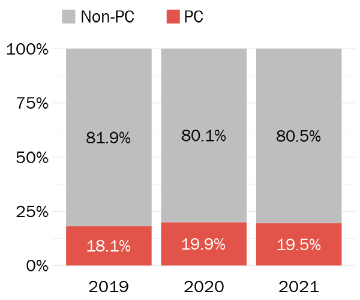
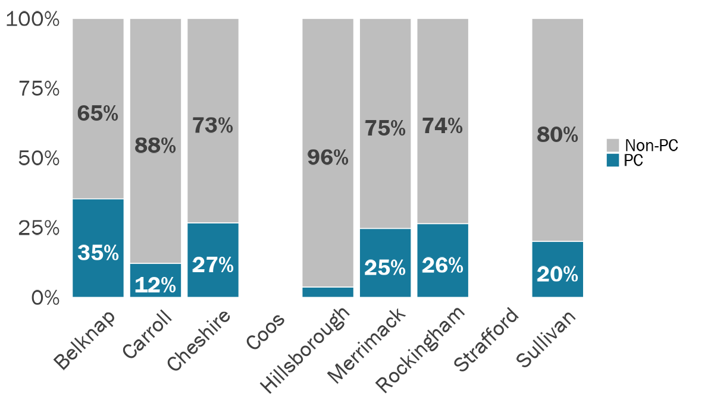
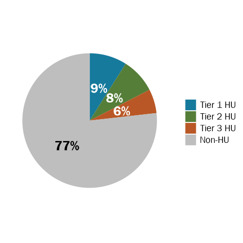
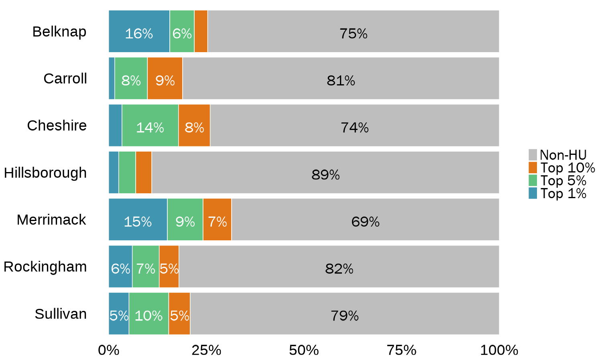
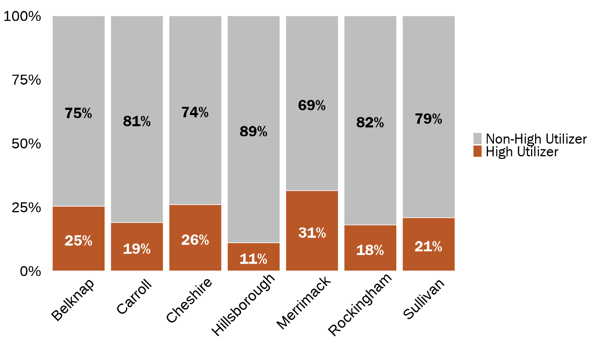

The following incarceration patterns were found using jail administrative data submitted directly to CSG.   

```{r setup, include=FALSE}
knitr::opts_chunk$set(
  echo=FALSE, 
  message=FALSE, 
  warning=FALSE,
  #dev = "ragg_png",
  cache = FALSE
  )

# Load packages, functions, and R data
source("data_cleaning/00_library.R")
source("data_cleaning/01_functions.R")
source("data_cleaning/rdas.R")

# Create HU variables
bookings_entrances <- fnc_hu_group_exclusive(bookings_entrances) 
```

# Protective Custody Holds

### By State

```{r, results='asis'}
# Filter pc data by year
data_19 <- df_pch %>% select(county, id, booking_id, fy, pc_hold_in_booking) %>% distinct() %>% filter(fy == 2019)
data_20 <- df_pch %>% select(county, id, booking_id, fy, pc_hold_in_booking) %>% distinct() %>% filter(fy == 2020)
data_21 <- df_pch %>% select(county, id, booking_id, fy, pc_hold_in_booking) %>% distinct() %>% filter(fy == 2021)

# Df showing PC holds from 2019-2021
data1 <- fnc_variable_table(data_19, data_20, data_21, "pc_hold_in_booking")
data1 <- data1 %>% dplyr::rename(pc_hold_in_booking = variable_name)
data1[is.na(data1)] = 0
data1 <- data1 %>% filter(pc_hold_in_booking != "Total")

# % of entrances (bookings) that are PC holds
amt_pch_pct <- data1 %>% filter(pc_hold_in_booking == "PC Hold")
amt_pch_pct <- amt_pch_pct$freq*100
amt_pch_pct <- round(amt_pch_pct, 1)

# Print sentence
cat("**Protective custody holds accounted for ", amt_pch_pct, "% of bookings from 2019 to 2021.** Coos and Strafford are not included in this calculation due to missing data.\n\n", sep = "")
```

**Although the number of entrances has been decreasing, the proportion of PC holds has remained the same.**

```{r}
# Data for ggplot showing the number of entrances and proportion of PC holds by FY
# Remove Coos and Stafford because they don't have PC data
data1 <- df_pch %>%
  filter(county != "Coos" | county != "Strafford") %>%
  group_by(fy, pc_hold_in_booking) %>% 
  summarise(total = n()) %>% 
  filter(!is.na(pc_hold_in_booking)) %>% 
  group_by(fy) %>% mutate(pct = total/sum(total)*100) %>%
  mutate(pct = round(pct, 1),
         pct = paste0(pct, "%"))

# Grouped bar chart showing the proportion of PC holds by FY
PRES_gg_pch_pct_barchart <- ggplot(data1, aes(x = fy, y = total, fill = pc_hold_in_booking)) +
  geom_col(colour = NA, position = "fill") +
  scale_y_continuous(labels = scales::percent) +
  scale_fill_manual(values=c("gray",jri_light_blue), labels = c("Non-PC      ","PC")) +
  geom_text(aes(label = pct, fontface = 'bold'), position = position_fill(vjust = 0.5),
            size = 7.5, family = "Franklin Gothic Book",
            color = ifelse(data1$pc_hold_in_booking == "Non-PC Hold", "black", "white")) +
  theme_no_grid_no_labels +
  theme(legend.position = "top",
        legend.justification = c(0, 0),
        legend.title=element_blank(),
        axis.title.y = element_blank(),
        axis.title.x = element_blank())
```

```{r, out.width="50%", echo=FALSE, layout = "l-body"}
ggsave(PRES_gg_pch_pct_barchart, file="img/PRES_gg_pch_pct_barchart.png", width = 6,  height = 5, dpi = 100)

```

<br>

**Protective custody holds tend to occur most frequently during summer months. There was a decline in protective custody holds at the start of the pandemic but they began climbing again shortly after.**  

```{r}
# Filter to PC holds
# Generate highchart showing PC holds over time
df_pch %>% filter(pc_hold_in_booking == "PC Hold") %>%
    dplyr::group_by(month_year, month_year_text) %>%
    dplyr::summarise(total = n()) %>%
    mutate(tooltip = paste0("<b>", month_year_text, "</b><br>","Total: ", total, "<br>"),
           month_year_text = as.factor(month_year_text)) %>%
    hchart('line', hcaes(x = month_year_text, y = total), color = jri_light_blue) %>%
    hc_setup() %>%
    hc_xAxis(
      title = list(text = "Month and Year", style = list(color =  "#000000", fontWeight = "bold", fontSize = "16px")),
      plotLines = list(list(label = list(text = "COVID-19 Start"), fontSize = "26px", color = "gray", width = 2, value = 20, zIndex = 1))
    ) %>%
    hc_yAxis(title = list(text = "Number of PC Holds", style = list(color =  "#000000", fontWeight = "bold", fontSize = "16px"))) 
```


<br>

### By County

The proportion of entrances that were protective custody holds varied greatly by county. The table below shows the number of and proportion of entrances that included a protective custody hold charge. Belknap had the highest proportion of bookings that were protective custody holds.  

```{r}
##########
# People with PC holds by county
##########

# Select variables and count number of pc holds people had by county by FY
df_pc_people_fy_county <- df_pch %>%
  ungroup() %>%
  filter(pc_hold_in_booking == "PC Hold" & county != "Strafford" & county != "Coos") %>%
  group_by(county) %>%
  summarise(total_people = n_distinct(id)) %>%
  adorn_totals("row") %>%
  mutate(county = case_when(county == "Total" ~ "State", TRUE ~ county)) %>%
  arrange(county %in% "State")

##########
# PC holds by county
##########

# Data for number of pc holds vs non-pc holds by county by FY
df_pc_holds_fy_county <- df_pch %>%
  select(id, booking_id, fy, county, pc_hold_in_booking) %>%
  distinct() %>%
  group_by(fy, county, pc_hold_in_booking) %>%
  dplyr::summarise(total = n_distinct(booking_id))

# Reshape table for viewing
df_pc_holds_fy_county <- df_pc_holds_fy_county %>% spread(pc_hold_in_booking, total) %>% clean_names()
df_pc_holds_fy_county <- dcast(setDT(df_pc_holds_fy_county), county~fy, value.var=c('non_pc_hold', 'pc_hold'))

# Calculate % of bookings that pc holds by county by FY
df_pc_holds_fy_county <- df_pc_holds_fy_county %>%
  mutate(pc_hold_pct_2019 = pc_hold_2019/(non_pc_hold_2019 + pc_hold_2019),
         pc_hold_pct_2020 = pc_hold_2020/(non_pc_hold_2020 + pc_hold_2020),
         pc_hold_pct_2021 = pc_hold_2021/(non_pc_hold_2021 + pc_hold_2021),
         pc_hold_total = pc_hold_2019 + pc_hold_2020 + pc_hold_2021,
         non_pc_hold_total = non_pc_hold_2019 + non_pc_hold_2020 + non_pc_hold_2021) %>%
  mutate(freq = pc_hold_total/(non_pc_hold_total + pc_hold_total)) %>%
  select(county,
         count_19 = pc_hold_2019,
         pct_19   = pc_hold_pct_2019,
         count_20 = pc_hold_2020,
         pct_20   = pc_hold_pct_2020,
         count_21 = pc_hold_2021,
         pct_21   = pc_hold_pct_2021,
         total    = pc_hold_total,
         freq)

##########
# Entrances by county
##########

# Data for total booking/entrances by FY and county
df_entrances_county <- bookings_entrances %>%
  select(id, booking_id, fy, county) %>%
  distinct() %>%
  group_by(fy, county) %>%
  dplyr::summarise(total = n_distinct(booking_id)) %>%
  spread(fy, total) %>%
  mutate(`2019` = as.numeric(`2019`),
         `2020` = as.numeric(`2020`),
         `2021` = as.numeric(`2021`)) %>%
  mutate(total = `2019` + `2020` + `2021`) %>%
  select(county, total_entrances = total)

# Data for total booking/entrances for Coos and Strafford
# Separate out so they aren't included in calculations
df_entrances_Coos_Strafford <- df_entrances_county %>%
  filter(county == "Coos" | county == "Strafford") %>%
  mutate(total_pc_holds = NA,
         freq = NA)

# Remaining data with other counties
df_entrances_county <- df_entrances_county %>%
  ungroup() %>%
  filter(county != "Coos" & county != "Strafford") %>%
  droplevels()

##########
# Entrances with PC holds by county
##########

# Arrange data and get totals per row
df_entrances_with_pc_holds <- df_pc_holds_fy_county %>%
  select(county, total_pc_holds = total, freq) %>%
  left_join(df_entrances_county, by = "county") %>%
  select(county, total_entrances, everything()) %>%
  arrange(county) %>%
  adorn_totals("row")

# Combine Coos and Strafford numbers
df_entrances_with_pc_holds <- df_entrances_with_pc_holds %>%
  mutate(freq = case_when(county == "Total" ~ (filter(df_entrances_with_pc_holds, county=='Total')$total_pc_holds)/(filter(df_entrances_with_pc_holds, county=='Total')$total_entrances),
                          TRUE ~ freq)) %>%
  full_join(df_entrances_county, by = c("county", "total_entrances")) %>%
  arrange(county) %>%
  mutate(total_entrances = case_when(county == "Total" ~ sum(total_entrances) - filter(df_entrances_with_pc_holds, county=='Total')$total_entrances,
                                    TRUE ~ total_entrances))

df_entrances_with_pc_holds <- rbind(df_entrances_with_pc_holds, df_entrances_Coos_Strafford)

# Add totals and arrange table data
# Add total number of people df
df_entrances_with_pc_holds <- df_entrances_with_pc_holds %>%
  mutate(total_entrances = case_when(county == "Total" ~ sum(total_entrances, na.rm = TRUE),
                                     TRUE ~ total_entrances)) %>%
  filter((county != "Coos" | county != "Strafford") & !is.na(total_entrances)) %>%
  arrange(county) %>%
  mutate(county = case_when(county == "Coos" ~ "Coos (bookings only)",
                            county == "Total" ~ "State", TRUE ~ county)) %>%
  left_join(df_pc_people_fy_county, by = "county") %>%
  arrange(county %in% "State") %>%
  select(county, total_entrances, total_pc_holds, total_people, freq)


##########
# Reactable table
##########

 reactable(df_entrances_with_pc_holds,
            pagination = FALSE,
            style = list(fontFamily = "Franklin Gothic Book", fontSize = "1.0rem"),
            theme = reactableTheme(cellStyle = list(display = "flex", flexDirection = "column", justifyContent = "center"),
                                   headerStyle = list(display = "flex", flexDirection = "column", justifyContent = "center")),
            compact = TRUE,
            fullWidth = FALSE,
            rowStyle = function(index) {
              if (index %in% c(10)) {
                list(`border-top` = "thin solid",
                     fontWeight = "bold")
              }
            },
            defaultColDef = reactable::colDef(
              format = colFormat(separators = TRUE), align = "left"),
            columns = list(
              county          = colDef(minWidth = 180, name = "County", style = list(fontWeight = "bold")),
              total_entrances = colDef(minWidth = 100, name = "Total Entrances", align = "center"),
              total_pc_holds  = colDef(minWidth = 100, name = "PC Holds (Entrances)", align = "center"),
              total_people    = colDef(minWidth = 100, name = "PC Holds (People)", align = "center"),
              freq            = colDef(minWidth = 100, style = list(fontWeight = "bold"), name = "% PC Hold Entrances", format = colFormat(percent = TRUE, digits = 1), align = "center"))) 
```

```{r}
# Proportion of PC holds by county
data1 <- df_pch %>%
  group_by(county, pc_hold_in_booking) %>% summarise(total = n()) %>% 
  group_by(county) %>% mutate(pct = round(total/sum(total)*100, 1)) %>% 
  mutate(pct = round(pct, digits = 0)) 

# Stacked bar chart showing proportion of pc holds by county
PRES_gg_pchold_prop <- ggplot(data1, aes(x = county, y = total, fill = pc_hold_in_booking)) +
  geom_col(colour = "white", position = "fill") +
  scale_y_continuous(labels = scales::percent) +
  scale_fill_manual(values=c("gray",jri_light_blue),
                    na.value = "white",
                    labels = c("Non-PC      ","PC", " ")
                    ) +
  geom_text(aes(label = ifelse(pct > 4, paste0(pct, "%"), ""), 
                fontface = 'bold'),
            position = position_fill(vjust = 0.5),
            vjust = 0.8,
            size = 10, family = "Franklin Gothic Book",
            color = case_when(data1$pc_hold_in_booking == "Non-PC Hold" ~ "black",
                              TRUE ~ "white")) +
  theme_no_grid_no_labels +
  theme(panel.grid.minor.y = element_blank(),
        panel.grid.major.y = element_blank(),
        panel.grid.major.x = element_blank(),
        panel.grid.minor.x = element_blank(),
        axis.title.y = element_blank(),
        axis.title.x = element_blank(),
        axis.text.x = element_text(angle = 45, hjust = 0.85, size = 28, color = "black"),
        axis.text.y = element_text(size = 28, color = "black"),
        legend.position = "right",
        legend.justification = c(1, 0.5))
```

```{r, out.width="100%", echo=FALSE, layout = "l-body"}
ggsave(PRES_gg_pchold_prop, file="img/PRES_gg_pchold_prop.png", width = 12,  height = 7, dpi = 100)

```

<br>

**Some counties saw decreases in PC holds while others saw increases.**  

```{r}
# Remove Coos and Strafford since they dont have data on PC holds
data1 <- df_pc_holds_fy_county %>% filter(county != "Coos" & county != "Strafford") %>% droplevels()

# Table showing the number and proportion of PC holds each FY by county
table_pc_holds_fy_county <- fnc_reactable_fy(data1, metric_label = " ", label_width = 150, note = "Coos removes entrances that are PC holds so Coos's administrative data is not included in this table. Strafford's data cannot differentiate between bookings and PC holds so their administrative data is also excluded.")

table_pc_holds_fy_county
```

<br>

```{r}
# Select variables, remove Coos and Strafford
# Count number of pc holds by HU group
data1 <- bookings_entrances %>%
  filter(county != "Coos" & county != "Strafford") %>%
  select(county,
         fy,
         id,
         booking_id,
         hu_group_exclusive,
         pc_hold_in_booking) %>%
  distinct() %>%
  filter(!is.na(pc_hold_in_booking)) %>%
  filter(pc_hold_in_booking == "PC Hold") %>%
  group_by(pc_hold_in_booking, hu_group_exclusive) %>%
  summarise(total = n()) %>%
  mutate(pct = total/sum(total)*100) %>%
  mutate(pct = round(pct, 0)) %>% 
  mutate(pct = paste0(pct, "%")) %>% 
  mutate(hu_group_exclusive = factor(hu_group_exclusive, levels = c("Non-HU", "Tier 3 HU","Tier 2 HU", "Tier 1 HU")))

# One stacked barplot for all three years then create a pie chart
PRES_gg_pie_hu_pc_holds <- ggplot(data1, aes(x = pc_hold_in_booking, y = total, fill = hu_group_exclusive )) +
  geom_col(colour = NA, position = "fill") +
  scale_y_continuous(labels = scales::percent) +
  scale_fill_manual(values=c("gray", jri_orange, jri_green, jri_light_blue), labels = c("Non-HU", "Tier 3 HU","Tier 2 HU", "Tier 1 HU"),
                    guide = guide_legend(reverse = TRUE) ) +
  geom_text(aes(label = pct, fontface = 'bold'), position = position_fill(vjust = 0.5),
            size = 7.5, family = "Franklin Gothic Book",
            color = case_when(data1$hu_group_exclusive == "Non-HU" ~ "black",
                              TRUE ~ "white")) +
  theme(legend.position = "top",
        legend.justification = c(0, 0),
        legend.title=element_blank(),
        axis.title.y = element_blank()) +
  coord_polar("y", start=0) +
  theme_no_grid_no_labels +
  theme(
    axis.title.x = element_blank(),
    axis.title.y = element_blank(),
    panel.border = element_blank(),
    panel.grid=element_blank(),
    axis.ticks = element_blank(),
    plot.title=element_text(size=14, face="bold"),
    axis.text.x=element_blank(),
    axis.text.y=element_blank(),
    legend.title = element_blank(),
    legend.text = element_text(family = "Franklin Gothic Book", size = 20, color = "black"))
```

**Between 2019 and 2021, people who were high jail utilizers also accounted for nearly a quarter of PC holds.**  

```{r, out.width="50%", echo=FALSE, layout = "l-body"}
ggsave(PRES_gg_pie_hu_pc_holds, file="img/PRES_gg_pie_hu_pc_holds.png", width = 5,  height = 5, dpi = 100)

```

```{r}
# Select variables and count number of pc holds by HU group and county
data1 <- bookings_entrances %>%
  select(county,
         fy,
         id,
         booking_id,
         hu_group_exclusive,
         pc_hold_in_booking) %>%
  distinct() %>%
  group_by(county, pc_hold_in_booking, hu_group_exclusive) %>%
  summarise(total = n_distinct(booking_id)) %>%
  filter(pc_hold_in_booking == "PC Hold") %>% 
  mutate(pct = round(total/sum(total)*100, 0)) %>% 
  mutate(hu_group_exclusive = factor(hu_group_exclusive, levels = c("Non-HU", "Tier 3 HU","Tier 2 HU", "Tier 1 HU")),
         county = factor(county)) 

# Stacked bar chart showing the proportion of HU PC holds out of all entrances
PRES_gg_pchold_hu_prop <- ggplot(data1, aes(x = county, y = total, fill = hu_group_exclusive )) +
  geom_col(colour = "white", position = "fill") +
  scale_y_continuous(labels = scales::percent) +
  scale_fill_manual(values=c("gray", jri_orange, jri_green, jri_light_blue), labels = c("Non-HU", "Tier 3 HU","Tier 2 HU", "Tier 1 HU")) +
  geom_text(aes(label = ifelse(pct > 4, paste0(pct, "%"), ""),
                fontface = 'bold'),
            position = position_fill(vjust = 0.5),
            vjust = 0.7,
            color = ifelse(data1$hu_group_exclusive == "Non-HU", "black", "white"),
            size = 10, family = "Franklin Gothic Book") +
  # coord_flip() +
  # scale_x_discrete(limits = rev(levels(data1$county))) +
  theme_minimal() +
  theme(panel.grid.minor.y = element_blank(),
        panel.grid.major.y = element_blank(),
        panel.grid.major.x = element_blank(),
        panel.grid.minor.x = element_blank(),
        axis.title.y = element_blank(),
        axis.title.x = element_blank(),
        axis.text.x = element_text(angle = 45, size = 28, color = "black", hjust = 0.75),
        axis.text.y = element_text(size = 28, color = "black"),
        legend.position = "right",
        legend.justification = c(1, 0.5),
        legend.title=element_blank(),
        legend.text = element_text(family = "Franklin Gothic Book", size = 28, color = "black"))
  # geom_hline(aes(yintercept=0.20), size = 1)
```

**Belknap and Merrimack County had the most Tier 1 high utilizers who entered jail on a PC hold.**

```{r, out.width="75%", echo=FALSE, layout = "l-body"}
ggsave(PRES_gg_pchold_hu_prop, file="img/PRES_gg_pchold_hu_prop.png", width = 15,  height = 9, dpi = 100)

```

```{r}
# Select variables and count number of pc holds by HU group and county
data1 <- bookings_entrances %>%
  select(county,
         fy,
         id,
         booking_id,
         hu_group_overall,
         pc_hold_in_booking) %>%
  distinct() %>%
  group_by(county, pc_hold_in_booking, hu_group_overall) %>%
  summarise(total = n_distinct(booking_id)) %>%
  filter(pc_hold_in_booking == "PC Hold") %>% 
  mutate(pct = round(total/sum(total)*100, 0)) %>% 
  mutate(hu_group_overall = factor(hu_group_overall, levels = c("Non-High Utilizer", "High Utilizer")),
         county = factor(county)) 

# Stacked bar chart showing the proportion of HU PC holds out of all entrances
PRES_gg_pchold_hu_prop_overall <- ggplot(data1, aes(x = county, y = total, fill = hu_group_overall)) +
  geom_col(colour = "white", position = "fill") +
  scale_y_continuous(labels = scales::percent) +
  scale_fill_manual(values=c("gray", jri_orange), labels = c("Non-High Utilizer", "High Utilizer")) +
  geom_text(aes(label = ifelse(pct > 4, paste0(pct, "%"), ""),
                fontface = 'bold'),
            position = position_fill(vjust = 0.5),
            vjust = 0.7,
            color = ifelse(data1$hu_group_overall == "Non-High Utilizer", "black", "white"),
            size = 10, family = "Franklin Gothic Book") +
  theme_minimal() +
  theme(panel.grid.minor.y = element_blank(),
        panel.grid.major.y = element_blank(),
        panel.grid.major.x = element_blank(),
        panel.grid.minor.x = element_blank(),
        axis.title.y = element_blank(),
        axis.title.x = element_blank(),
        axis.text.x = element_text(angle = 45, size = 28, color = "black", hjust = 0.75),
        axis.text.y = element_text(size = 28, color = "black"),
        legend.position = "right",
        legend.justification = c(1, 0.5),
        legend.title=element_blank(),
        legend.text = element_text(family = "Franklin Gothic Book", size = 28, color = "black"))
```

**Belknap and Merrimack County had the most high utilizers who entered jail on a PC hold.**

```{r, out.width="75%", echo=FALSE, layout = "l-body"}
ggsave(PRES_gg_pchold_hu_prop_overall, file="img/PRES_gg_pchold_hu_prop_overall.png", width = 15,  height = 9, dpi = 100)

```

<br><br>
